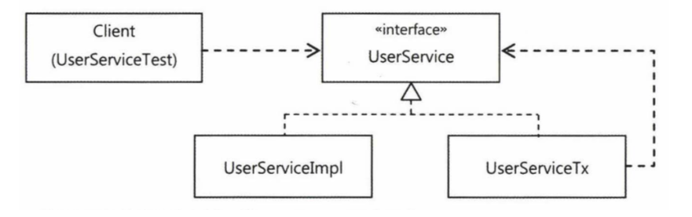

# 6.1 트랜잭션 코드의 분리

<details>
<summary><b>upgradeLevels() 메서드</b></summary>
<div markdown="1">

```java
public void upgradeLevels() throws Exception {
    TransactionStatus status = this.transactionManager.getTransaction(new DefaultTransactionDefinition());

    try{
        List<User> users = userDao.getAll();
        for (User user : users) {
            if (canUpgradeLevel(user)) {
                upgradeLevel(user);
            }
        }
        
        this.transactionManager.commit(status);
    }catch (Exception e){
        this.transactionManager.rollback(status);
    }
}
```

</div>
</details>

스프링이 제공하는 서비스 추상화를 이용해 기술에 종속적이지 않은 트랜잭션 코드가 됐지만,
트랜잭션을 설정하기 위한 코드가 추가되었다.

## 6.1.1 메서드 분리


검은색 박스에 있는 부분만 비즈니스 로직이고 나머지는 전부 트랜잭션 설정 코드이다.
upgradeLevels() 메서드는 현재 트랜잭션이라는 설정과 사용자 등급 업그레이드라는 두 가지 책임을 지니고 있는 셈이다.
또한 트랜잭션 코드와 비즈니스 로직 코드는 주고 받는 정보도 없다. 따라서 트랜잭션 로직 부분을 메서드로 분리해보자.

<details>
<summary><b>비즈니스 로직과 트랜잭션 경계설정의 분리 코드</b></summary>
<div markdown="1">

```java
private void upgradeLevelsInternal(){
    List<User> users = userDao.getAll();
    for (User user : users) {
        if (canUpgradeLevel(user)) {
            upgradeLevel(user);
        }
    }
}

public void upgradeLevels() throws Exception {
TransactionStatus status = this.transactionManager.getTransaction(new DefaultTransactionDefinition());

    try{
        upgradeLevelsInternal();   
        this.transactionManager.commit(status);
    }catch (Exception e){
        this.transactionManager.rollback(status);
    }
}
```

</div>
</details>


## 6.1.2 DI를 이용한 클래스의 분리

메서드 단위로 분리했지만 트랜잭션 처리 메서드가 여전히 UserService 클래스에 남는다는 문제가 있다.
UserService 는 User와 관련된 서비스를 처리하는 곳이지, 트랜잭션 처리를 담당하는 곳이 아니다.
따라서 이 트랜잭션 메서드를 밖으로 빼는 작업을 해야 한다.

### DI 적용을 이용한 트랜잭션 분리

현재 UserService를 사용하고 있는 클라이언트는 테스트를 위해 만들어진 UserServiceTest이다.
다만 이 둘은 강력하게 결합되어 있기 때문에 중간 다리에 어떤 로직을 추가하기는 어렵다.
그래서 느슨한 결합을 위해 UserServiceImpl을 구현 클래스로 두고 UserService라는 인터페이스를 생성해야 한다.

지금 해결하려고 하는 문제는 비즈니스 로직을 담고 있는 코드만 놔두고 트랜잭션 경계설정을 담당하는 코드를
외부로 빼내려는 것이다. 그렇기 때문에 아래 그림과 같은 구조를 생각할 수 있다.



UserServiceImpl를 호출하기 전에 UserServiceTx를 먼저 호출하는 작업을 거친다면,
클라이언트 입장에서 볼 때는 트랜잭션이 적용된 비즈니스 로직 구현이라는 동작을 기대할 수 있다.

### 분리된 트랜잭션 기능

<details>
<summary><b>UserServiceTx 클래스 생성</b></summary>
<div markdown="1">

```java
public class UserServiceTx implements UserService{
    UserService userService;
    PlatformTransactionManager transactionManager;

    public void setTransactionManager(PlatformTransactionManager transactionManager) {
        this.transactionManager = transactionManager;
    }

    public void setUserService(UserService userService) {
        this.userService = userService;
    }

    @Override
    public void add(User user) {
        userService.add(user);
    }

    @Override
    public void upgradeLevels() {
        TransactionStatus status = this.transactionManager
                .getTransaction(new DefaultTransactionDefinition());
        try {
            userService.upgradeLevels();
            this.transactionManager.commit(status);
        } catch (RuntimeException e) {
            this.transactionManager.rollback(status);
            throw e;
        }
    }
}
```

</div>
</details>

트랜잭션의 경계설정이라는 부가적인 작업을 부여한 UserServiceTx 클래스이다.

### 트랜잭션 적용을 위한 DI 설정

이제 남은 것은 UserServiceTx 를 중간에 놓고 이 클래스를 거쳐 UserService 로직을 실행시키는 일이다.


```xml
<bean id="userService" class="service.UserServiceTx">
    <property name="transactionManager" ref="transactionManager"/>
    <property name="userService" ref="userServiceImpl"/>
</bean>

<bean id="userServiceImpl" class="service.UserServiceImpl">
    <property name="userDao" ref="userDao"/>
    <property name="mailSender" ref="mailSender"/>
</bean>

```

이제 클라이언트는 UserServiceTx 빈을 호출해서 사용하도록 만들어야한다.
따라서 userService 라는 대표적인 빈 아이디는 UserServiceTx 클래스로 정의된 빈에게 부여해준다.
userService 빈은 UserServiceImpl 클래스로 정의되는, 아이디가 userServiceImpl인 빈을 DI 하게 만든다.

### 트랜잭션 분리에 따른 테스트 수정

테스트 코드를 수정해야 하는 이유는 UserService 인터페이스를 확장하는 두 개의 하위 클래스가 생겼기 때문이다.
@Autowired는 기본적으로 타입이 일치하는 빈을 찾아주는데, 타입으로 하나의 빈을 결정할 수 없는 경우에는
**필드 이름을 이용해 빈을 찾는다**

일반적인 기능에선 userService 인터페이스를 통해 결과를 확인하는 것도 충분하지만,
목 오브젝트를 이용한 테스트는 직접 MailSender에 DI 해줘야할 필요가 있었다.
따라서 자동 주입되는 UserService를 UserServiceImpl 로 바꿔주는게 맞다.

### 트랜잭션 경계설정 코드 분리의 장점

1. 비즈니스 로직을 담당하고 있는 UserServiceImpl 코드를 작성할 때, 트랜잭션과 같은 기술적인 내용에는 전혀 신경쓰지 않아도 된다.
2. 비즈니스 로직에 대한 테스트를 손쉽게 만들어낼 수 있다.

# 6.2 고립된 단위 테스트

<details>
<summary><b>UserServiceImpl.java</b></summary>
<div markdown="1">

```java
package service;

import dao.UserDao;
import domain.Level;
import domain.User;
import org.springframework.mail.MailSender;
import org.springframework.mail.SimpleMailMessage;

import java.util.List;

public class UserServiceImpl implements UserService{
    UserDao userDao;
    public static final int MIN_LOGCOUNT_FOR_SILVER = 50;
    public static final int MIN_RECCOMMEND_FOR_GOLD = 30;
    public static final String TO_USER_EMAIL = "dailyzett@gmail.com";

    private MailSender mailSender;

    public void setMailSender(MailSender mailSender) {
        this.mailSender = mailSender;
    }

    public void setUserDao(UserDao userDao) {
        this.userDao = userDao;
    }

    public void upgradeLevels(){
        List<User> users = userDao.getAll();
        for (User user : users) {
            if (canUpgradeLevel(user)) {
                upgradeLevel(user);
            }
        }
    }

    protected void upgradeLevel(User user) {
        user.upgradeLevel();
        userDao.update(user);
        sendUpgradeEmail(user);
    }

    private void sendUpgradeEmail(User user) {
        SimpleMailMessage mailMessage = new SimpleMailMessage();
        mailMessage.setTo(user.getEmail());
        mailMessage.setFrom("semineun@naver.com");
        mailMessage.setSubject("Upgrade 안내");
        mailMessage.setText("사용자님의 등급이 " + user.getLevel().name());

        this.mailSender.send(mailMessage);
    }


    private boolean canUpgradeLevel(User user) {
        Level currentLevel = user.getLevel();
        return switch (currentLevel) {
            case BASIC -> (user.getLogin() >= MIN_LOGCOUNT_FOR_SILVER);
            case SILVER -> (user.getRecommend() >= MIN_RECCOMMEND_FOR_GOLD);
            case GOLD -> false;
            default -> throw new IllegalArgumentException("Unknown Level: " + currentLevel);
        };
    }

    public void add(User user) {
        if (user.getLevel() == null) user.setLevel(Level.BASIC);
        userDao.add(user);
    }
}
```

</div>
</details>

## 6.2.1 복잡한 의존관계 속의 테스트

지금껏 작성했던 UserService의 구현 클래스들이 동작하려면 세 가지 타입의 의존 오브젝트가 필요하다.

1. UserDao
2. MailSender
3. PlatformTransactionManager

이 코드의 의존 관계를 그림으로 그려보면 아래와 같다.


그림으로 봐도 테스트 대상에 의존 관계가 얽혀있다 보니 하나의 셋팅만 잘못돼도 모든 테스트가 실패할 가능성이 높아진다.
이런 경우의 테스트는 준비하기 힘들고, 환경이 조금이라도 달라지면 동일한 테스트 결과를 내지 못할 수도 있으며,
수행 속도는 느리고 그에 따라 테스트를 작성하고 실행하는 빈도가 점차 떨어질 것이다.

## 6.2.2 테스트 대상 오브젝트 고립시키기

테스트를 의존 대상으로부터 고립시키는 방법은 MailSender처럼 **테스트를 위한 대역**을 사용하는 것이다.

```java
public void upgradeLevels(){
        List<User> users = userDao.getAll();
        for (User user : users) {
            if (canUpgradeLevel(user)) {
                upgradeLevel(user);
            }
        }
    }
```

upgradeLevels() 메서드는 리턴값이 없다. 따라서 메서드를 실행하고 결괏값을 검증하는 것은 불가능하다.
upgradeLevels() 메서드는 DAO에서 정보를 가져와 일정 작업을 수행하고 다시 그 정보를 DAO를 통해 DB에 반영한다.
따라서 기존 테스트에서는 UserService의 메서드를 실행시킨 후에 UserDao를 이용해 DB에 들어간 결과를 가져와 검증하는 방법을 사용했다.

그런데 외부 서비스에 의존하지 않는 UserServiceImpl은 그 기능을 수행해도 그 결과가 DB에 남지 않기 때문에 작업 결과를 검증하기 힘들다.
그래서 어떤 요청을 했는지를 확인하는 작업이 필요하다. 이를 위해 테스트의 검증에 사용할 수 있게 하는 목 오브젝트를 만들 필요가 있다.


### 고립된 단위 테스트 활용

upgradeLevels() 테스트를 분석해보자.

<details>
<summary><b>upgradeLevels() 메서드 전체 코드</b></summary>
<div markdown="1">

```java
@Test
@DirtiesContext
public void upgradeLevels() throws Exception {
    userDao.deleteAll();
    for (User user : users) userDao.add(user);

    MockMailSender mockMailSender = new MockMailSender();
    userServiceImpl.setMailSender(mockMailSender);
    userServiceImpl.upgradeLevels();

    // true = 계급 업그레이드
    // false = 계급 그대로
    checkLevel(users.get(0), false);
    checkLevel(users.get(1), true);
    checkLevel(users.get(2), false);
    checkLevel(users.get(3), true);
    checkLevel(users.get(4), false);

    List<String> request = mockMailSender.getRequests();
    // true 가 두 번이기 때문에 request.size()는 2여야 한다.
    assertEquals(request.size(), 2);
    assertEquals(request.get(0), users.get(1).getEmail());
    assertEquals(request.get(1), users.get(3).getEmail());
}

private void checkLevel(User user, boolean upgraded) {
    User userUpdate = userDao.get(user.getId());
    if (upgraded) {
        //업그레이드가 일어났는지 확인
        assertEquals(userUpdate.getLevel(), user.getLevel().nextLevel());
    } else {
        //업그레이드가 일어나지 않았는지 확인
        assertEquals(userUpdate.getLevel(), user.getLevel());
    }
}
```

</div>
</details>

- DB 테스트 데이터 준비
```java
userDao.deleteAll();
for (User user : users) userDao.add(user);
```

- 메일 발송 여부 확인을 위한 목 오브젝트 DI
```java
MockMailSender mockMailSender = new MockMailSender();
userServiceImpl.setMailSender(mockMailSender);
```
- 테스트 대상 실행

```java
userServiceImpl.upgradeLevels();
```
- DB에 저장된 결과 확인
```java
checkLevel(users.get(0), false);
checkLevel(users.get(1), true);
checkLevel(users.get(2), false);
checkLevel(users.get(3), true);
checkLevel(users.get(4), false);
```
- 목 오브젝트를 이용한 결과 확인
```java
List<String> request = mockMailSender.getRequests();

assertEquals(request.size(), 2);
assertEquals(request.get(0), users.get(1).getEmail());
assertEquals(request.get(1), users.get(3).getEmail());
```

### UserDao 목 오브젝트

```java
public void upgradeLevels(){
    List<User> users = userDao.getAll();
    for (User user : users) {
        if (canUpgradeLevel(user)) {
            upgradeLevel(user);
        }
    }
}
```

userDao.getAll() 메서드는 단순히 정보를 읽어오는 메서드이다.
따라서 미리 준비된 사용자의 목록만 제공해주면 되기 때문에 **테스트 스텁**으로 만들면 된다.

```java
protected void upgradeLevel(User user) {
        user.upgradeLevel();
        userDao.update(user);
        sendUpgradeEmail(user);
}
```

하지만 upgradeLevel 메서드는 DB 정보를 변경하는 역할을 한다.
변경에 대한 검증을 하려면 그 동작에 대한 확인이 필요하기 때문에,
UserDao 타입의 **목 오브젝트**를 만들어야 한다.

<details>
<summary><b>MockUserDao 클래스</b></summary>
<div markdown="1">

```java
static class MockUserDao implements UserDao {
    private List<User> users;
    private List<User> updated = new ArrayList<>();

    @Override
    public void update(User user) {
        updated.add(user);
    }

    public List<User> getUpdated() {
        return this.updated;
    }

    @Override
    public List<User> getAll() {
        return this.users;
    }

    @Override
    public void add(User user) { throw new UnsupportedOperationException(); }

    @Override
    public User get(String id) { throw new UnsupportedOperationException(); }

    @Override
    public void deleteAll() { throw new UnsupportedOperationException(); }

    @Override
    public int getCount() { throw new UnsupportedOperationException(); }
}
```

</div>
</details>


테스트에 사용하지 않을 메서드는 UnsupportedOperationException 을 던지도록 놔두고 사용하는 메서드 구현에만 집중한다.
이제 upgradeLevels 는 직접 DB에 접근할 필요 없다. 목 오브젝트를 이용해 테스트를 진행하면 되기 때문이다.

MockUserDao 클래스를 생성했으면 그 다음은 upgardeLevels() 메서드를 변경할 차례이다.
직접 DB를 연결하기 위해 DI를 설정했던 부분을 MockUserDao로 대체한다.

```java
MockUserDao mockUserDao = new MockUserDao(this.users);
userServiceImpl.setUserDao(mockUserDao);
```
그리고 MockUserDao 에 저장된 리스트들을 불러와 테스트를 진행한다.

```java
List<User> updated = mockUserDao.getUpdated();
assertEquals(updated.size(), 2);

checkUserAndLevel(updated.get(0), "joytouch", Level.SILVER);
checkUserAndLevel(updated.get(1), "madnite1", Level.GOLD);
```

```java
private void checkUserAndLevel(User updated, String expectedId, Level expectedLevel) {
    assertEquals(updated.getId(), expectedId);
    assertEquals(updated.getLevel(), expectedLevel);
}
```

테스트 대역을 만들기 전의 코드는 @Autowired 된 UserService 타입의 빈을 사용했다.
하지만 이 UserService 는 DI를 통해서 많은 의존 오브젝트와 서비스, 외부 환경에 의존하고 있었다.
이제는 완전히 고립돼서 테스트만을 위해 독립적으로 동작하는 테스트 대상을 사용할 것이기 때문에
스프링 컨테이너에서 빈을 가져올 필요가 없다.

고립 테스트의 장점은 더 이상 DB에서 정보를 가져오지 않기 때문에 dao.deleteAll() 과 같은 작업은 해줄 필요 없다는 점이다.
그리고 핵심 로직을 검증하는 데 직접적으로 필요하지 않은 의존 오브젝트와 서비스를 모두 제거했기 때문에 테스트 수행속도도 상당히 빨라진다.

## 6.2.3 단위 테스트와 통합 테스트

단위 테스트의 단위는 정하기 나름이다.
중요한 것은 "하나의 단위에 초점을 맞춘 테스트" 라는 것이다.

반면 두 개 이상의, 성격이나 계층이 다른 오브젝트가 연동하도록 만들어 테스트하거나,
또는 외부의 DB나 파일, 서비스 등의 리소스가 참여하는 테스트는 **통합 테스트** 라고 한다.
스프링의 테스트 컨텍스트 프레임워크를 이용해서 컨텍스트에서 생성되고 DI된 오브젝트를 테스트하는 것도 통합 테스트이다.

단위 테스트와 통합 테스트 중에서 어떤 방법을 결정할지는 다음 가이드라인을 따른다.

- 항상 단위 테스트를 먼저 고려한다.
- 외부와의 의존관계를 모두 차단하고 필요에 따라 스텁이나 목 오브젝트 등의 테스트 대역을 이용하여 테스트를 만든다.
- 외부 리소스를 이용해야만 가능한 테스트는 통합 테스트로 만든다.
- 여러 개의 단위가 의존관계를 가지고 동작할 때를 위한 통합 테스트는 필요하다.
- 단위 테스트를 만들기가 너무 복잡하다고 판단되는 코드는 처음부터 통합 테스트를 고려한다.
- 스프링 테스트 컨텍스트 프레임워크를 이용하는 테스트는 통합 테스트이다.

## 6.2.4 목 프레임워크

### Mockito 프레임 워크

Mockito 프레임워크는 목 클래스를 일일이 준비해둘 필요가 없다.
간단한 메서드 호출만으로 다이내믹하게 특정 인터페이스를 구현한 테스트용 목 오브젝트를 만들 수 있다.
Mockito 목 오브젝트는 다음의 네 단계를 거쳐서 사용한다.

1. 인터페이스를 이용해 목 오브젝트를 만든다.
2. 목 오브젝트가 리턴할 값이 있으면 이를 지정해준다. 메서드가 호출되면 강제로 예외를 던지게 만들 수도 있다.
3. 테스트 대상 오브젝트에 DI 해서 목 오브젝트가 테스트 중에 사용되도록 만든다.
4. 테스트 대상 오브젝트를 사용한 후에 목 오브젝트의 특정 메서드가 호출됐는지,
   어떤 값을 가지고 몇 번호출됐는지를 검증한다.

<details>
<summary><b>Mockito를 적용한 테스트 코드</b></summary>
<div markdown="1">

```java
@Test
public void upgradeLevels() throws Exception {
    UserServiceImpl userServiceImpl = new UserServiceImpl();

    UserDao mockUserDao = mock(UserDao.class);
    when(mockUserDao.getAll()).thenReturn(this.users);
    userServiceImpl.setUserDao(mockUserDao);

    MailSender mockMailSender = mock(MailSender.class);
    userServiceImpl.setMailSender(mockMailSender);

    userServiceImpl.upgradeLevels();

    verify(mockUserDao, times(2)).update(any(User.class));
    verify(mockUserDao).update(users.get(1));
    assertEquals(users.get(1).getLevel(), Level.SILVER);
    verify(mockUserDao).update(users.get(3));
    assertEquals(users.get(3).getLevel(), Level.GOLD);

    ArgumentCaptor<SimpleMailMessage> mailMessageArg = ArgumentCaptor.forClass(SimpleMailMessage.class);
    verify(mockMailSender, times(2)).send(mailMessageArg.capture());
    List<SimpleMailMessage> mailMessages = mailMessageArg.getAllValues();
    assertEquals(mailMessages.get(0).getTo()[0], users.get(1).getEmail());
    assertEquals(mailMessages.get(1).getTo()[0], users.get(3).getEmail());
}
```
</div>
</details>

#### 코드 설명

- mockUserDao.getAll()이 호출됐을 때(when), users 리스트를 리턴해준다.(thenReturn)

```java
when(mockUserDao.getAll()).thenReturn(this.users);
```

- User 타입의 오브젝트를 파라미터로 받으며 update() 메서드가 두 번 호출됐는지(times(2)) 검증하라(verify).
- any() 는 파라미터의 내용은 무시하고 호출 횟수만 확인할 때 사용한다.
- times(2)를 생략하면 디폴트 값은 times(1)이다. 즉, users.get(1) 의 업데이트가 한 번 이루어졌는지 검증한다.
```java
verify(mockUserDao, times(2)).update(any(User.class));
verify(mockUserDao).update(users.get(1));
```

- 실제 MailSender 목 오브젝트에 전달된 파라미터를 가져온다

```java
ArgumentCaptor<SimpleMailMessage> mailMessageArg = 
        ArgumentCaptor.forClass(SimpleMailMessage.class);
```

- SimpleMailMessage 클래스에 전달된 모든 argument들을 가져와 List에 저장한다.

```java
List<SimpleMailMessage> mailMessages = mailMessageArg.getAllValues();
```

# 6.3 다이내믹 프록시와 팩토리 빈

## 6.3.1 프록시와 프록시 패턴, 데코레이터 패턴

자신이 클라이언트가 사용하려고 하는 실제 대상인 것처럼 위장해서 클라이언트의 요청을 받아주는 것을 대리자, 대리인과 같은 역할을 한다고 해서
**프록시**라고 부른다. 그리고 프록시를 통해 최종적으로 요청을 위임받아 처리하는 실제 오브젝트를 **타깃** 또는 **실체**라고 부른다.

프록시의 특징은 타깃과 같은 인터페이스를 구현했다는 것과 프록시가 타깃을 제어할 수 있는 위치에 있다는 것이다.
프록시는 사용 목적에 따라 두 가지로 구분할 수 있다.
- 첫번째는 클라이언트가 타깃에 접근하는 방법을 제어하기 위해서다.
- 두번째는 타깃에 부가적인 기능을 부여해주기 위해서다.

### 데코레이터 패턴

타깃에 부가적인 기능을 런타임 시 다이내믹하게 부여해주기 위해 프록시를 사용하는 패턴을 말한다.
데코레이터 패턴은 프록시가 꼭 한 개로 제한되지 않는다. 프록시가 여러 개인 만큼 순서를 정해서 단계적으로 위임하는 구조로 만들면 된다.

예를 들어 소스코드에 라인넘버를 붙여준다거나, 문법에 따라 색을 변경해주거나, 특정 폭으로 소스를 잘라주거나,
페이지를 표시해주는 등의 부가적인 기능을 각각 프록시로 만들어두고 아래 그림처럼 런타임 시에 이를 적절한 순서로 조합해서 사용하면 된다.


프록시로서 동작하는 각 데코레이터는 위임하는 대상에도 인터페이스로 접근하기 때문에 자신이 최종 타깃으로 위임하는지,
아니면 다음 단계의 데코레이터 프록시로 위임하는지 알지 못한다.

> 데코레이터 패턴은 타깃의 코드를 손대지 않고, 클라이언트가 호출하는 방법도 변경하지 않은 채로 새로운 기능을 추가할 때 유용한 방법이다.


### 프록시 패턴

타깃 오브젝트를 생성하기가 복잡하거나 당장 필요하지 않은 경우에는 꼭 필요한 시점까지 오브젝트를 생성하지 않는 것이 좋다.
그런데 타깃 오브젝트에 대한 레퍼런스가 미리 필요할 수 있다. 이럴 때 **프록시 패턴**을 적용하면 된다.

특별한 상황에서 타깃에 대한 접근권한을 제어하기 위해 프록시 패턴을 사용할 수 있다.
Collections의 **unmodifiableCollection()** 을 통해 만들어지는 오브젝트가 전형적인 접근권한 제어용 프록시라고 볼 수 있다.
이렇게 프록시 패턴은 타깃의 기능 자체에는 관여하지 않으면서 접근하는 방법을 제어해주는 프록시를 이용하는 것이다.

#### 프록시 패턴 vs 데코레이터 패턴

구조적으로 보면 프록시 패턴과 데코레이터 패턴은 유사하다.
다만 프록시는 코드에서 자신이 만들거나 접근할 타깃 클래스 정보를 알고 있는 경우가 많다.
생성을 지연하는 프록시라면 구체적인 생성 방법을 알아야 하기 때문에 타깃 클래스에 대한 직접적인 정보를 알아야 한다.
물론 프록시 패턴이라고 하더라도 인터페이스를 통해 위힘하도록 만들 수도 있다.


## 6.3.2 다이내믹 프록시

### 프록시의 구성과 프록시 작성의 문제점

프록시는 두 가지 기능으로 구성된다.

- 타깃과 같은 메서드를 구현하고 있다가 메서드가 호출되면 타깃 오브젝트로 위임한다.
- 지정된 요청에 대해서는 부가기능을 수행한다.

하지만 이런 프록시는 만들기가 번거러운데 이유는 다음과 같다.

- 타깃의 인터페이스를 구현하고 위임하는 코드를 작성하기가 번거롭다.
  부가기능이 필요 없는 메서드도 구현해서 타깃으로 위임하는 코드를 일일이 만들어줘야 한다.
- 부가기능 코드가 중복될 가능성이 많다.

두 번째 문제인 부가기능의 중복 문제는 코드를 분리하면 어떻게 될 것 같지만, 첫 번째 문제는 간단해보이지 않는다.
이런 문제를 해결하는 데 유용한 것이 JDK의 **다이내믹 프록시**이다.

### 리플렉션

> 다이내믹 프록시는 리플렉션 기능을 이용해서 프록시를 만들어준다.
> 리플렉션은 자바의 코드 자체를 추상화해서 접근하도록 만든 것이다.

아래 코드는 리플렉션 API 중에서 메서드에 대한 정의를 담은 Method 인터페이스를 이용해 메서드를 호출하는 방법이다.

```java
Method lenghMethod = String.class.getMethod("length");
```

스트링이 가진 메서드 중에서 "length" 라는 이름을 갖고 있고, 파라미터는 없는 메서드의 정보를 가져오는 것이다.
invoke() 메서드는 메서드를 실행시킬 대상 오브젝트와 파라미터 목록을 받아서 메서드를 호출한 뒤에 그 결과를 Object 타입으로 돌려준다.

### 프록시 클래스

다이내믹 프록시를 이용한 프록시를 만들어보자. 그림으로 표현하면 아래와 같다.


<details>
<summary><b>Hello Interface</b></summary>
<div markdown="1">

```java
public interface Hello {
    String sayHello(String name);
    String sayHi(String name);
    String sayThankYou(String name);
}
```
</div>
</details>

<details>
<summary><b>HelloTarget</b></summary>
<div markdown="1">

```java
public class HelloTarget implements Hello{
    @Override
    public String sayHello(String name) {
        return "Hello " + name;
    }

    @Override
    public String sayHi(String name) {
        return "Hi " + name;
    }

    @Override
    public String sayThankYou(String name) {
        return "Thank you " + name;
    }
}
```

</div>
</details>

<details>
<summary><b>HelloUppercase</b></summary>
<div markdown="1">

```java
public class HelloUppercase implements Hello{
    Hello hello;

    public HelloUppercase(Hello hello) {
        this.hello = hello;
    }

    @Override
    public String sayHello(String name) {
        return hello.sayHello(name).toUpperCase();
    }

    @Override
    public String sayHi(String name) {
        return hello.sayHi(name).toUpperCase();
    }

    @Override
    public String sayThankYou(String name) {
        return hello.sayThankYou(name).toUpperCase();
    }
}
```

</div>
</details>

<details>
<summary><b>Hello Test Code</b></summary>
<div markdown="1">

```java
@Test
public void simpleProxy(){
    Hello helloTarget = new HelloUppercase(new HelloTarget());
    assertEquals(helloTarget.sayHello("Toby"), "HELLO TOBY");
    assertEquals(helloTarget.sayHi("Toby"), "HI TOBY");
    assertEquals(helloTarget.sayThankYou("Toby"), "THANK YOU TOBY");
}
```

</div>
</details>

이 프록시는 프록시 적용의 일반적인 문제점 두 가지를 모두 갖고 있다.
인터페이스의 모든 메서드를 구현해 위임하도록 코드를 만들어야 하며, 부가기능인 리턴 값을 대문자로 바꾸는 기능이 모둔 메서드에 중복돼서 나타난다.

### 다이내믹 프록시 적용

클래스로 만든 프록시인 HelloUppercase를 다이내믹 프록시를 이용해 다시 만들어보자.
다이내믹 프록시가 동작하는 방식은 아래 그림과 같다.


- 다이내믹 프록시는 프록시 팩토리에 의해 런타임 시 다이내믹하게 만들어지는 오브젝트이다.
- 클라이언트는 다이내믹 프록시 오브젝트를 타깃 인터페이스를 통해 사용할 수 있다.
  그래서 프록시를 만들 때 인터페이스를 모두 구현해가면서 클래스를 정의하지 않아도 된다.
  프록시 팩토리에게 인터페이스 정보만 제공해주면 해당 인터페이스를 구현한 클래스의 오브젝트를 자동으로 만들어주기 때문이다.
- 부가기능은 프록시 오브젝트와 독립적으로 InvocationHandler를 구현한 오브젝트에 남는다.
- 남은 것은 각 메서드 요청을 어떻게 처리할 지 결정하는 일이다.
  리플렉션으로 메서드와 파라미터 정보를 모두 갖고 있으므로 타깃 오브젝트의 메서드를 호출하게 할 수도 있다.

다이내믹 프록시를 이용해 Hello 코드를 리팩토링하면 아래 그림처럼 순서도를 그릴 수 있다.


<details>
<summary><b>InvocationHandler 구현 클래스</b></summary>
<div markdown="1">

```java
package proxyTest;

import java.lang.reflect.InvocationHandler;
import java.lang.reflect.Method;

public class UppercaseHandler implements InvocationHandler {
    Hello target;

    public UppercaseHandler(Hello target) {
        this.target = target;
    }

    @Override
    public Object invoke(Object proxy, Method method, Object[] args) throws Throwable {
        String ret = (String) method.invoke(target, args);
        return ret.toUpperCase();
    }
}
```
</div>
</details>

<details>
<summary><b>프록시 생성</b></summary>
<div markdown="1">

```java
@Test
public void simpleProxy(){
    Hello proxiedHello = (Hello) Proxy.newProxyInstance(
            // 동적으로 생성되는 다이내믹 프록시 클래스의 로딩에 사용할 클래스 로더
            getClass().getClassLoader(),
            // 구현할 인터페이스
            new Class[]{Hello.class},
            // 부가기능과 위임 코드를 담은 InvocationHandler
            new UppercaseHandler(new HelloTarget())
    );

    assertEquals(proxiedHello.sayHello("Toby"), "HELLO TOBY");
    assertEquals(proxiedHello.sayHi("Toby"), "HI TOBY");
    assertEquals(proxiedHello.sayThankYou("Toby"), "THANK YOU TOBY");
}
```

</div>
</details>

### 다이내믹 프록시의 확장

UppercaseHandler는 모든 메서드의 리턴 타입이 스트링이라고 가정한다.
그렇기 때문에 리턴 타입을 확인해서 스트링인 경우에만 대문자로 바꿔주고 나머지는 그대로 넘겨주는 방식으로 수정해야 한다.

리플렉션의 Method 인터페이스를 이용해 타깃의 메서드를 호출하는 것이니 Hello 타입의 타깃으로 제한할 필요도 없다.
따라서 기존 Hello 타입의 변수를 전부 Object 로 변환해도 된다.

<details>
<summary><b>확장된 UppercaseHandler</b></summary>
<div markdown="1">

```java
public class UppercaseHandler implements InvocationHandler {
    Object target;

    public UppercaseHandler(Object target) {
        this.target = target;
    }

    @Override
    public Object invoke(Object proxy, Method method, Object[] args) throws Throwable {
        Object ret = method.invoke(target, args);
        if(ret instanceof String){
            return ((String)ret).toUpperCase();
        }else{
            return ret;
        }
    }
}
```

</div>
</details>

## 6.3.3 다이내믹 프록시를 이용한 트랜잭션 부가기능

UserServiceTx 를 다이내믹 프록시 방식으로 변경해보자.

<details>
<summary><b>다이내믹 프록시를 위한 트랜잭션 부가기능</b></summary>
<div markdown="1">

```java
public class TransactionHandler implements InvocationHandler {
    private Object target;
    private PlatformTransactionManager transactionManager;
    private String pattern;

    public void setTarget(Object target) {
        this.target = target;
    }

    public void setTransactionManager(PlatformTransactionManager transactionManager) {
        this.transactionManager = transactionManager;
    }

    public void setPattern(String pattern) {
        this.pattern = pattern;
    }

    @Override
    public Object invoke(Object proxy, Method method, Object[] args) throws Throwable {
        if (method.getName().startsWith(pattern)) {
            return invokeTransaction(method, args);
        }else{
            return method.invoke(target, args);
        }
    }

    private Object invokeTransaction(Method method, Object[] args) throws Throwable {
        TransactionStatus status = this.transactionManager.getTransaction(new DefaultTransactionDefinition());
        try {
            Object ret = method.invoke(target, args);
            this.transactionManager.commit(status);
            return ret;
        } catch (InvocationTargetException e) {
            this.transactionManager.rollback(status);
            throw e.getTargetException();
        }
    }
}
```

</div>
</details>

타깃을 저장할 변수를 Object로 선언했기 때문에 UserServiceImpl 외에 트랜잭션 적용이 필요한 어떤 타깃 오브젝트에도 적용할 수 있다.
그리고 기존 테스트 코드는 아래와 같이 변경된다.

```java
TransactionHandler txHandler = new TransactionHandler();
txHandler.setTarget(testUserService);
txHandler.setTransactionManager(transactionManager);
txHandler.setPattern("upgradeLevels");

UserService txUserService = (UserService) Proxy.newProxyInstance(
        getClass().getClassLoader(), 
        new Class[] {UserService.class}, 
        txHandler
);
```

## 6.3.4 다이내믹 프록시를 위한 팩토리 빈

이제 TransactionHandler와 다이내믹 프록시를 스프링의 DI를 통해 사용할 수 있도록 만들어야할 차례이다.
문제는 다이내믹 프록시 오브젝트는 일반적인 스프링의 빈으로는 등록할 방법이 없다는 점이다.
다이내믹 프록시는 내부적으로 클래스를 다이내믹하게 새로 정의해서 사용하기 때문에 정확히 어떤 클래스를 지목하고 있는지 알 수 없다.
따라서 다이내믹 프록시는 Proxy 클래스의 newProxyInstance() 라는 스태틱 팩토리 메서드를 통해서만 만들 수 있다.

### 팩토리 빈

스프링은 클래스 정보를 가지고 디폴트 생성자를 통해 오브젝트를 만드는 방법 외에도 빈을 만들 수 있는 여러 가지 방법을 제공한다.
그 중 하나가 팩토리 빈을 이용한 빈 생성 방법이다.

> 팩토리 빈이란 스프링을 대신해서 오브젝트의 생성로직을 담당하도록 만들어진 특별한 빈을 말한다.

팩토리 빈을 만드는 방법 중 가장 간단한 방법은 **FactoryBean** 인터페이스를 구현하는 것이다.

> **Note.**<br>
> 스프링은 private 생성자를 가진 클래스도 빈으로 등록해주면 리플렉션을 이용해 오브젝트를 만들어준다.
> 리플렉션은 private으로 선언된 접근 규약을 위반할 수 있는 강력한 기능이 있기 때문이다.
> 하지만 private 생성자를 가진 클래스를 빈으로 등록하는 일은 권장되지 않으며, 등록하더라도 빈 오브젝트가 제대로 동작하지 않을 가능성이 있으니 주의해야 한다.

팩토리 빈은 전형적인 팩토리 메서드를 가진 오브젝트다.
스프링은 FactoryBean 인터페이스를 구현한 클래스가 빈의 클래스로 지정되면, 팩토리 빈 클래스의 오브젝트의 getObject() 메서드를 이용해
오브젝트를 가져오고, 이를 빈 오브젝트로 사용한다.

드물지만 팩토리 빈이 만들어주는 빈 오브젝트가 아니라 팩토리 빈 자체를 가져오고 싶은 경우도 있다.
이럴 때를 위해 스프링은 "&" 를 빈 이름 앞에 붙여주면 팩토리 빈 자체를 돌려준다.

### 다이내믹 프록시를 만들어주는 팩토리 빈

Proxy의 newProxyInstace() 메서드를 통해서만 생성이 가능한 다이내믹 프록시 오브젝트는 일반적인 방법으로는 스프링의 빈으로 등록할 수 없다.
대신 **팩토리 빈**을 사용하면 스프링의 빈으로 만들어줄 수 있다.


- 스프링 빈에는 팩토리 빈과 UserServiceImpl만 빈으로 등록
    - 팩토리 빈은 다이내믹 프록시가 위임할 타깃 오브젝트인 UserServiceImpl에 대한 레퍼런스를 프로퍼티를 통해 DI 받아둬야 한다.
    - 다이내믹 프록시와 함께 생성할 TransactionHandler에게 타깃 오브젝트를 전달해줘야 하기 때문이다.
- 그 외에도 다이내믹 프록시나 TransactionHandler를 만들 때 필요한 정보는 팩토리 빈의 프로퍼티로 설정해뒀다가
  다이내믹 프록시를 만들면서 전달해줘야 한다.

### 트랜잭션 프록시 팩토리 빈

<details>
<summary><b>트랜잭션 프록시 팩토리 빈</b></summary>
<div markdown="1">

```java
package service;

import org.springframework.beans.factory.FactoryBean;
import org.springframework.transaction.PlatformTransactionManager;

import java.lang.reflect.Proxy;

public class TxProxyFactoryBean implements FactoryBean<Object> {
private Object target;
private PlatformTransactionManager transactionManager;
private String pattern;
Class<?> serviceInterface;

    public void setTarget(Object target) {
        this.target = target;
    }

    public void setTransactionManager(PlatformTransactionManager transactionManager) {
        this.transactionManager = transactionManager;
    }

    public void setPattern(String pattern) {
        this.pattern = pattern;
    }

    public void setServiceInterface(Class<?> serviceInterface) {
        this.serviceInterface = serviceInterface;
    }

    @Override
    public Object getObject() throws Exception {
        TransactionHandler txHandler = new TransactionHandler();
        txHandler.setTarget(target);
        txHandler.setTransactionManager(transactionManager);
        txHandler.setPattern(pattern);
        return Proxy.newProxyInstance(
                getClass().getClassLoader(),
                new Class[]{serviceInterface},
                txHandler
        );
    }

    @Override
    public Class<?> getObjectType() {
        return serviceInterface;
    }

    @Override
    public boolean isSingleton() {
        return false;
    }
}
```
</div>
</details>

코드의 class<?> 는 UserService 외의 인터페이스를 가진 타깃에도 적용하기 위해 선언한 것이다.
그리고 isSingleton 은 싱글톤 빈이 아니라는 뜻이 아니라 getObject()가 매번 같은 오브젝트를 리턴하지 않는다는 것을 뜻한다.
프록시 팩토리 빈 프로퍼티에 값을 넣어주기 위해 applicationContext 도 다음과 같이 변경한다.

```xml
    <bean id="userService" class="service.TxProxyFactoryBean">
        <property name="target" ref="userServiceImpl"/>
        <property name="transactionManager" ref="transactionManager"/>
        <property name="pattern" value="upgradeLevels"/>
        <property name="serviceInterface" value="service.UserService"/>
    </bean>
```

### 트랜잭션 프록시 팩토리 빈 테스트

TxProxyFactoryBean의 트랜잭션을 지원하는 프록시를 바르게 만들어주는지를 확인하는 게 목적이므로 빈으로 등록된
TxProxyFactoryBean을 직접 가져와서 프록시를 만들어서 테스트를 진행한다.

<details>
<summary><b>트랜잭션 프록시 팩토리 빈을 적용한 테스트</b></summary>
<div markdown="1">

```java
@Test
@DirtiesContext
public void upgradeAllOrNothing() throws Exception {
    TestUserService testUserService = new TestUserService(users.get(3).getId());
    testUserService.setUserDao(userDao);
    testUserService.setMailSender(mailSender);

    TxProxyFactoryBean txProxyFactoryBean =
            context.getBean("&userService", TxProxyFactoryBean.class);
    txProxyFactoryBean.setTarget(testUserService);
    UserService txUserService = (UserService) txProxyFactoryBean.getObject();

    userDao.deleteAll();
    for (User user : users) userDao.add(user);

    try {
        txUserService.upgradeLevels();
        fail("TestUserServiceException expected");
    } catch (TestUserServiceException e) {

    }
    checkLevel(users.get(1), false);
}
```

</div>
</details>

1. 스프링 빈으로 등록된 TxProxyFactoryBean을 가져와서 target 프로퍼티를 재구성해준다.
2. 프록시 오브젝트를 생성하도록 요청한다.
3. 컨텍스트의 설정을 변경하기 때문에 @DirtiesContext 애노테이션이 필요하다.
4. 팩토리 빈 자체를 가져와야하기 때문에 빈 이름에 "&"가 붙어 있다.

## 6.3.5 프록시 팩토리 빈 방식의 장점과 한계

### 프록시 팩토리 빈의 재사용

TransactionHandler를 이용하는 다이내믹 프록시를 생성해주는 TxProxyFactoryBean은 코드의 수정 없이도 다양한 클래스에 적용할 수 있다.
그리고 하나 이상의 TxProxyFactoryBean을 동시에 빈으로 등록해도 괜찮다.
팩토리 빈이기 때문에 각 빈의 타입은 타깃 인터페이스와 일치하기 때문이다.

### 프록시 팩토리 빈 방식의 장점

데코레이터 패턴이 적용된 프록시를 사용하면 많은 장점이 있음에도 적극적으로 활용되지 못하는 데는 두 가지 문제점이 있기 때문이다.

1. 프록시를 적용할 대상이 구현하고 있는 인터페이스를 구현하는 프록시 클래스를 일일이 만들어야 한다.
2. 부가적인 기능이 여러 메서드에 반복적으로 나타나게 돼서 코드 중복의 문제가 발생한다.

하지만 다이내믹 프록시를 이용하면 타깃 인터페이스를 구현하는 클래스를 일일이 만들지 않아도 된다.
거기다 다이내믹 프록시에 **팩토리 빈**을 이용한 DI까지 더해주면 번거러운 다이내믹 프록시 생성 코드도 제거할 수 있다.


### 프록시 팩토리 빈의 한계

하지만 이런 프록시 팩토리 빈에도 한계가 존재한다.
프록시를 통해 타깃에 부가기능을 제공하는 것은 **메서드 단위**로 일어난다.
즉 하나의 클래스 안에 존재하는 여러 개의 메서드에 부가기능을 한 번에 제공하는 건 가능하다.

반대로 한 번에 여러 개의 클래스에 공통적인 부가기능을 제공하는 일은 불가능하다.
트랜잭션과 같이 비즈니스 로직을 담은 많은 클래스의 메서드에 적용할 필요가 있다면 **거의 비슷한 프록시 팩토리 빈의 설정**이 중복되는 것을 막을 수 없다.

하나의 타깃에 여러 개의 부가기능을 적용하려고 할 때도 문제다.
적용 대상인 서비스 클래스가 200개쯤 된다면, 보통 하나당 3, 4 줄이면 되는 서비스 빈의 설정에 5, 6줄씩 되는 프록시 팩토리 빈 설정이
**부가기능 개수만큼** 따라 붙어야 한다.

이 말은 600라인이면 되는 XML 설정이 4,000라인으로 늘어난다는 소리다. 4,000라인의 XML 설정은
사람이 손으로 편집할 수 있는 한계를 벗어난다. 게다가 타깃과 인터페이스만 다른, 거의 비슷한 설정이 자꾸 반복된다는 점도 큰 단점으로 작용한다.

또 한 가지 문제점은 TransactionHandler 오브젝트가 프록시 팩토리 빈 개수만큼 만들어진다는 점이다.
TransactionHandler는 타깃 오브젝트를 프로퍼티로 갖고 있다.
따라서 동일한 로직임에도 타깃 오브젝트가 달라지면 새로운 TransactionHandler 오브젝트를 만들어야 한다.

# 6.4 스프링의 프록시 팩토리 빈

## 6.4.1 ProxyFactoryBean

스프링의 ProxyFactoryBean은 프록시를 생성해서 빈 오브젝트로 등록하게 해주는 팩토리 빈이다.
기존의 TxProxyFactoryBean과 차이점은 ProxyFactoryBean은 순수하게 프록시를 생성하는 작업만을 담당하고
프록시를 통해 제공해줄 부가기능은 별도의 빈에 둘 수 있다.

ProxyFactoryBean이 생성하는 프록시에서 사용할 부가기능은 MethodInterceptor 인터페이스를 구현해서 만든다.
MethodInterceptor의 invoke() 메서드는 ProxyFactoryBean으로부터 타깃 오브젝트에 대한 정보까지도 함께 제공받는다.
그래서 타깃 오브젝트에 상관없이 독립적으로 만들어질 수 있다.
따라서 MethodInterceptor 오브젝트는 타깃이 다른 여러 프록시에서 함께 사용할 수 있고, 싱글톤 빈으로 등록 가능하다.

```java
public class DynamicProxyTest {
    @Test
    public void SimpleProxy(){
        Hello proxiedHello = (Hello) Proxy.newProxyInstance(
                getClass().getClassLoader(),
                new Class[]{Hello.class},
                new UppercaseHandler(new HelloTarget())
        );
    }

    @Test
    public void proxyFactoryBean(){
        ProxyFactoryBean pfBean = new ProxyFactoryBean();
        pfBean.setTarget(new HelloTarget());
        pfBean.addAdvice(new UppercaseAdvice());

        Hello proxiedHello = (Hello) pfBean.getObject();

        assertEquals(proxiedHello.sayHello("Toby"), "HELLO TOBY");

    }

    static class UppercaseAdvice implements MethodInterceptor {
        @Override
        public Object invoke(MethodInvocation invocation) throws Throwable {
            String ret = (String) invocation.proceed();
            return ret.toUpperCase();
        }
    }
}

```

### 어드바이스 : 타깃이 필요 없는 순수한 부가기능

UppercaseAdvice 클래스를 보면 타깃 오브젝트가 등장하지 않는다.
MethodInvocation은 타깃 오브젝트의 메서드를 실행할 수 있는 기능이 있기 때문에 부가기능을 제공하는 데만 집중할 수 있다.

MethodInvocation은 일종의 **콜백 오브젝트**로, proceed() 메서드를 실행하면 타깃 오브젝트의 메서드를 내부적으로 실행해주는 기능이 있다.
ProxyFactoryBean은 작은 단위의 템플릿/콜백 구조를 응용해서 적용했기 때문에 템플릿 역할을 하는 MethodInvocation을 싱글톤으로 두고 공유할 수 있다.

#### addAdvice()

addAdvice() 메서드를 통해 여러개의 MethodInterceptor 를 추가할 수 있다.
기존의 프록시 팩토리 빈은 새로운 부가기능을 추가할 때마다 프록시와 프록시 팩토리 빈도 추가해줘야 했다면,
스프링 프록시 팩토리 빈은 addAdvice() 덕분에 다수의 부가기능을 적용하더라도 하나의 ProxyFactoryBean 이면 충분하다.

#### advice 의 정의

MethodInterceptor처럼 타깃 오브젝트에 적용하는 부가기능을 담은 오브젝트를 스프링에서는 **어드바이스**라고 부른다.


ProxyFactoryBean을 적용한 코드를 보면 프록시가 구현해야 하는 Hello 라는 인터페이스를 제공해주는 부분이 없다.
그 이유는 ProxyFactoryBean에 있는 인터페이스 자동검출 기능을 이용해 타깃 오브젝트가 구현하고 있는 인터페이스 정보를 알아내기 때문이다.

그 밖에도 ProxyFactoryBean은 경우에 따라서 CGLib이라고 하는 오픈소스 바이트코드 생성 프레임워크를 이용해 프록시를 만들기도 한다.

### 포인트컷: 부가기능 적용 대상 메서드 선정 방법

기존의 InvocationHandler를 직접 구현했을 때는 메서드의 이름을 가지고 부가기능을 적용 대상 메서드를 선정하는 작업을 직접 해야했다.
이전의 TxProxyFactoryBean은 pattern이라는 메서드 이름 비교용 스트링 값을 DI 받아서 TransactionHandler를 생성할 때 이를 넘겨준다.
그리고 이 핸들러는 요청이 들어오는 메서드의 이름과 패턴을 비교해서 부가기능인 트랜잭션 적용 대상을 판별했다.

하지만 스프링의 ProxyFactoryBean과 MethodInterceptor를 사용하면 이는 불가능하다.
트랜잭션 적용 패턴은 프록시마다 다를 수 있기 때문에 여러 프록시가 공유하는 MethodInterceptor에 특정 프록시에만 적용되는 패턴을 넣으면
문제가 되기 때문이다.

스프링의 ProxyFactoryBean 방식은 두 가지 확장 기능인 부가기능(Advice)와 메서드 선정 알고리즘(Pointcut)을 활용하는 유연한 구조를 제공한다.


- 부가기능을 제공하는 오브젝트를 **어드바이스**라고 부른다.
- 메서드 선정 알고리즘을 담은 오브젝트를 **포인트컷**이라고 부른다.

두 가지 모두 여러 프록시에서 공유가 가능하도록 만들어지기 때문에 스프링의 싱글톤 빈으로 등록이 가능하다.
어드바이스와 포인트컷이 작동되는 순서는 다음과 같다.

1. 프록시가 클라이언트로부터 요청을 받는다.
2. 요청을 받은 프록시는 먼저 포인트컷에게 부가기능을 부여할 메서드인지를 확인해달라고 요청한다.
3. 확인받은 후, 프록시는 MethodInterceptor 타입의 어드바이스를 호출한다.
4. 어드바이스가 부가기능을 부여하는 중에 타깃 메서드의 호출이 필요하면 프록시로부터 전달받은
   MethodInvocation 타입 콜백 오브젝트의 proceed() 메서드를 통해 호출한다.

재사용 가능한 기능을 만들어두고 바뀌는 부분(콜백 오브젝트와 메서드 호출정보)만
외부에서 주입해서 이를 작업 흐름(부가기능 부여) 중에 사용하도록 하는 전형적인 **템플릿/콜백 구조**이다.

어드바이스만 등록할 때는 addAdvice() 메서드만 호출하면 되지만 포인트컷과 함께 사용할 때는 Advisor 타입의 오브젝트에 담아서 조합해야 한다.
포인트컷과 어드바이스를 따로 등록하면 **어떤 어드바이스에 대해 어떤 포인트컷을 적용할지 애매해지기 때문이다.**

> 어드바이저 = 포인트컷 + 어드바이스

## 6.4.2 ProxyFactoryBean 적용

### TransactionAdvice

부가기능을 담당하는 어드바이스는 MethodInterceptor라는 Advice 서브인터페이스를 구현해서 만든다.

```java
public class TransactionAdvice implements MethodInterceptor {
    PlatformTransactionManager transactionManager;

    public void setTransactionManager(PlatformTransactionManager transactionManager) {
        this.transactionManager = transactionManager;
    }

    @Override
    public Object invoke(MethodInvocation invocation) throws Throwable {
        TransactionStatus status = this.transactionManager.getTransaction(new DefaultTransactionDefinition());
        try {
            Object ret = invocation.proceed();
            this.transactionManager.commit(status);
            return ret;
        } catch (RuntimeException e) {
            this.transactionManager.rollback(status);
            throw e;
        }
    }
}
```

### 스프링 XML 설정파일


```xml
<bean id="transactionAdvice" class="service.TransactionAdvice">
    <property name="transactionManager" ref="transactionManager"/>
</bean>

<bean id="transactionPointcut" class="org.springframework.aop.support.NameMatchMethodPointcut">
    <property name="mappedName" value="upgrade*"/>
</bean>

<bean id="transactionAdvisor" class="org.springframework.aop.support.DefaultPointcutAdvisor">
    <property name="advice" ref="transactionAdvice"/>
    <property name="pointcut" ref="transactionPointcut"/>
</bean>
```

차례대로 어드바이스, 포인트컷, 어드바이저 xml 설정 방식이다.
그리고 이 어드바이저의 bean id를 통해 아래와 같이 설정하면 끝이다.
property name의 "interceptorNames"는 어드바이저와 어드바이스를 동시에 설정해줄 수 있는 프로퍼티다.

```xml
<bean id="userService" class="org.springframework.aop.framework.ProxyFactoryBean">
    <property name="target" ref="userServiceImpl"/>
    <property name="interceptorNames">
        <list>
            <value>transactionAdvisor</value>
        </list>
    </property>
</bean>
```

<details>
<summary><b>ProxyFactoryBean을 이용한 트랜잭션 테스트</b></summary>
<div markdown="1">

```java
@Test
@DirtiesContext
public void upgradeAllOrNothing() throws Exception {
    TestUserService testUserService = new TestUserService(users.get(3).getId());
    testUserService.setUserDao(userDao);
    testUserService.setMailSender(mailSender);

    ProxyFactoryBean txProxyFactoryBean =
            context.getBean("&userService", ProxyFactoryBean.class);
    txProxyFactoryBean.setTarget(testUserService);
    UserService txUserService = (UserService) txProxyFactoryBean.getObject();

    userDao.deleteAll();
    for (User user : users) userDao.add(user);

    try {
        txUserService.upgradeLevels();
        fail("TestUserServiceException expected");
    } catch (TestUserServiceException e) {

    }
    checkLevel(users.get(1), false);
}
```

</div>
</details>

### 어드바이스와 포인트컷의 재사용

ProxyFactoryBean은 **스프링의 DI, 템플릿/콜백 패턴, 서비스 추상화 등의 기법**이 모두 적용된 것이다.
그 덕분에 독립적이며, 여러 프록시가 공유할 수 있는 어드바이스와 포인트컷으로 확장 기능을 분리할 수 있다.

아래 그림은 ProxyFactoryBean을 이용해서 많은 수의 서비스 빈에게 트랜잭션 부가기능을 적용했을 때의 구조다.
TransactionAdvice를 하나만 만들어서 싱글톤 빈으로 등록하고 메서드 선정 방식을 택하는 포인트컷의 설정만 따로 등록하고
어드바이저로 조합해서 적용해주면 된다.


# 6.5 스프링 AOP

## 6.5.1 자동 프록시 생성

프록시 팩토리 빈 방식의 접근 방법에는 두 가지 한계가 있다.

- 부가기능이 타깃 오브젝트마다 새로 만들어지는 문제
- 부가기능의 적용이 필요한 타깃 오브젝트마다 거의 비슷한 내용의 ProxyFactoryBean 빈 설정정보를 추가해주는 문제

첫 번째 문제는 스프링 ProxyFactoryBean의 어드바이스를 통해 해결할 수 있다.
새로운 타깃이 생겼다고 코드에 직접 수정할 필요는 없어졌지만 설정은 매번 복사해서 붙이고 target 프로퍼티의 내용을 수정해줘야 한다.

### 빈 후처리기를 이용한 자동 프록시 생성기

빈 후처리기는 BeanPostProcessor 인터페이스를 구현해서 만든다.
빈 후처리기는 이름 그대로 스프링 빈 오브젝트로 만들어지고 난 후에, 빈 오브젝트를 다시 가공할 수 있게 해준다.
빈 후처리기 중 하나인 DefaultAdvisorAutoProxyCreator는 어드바이저를 이용한 자동 프록시 생성기이다.


DefaultAdvisorAutoProxyCreator 빈 후처리기가 등록되어 있으면 스프링은 빈 오브젝트를 만들 때마다 후처리기에게 빈을 보낸다.
DefaultAdvisorAutoProxyCreator는 빈으로 등록된 모든 어드바이저 내의 포인트컷을 이용해 전달받은 빈이 프록시 적용 대상인지 확인한다.
프록시 적용 대상이면 내장된 프록시 생성기에게 현재 빈에 대한 프록시를 만들게 하고, 만들어진 프록시에 어드바이저를 연결해준다.

이를 통해 마지막 남은 ProxyFactoryBean 설정 문제를 깔끔하게 해결할 수 있다.

### 확장된 포인트컷

- Pointcut 인터페이스

```java
public interface Pointcut{
    ClassFilter getClassFilter();
    MethodMatcher getMethodMatcher();
}
```

포인트컷은 클래스 필터와 메서드 매처 두 가지를 모두 돌려주는 메서드를 가지고 있다.
Pointcut의 선정 기능을 모두 적용한다면 먼저 프록시를 적용할 클래스인지 판단하고 나서,
적용 대상이 클래스인 경우에는 어드바이스를 적용할 메서드인지 확인하는 식으로 동작한다.

모든 빈에 대해 프록시 자동 적용 대상을 선별해야 하는 빈 후처리기인 DefaultAdvisorAutoProxyCreator는
클래스와 메서드 선정 알고리즘을 모두 갖고 있는 포인트컷이 필요하다.

## 6.5.2 DefaultAdvisorAutoProxyCreator의 적용

먼저 DefaultAdvisorAutoProxyCreator를 사용하기 위해 xml 파일에 다음 코드를 추가한다.
자동 프록시 생성기는 어디선가 참조할 일이 없으므로 id를 적어주지 않아도 된다.

```xml
<bean class="org.springframework.aop.framework.autoproxy.DefaultAdvisorAutoProxyCreator"/>
```

<details>
<summary><b>1. 클래스 필터가 보함된 포인트컷</b></summary>
<div markdown="1">

```java
public class NameMatchClassMethodPointcut extends NameMatchMethodPointcut {
    public void setMappedClassName(String mappedClassName) {
        this.setClassFilter(new SimpleClassFilter(mappedClassName));

    }

    static class SimpleClassFilter implements ClassFilter {
        String mappedName;

        public SimpleClassFilter(String mappedClassName) {
            this.mappedName = mappedClassName;
        }

        @Override
        public boolean matches(Class<?> clazz) {
            return PatternMatchUtils.simpleMatch(mappedName, clazz.getSimpleName());
        }
    }
}
```

</div>
</details>

<details>
<summary><b>2. 포인트컷 빈 설정</b></summary>
<div markdown="1">

```xml
<bean id="transactionPointcut" class="service.NameMatchClassMethodPointcut">
    <property name="mappedClassName" value="*ServiceImpl"/>
    <property name="mappedName" value="upgrade*"/>
</bean>
```

</div>
</details>

더 이상 명시적인 프록시 팩토리 빈을 등록하지 않기 때문에 userService에 ProxyFactoryBean 을 주입하지 않아도 된다.

<details>
<summary><b>3. ProxyFactoryBean 제거와 서비스 빈의 원상복구</b></summary>
<div markdown="1">

```xml
<bean id="userService" class="service.UserServiceImpl">
    <property name="userDao" ref="userDao"/>
    <property name="mailSender" ref="mailSender"/>
</bean>
```

</div>
</details>

### 자동 프록시 생성기를 사용하는 테스트

이전 테스트는 ProxyFactoryBean이 빈으로 등록되어 있으므로 이를 가져와 타깃을 테스트용 클래스로 바꿔치기하는 방법을 사용했다.
하지만 자동 프록시 생성기를 사용하면 이 방법은 사용할 수 없다.
자동으로 프록시를 만들어주기 때문에 프록시 오브젝트만 남아있기 때문이다.

지금까지는 설정파일에는 정상적인 경우의 빈 설정만을 두고 롤백을 일으키는 예외상황에 대한 테스트는 테스트 코드에서 빈을 가져와 수동 DI로 구성을 바꿔서 사용했다.
하지만 자동 프록시 생성기라는 스프링 컨테이너에 종속적인 기법을 사용했기 때문에 예외상황을 위한 테스트 대상도 빈으로 등록해 줄 필요가 있다.

기존에 만들어서 사용하던 강제 예외 발생용 TestUserService 클래스를 이제는 직접 빈으로 등록해야 한다.
하지만 두 가지 문제점이 있다.

1. TestUserService 는 테스트 코드 내부에 정의된 스태틱 클래스다.
2. 포인트컷이 트랜잭션 어드바이스를 적용해주는 대상 클래스의 이름 패턴이 *ServiceImpl이라고 했기 때문에 TestUserService는 어드바이스가 적용되지 않는다.

- 1번 문제 해결: "$" 사용
```xml
<bean id="testUserService" class="service.UserServiceTest$TestUserServiceImpl" parent="userService"/>
```

- 2번 문제 해결: static class 이름 변경

```java
static class TestUserServiceImpl extends UserServiceImpl {
    private String id = "madnite1";

    protected void upgradeLevel(User user) {
        // 지정된 id의 User 오브젝트가 발견되면 예외를 던져서 작업을 강제로 중단시킨다.
        if (user.getId().equals(this.id)) throw new TestUserServiceException();
        super.upgradeLevel(user);
    }
}
```

빈을 테스트 코드에서 생성하는 것이 아니기 때문에 테스트 픽스처로 만든 users 리스트에서 예외를 발생시킬 기준 id를 가져오는 것이 불가능하다.
그러므로 아예 예외를 발생시킬 대상인 네 번째 사용자 아이디인 madenite1 를 대입해 이를 해결한다.

### 자동생성 프록시 확인

트랜잭션 어드바이스를 적용한 프록시 자동생성기를 빈 후처리기 메커니즘으로 적용하기 위해 최소한 두 가지는 확인해야 한다.

1. 트랜잭션이 필요한 빈에 트랜잭션 부가기능이 적용됐는가?
2. 아무 빈에나 트랜잭션 부가기능이 적용된 것은 아닌가?

## 6.5.3 포인트컷 표현식을 이용한 포인트컷

리플렉션 API는 코드를 작성하기가 번거롭다는 단점이 있다.
그리고 리플렉션 API를 이용해 메타정보를 비교하는 방법은 조건이 달라질 때마다 포인트컷 구현 코드를 수정해야하는 번거로움도 있다.

스프링은 아주 효과적인 방법으로 포인트컷의 클래스와 메서드를 선정하는 알고리즘을 작성할 수 있는 방법을 제공한다.
이것을 **포인트컷 표현식**이라고 부른다.

### 포인트컷 표현식

스프링이 사용하는 포인트컷 표현식은 **AspectJ**라는 유명한 프레임워크에서 제공하는 것을 가져와 일부 문법을 확장해서 사용하는 것이다.

### 포인트컷 표현식 문법

AspectJ 포인트컷 표현식은 주로 포인트컷 지시자를 이용해 작성한다.
포인트컷 지시자 중에서 가장 대표적으로 사용되는 것은 **execution()**이다.


[] 괄호는 옵션항목이기 때문에 생략 가능하며 | 는 OR 조건을 의미한다.
포인트컷 지시자는 메서드의 풀 시그니처를 문자열로 비교하는 개념이다.

- 접근제한자 패턴

public / protected / private 등이 올 수 있다. 생략 가능하다.

- 타입 패턴

리턴 값의 타입을 나타내는 패턴이다. 생략 불가능하다.
모든 리턴 타입을 지정하려면 "*"를 사용한다.

- 타입패턴.

패키지와 타입 이름을 포함한 클래스의 타입 패턴이다.
생략 가능하고 생략하면 모든 타입을 허용하겠다는 의미다.

- 이름 패턴

메서드의 이름 패턴이다. 생략 불가능하다.

- (타입 패턴)

메서드 파라미터의 타입 패턴이다. 파라미터가 없는 메서드를 지정할 때는 ()로 적는다
파라미터의 타입과 개수에 상관없이 모두 다 허용하는 패턴으로 만들려면 ".."를 넣는다.
".."를 이용해서 뒷부분의 파라미터 조건만 생략할 수도 있다.

### 포인트컷 표현식을 이용하는 포인트컷 적용

포인트컷 표현식은 메서드의 시그니처를 비교하는 방식인 execute() 외에도 몇 가지 표현식 스타일을 갖고 있다.
대표적으로 스프링에서 사용될 때 빈의 이름으로 비교하는 bean()이 있다.
bean(*Service)라고 쓰면 아이디가 Service로 끝나는 모든 빈을 선택한다는 뜻이다.

또 특정 애노테이션이 타입, 메서드, 파라미터에 적용되어 있는 것을 보고 메서드를 선정하게 하는 포인트컷도 만들 수 있다.

```java
@annotaion(org.springframework.transaction.annotaion.Transactional)
```

위 코드를 쓰면 @Transactional이라는 애노테이션이 적용된 메서드를 선정하게 해준다.
포인트컷 표현식을 이용해 기존 applicationContext xml 파일을 더 간단하게 설정할 수 있다.

```xml
<bean id="transactionPointcut" class="org.springframework.aop.aspectj.AspectJExpressionPointcut">
    <property name="expression" value="execution(* *..*ServiceImpl.upgrade*(..))"/>
</bean>
```

포인트컷 표현식을 이용하는 포인트컷이 정확히 원하는 빈만 선정했는지를 확인하는 일은 쉽지 않다.
하지만 스프링 개발팀이 제공하는 스프링 지원 툴을 사용하면 아주 간단히 포인트컷이 선정한 빈이 어떤 것인지 한눈에 확인하는 방법이 있다.

### 타입 패턴과 클래스 이름 패턴


현재 UserService 를 그림으로 그려보면 위와 같다.
execution(* *..*ServiceImpl.upgrade*(..)) 에서 주의해야할 점은 클래스 이름에 적용되는 패턴은 클래스 이름 패턴이아니라
**타입 패턴**이다. 그래서 TestUserServiceImpl 클래스는 타입을 따져보면 슈퍼 클래스인 UserServiceImpl, 구현 인터페이스인
UserService 세 가지가 모두 적용된다.

> **중요**<br/>
> 포인트컷 표현식에서 "타입 패턴"이라고 명시된 부분은 모두 동일한 원리가 적용됨을 알아야 한다

## 6.5.4 AOP란 무엇인가?

비즈니스 로직을 담은 UserService에 트랜잭션을 적용해온 과정을 정리해보자

### 1. 트랜잭션 서비스 추상화

트랜잭션 경계설정 코드를 UserService에 합친 결과 특정 트랜잭션 기술에 종속되는 코드가 돼버렸다.
그래서 이를 해결하기 위해 **서비스 추상화**기법을 적용했다.
이 덕분에 비즈니스 로직코드는 트랜잭션을 어떻게 처리해야 한다는 구체적인 방법과 서버환경에 종속되지 않는다.

### 2. 프록시와 데코레이터 패턴

트랜잭션을 어떻게 다룰 것인가는 추상화를 통해 코드에서 제거했지만,
트랜잭션이라는 부가적인 기능을 어디에 적용할 것인가는 여전히 코드에 노출시켜야 했다.
그리고 트랜잭션의 경계설정을 담당하는 코드의 특성 때문에 단순한 추상화와 메서드 추출 방법으로는 제거할 방법이 없었다.

이것을 해결하기 위해 **데코레이터 패턴**을 적용했다.
클라이언트가 인터페이스와 DI를 통해 접근하도록 설계하고, 데코레이터 패턴을 적용해서, 비즈니스 로직을 담은
클래스의 코드에는 전혀 영향을 주지 않으면서 트랜잭션이라는 부가기능을 자유롭게 부여할 수 있는 구조가 되었다.


### 3. 다이내믹 프록시와 프록시 팩토리 빈

비즈니스 로직 인터페이스의 모든 메서드마다 트랜잭션 기능을 부여하는 코드를 넣어 프록시 클래스를 만드는 작업은 오히려 큰 짐이 됐다.
트랜잭션 기능을 부여하지 않아도 되는 메서드조차 프록시로서 위임 기능이 필요하기 때문에 일일이 다 구현을 해줘야 했다.

이것을 해결하기 위해 프록시 오브젝트를 런타임 시에 만들어주는 **JDK 다이내믹 프록시 기술**을 적용했다.
하지만 동일한 기능의 프록시를 여러 오브젝트에 적용할 경우 오브젝트 단위로 일어나는 중복을 막을 순 없었다.

그래서 JDK 다이내믹 프록시와 같은 프록시 기술을 추상화한 스프링의 프록시 팩토리 빈을 이용해서 다이내믹 프록시 생성 방법에 DI를 도입했다.
내부적으로 템플릿/콜백 패턴을 활용하는 **스프링의 프록시 팩토리 빈**덕분에 어드바이스와 포인트컷은 프록시에서 분리될 수 있었고 여러 프록시에서
공유해서 사용할 수 있게 됐다.

### 4. 자동 프록시 생성 방법과 포인트컷

트랜잭션 적용 대상이 되는 빈마다 일일이 프록시 팩토리 빈을 설정해줘야 한다는 부담이 있었다.
이를 해결하기 위해 스프링의 빈 생성 후처리 기법을 활용해 컨테이너 초기화 시점에서 자동으로 프록시를 만들어주는 방법을 도입했다.

그리고 트랜잭션 부가기능을 어디에 적용하는지에 대한 정보를 포인트컷이라는 독립적인 정보로 완전히 분리할 수 있었다.

### 부가기능의 모듈화

관심사가 같은 코드를 분리해 한데 모으는 것은 소프트웨어 개발의 가장 기본이 되는 원칙이다.
하지만 트랜잭션과 같은 부가기능은 독립된 모듈로 만들기는 어렵다.
이름 그대로 부가기능이기 때문에 부가기능을 적용해 줄 다른 대상, 즉 **타깃이 존재해야만 의미가 있다.**
따라서 각 기능을 부가할 대상인 각 타깃의 코드 안에 침투하거나 긴밀하게 연결되어 있지 않으면 안 된다.

그래서 많은 개발자는 핵심기능을 담당하는 코드 여기저기에 흩어져 나타나야 했던 이런 부가기능을
어떻게 독립적인 모듈로 만들 수 있을까를 고민해왔다.
DI, 데코레이터 패턴, 다이내믹 프록시, 오브젝트 생성 후처리, 자동 프록시 생성, 포인트컷과 같은 기법은
이런 문제를 해결하기 위해 적용한 대표적인 방법이다.

결국 지금까지 해온 모든 작업은 핵심기능에 부여되는 부가기능을 효과적으로 모듈화하는 방법을 찾는 것이었고,
어드바이스와 포인트컷을 결합한 어드바이저가 단순하지만 이런 특성을 가진 모듈의 원시적인 형태로 만들어지게 됐다.

### AOP: 애스펙트 지향 프로그래밍

전통적인 객체지향 기술의 설계 방법으로는 독립적인 모듈화가 불가능한 부가기능을 어떻게 모듈화할 것인가를 연구해온 사람들은,
이 부가기능 모듈화 작업은 기존의 객체지향 설계 패러다임과는 구분되는 새로운 특성이 있다고 생각했다.
그래서 이런 부가기능 모듈을 객체지향 기술에서 주로 사용하는 오브젝트와는 다르게 특별한 이름으로 부르기 시작했는데 그것이 바로 **애스펙트(aspect)** 이다.

애스펙트는 부가될 기능을 정의한 코드인 어드바이스와 어드바이스를 어디에 적용할지를 결정하는 포인트컷을 함께 갖고 있다.

애플리케이션의 핵심적인 긴으에서 부가적인 기능을 분리해서 애스펙트라는 독특한 모듈로 만들어서 설계하고 개발하는 방법을
**애스펙트 지향 프로그래밍, 약자로 AOP**라고 부른다. 하지만 AOP도 결국 OOP를 돕는 보조적인 기술일 뿐이다.

## 6.5.5 AOP 적용 기술

### 프록시를 이용한 AOP

스프링은 다양한 기술을 조합해 AOP를 지원하고 있다. 그중 가장 핵심은 프록시를 이용했다는 것이다.
따라서 스프링 AOP는 자바의 기본 JDK와 스프링 컨테이너 외에는 특별한 기술이나 환경을 요구하지 않는다.

독립적으로 개발한 부가기능 모듈을 다양한 타깃 오브젝트의 메서드에 다이내믹하게 적용해주기 위해
가장 중요한 역할을 맡고 있는 게 바로 프록시다. 그래서 스프링 AOP는 프록시 방식의 AOP라고 할 수 있다.

### 바이트코드 생성과 조작을 통한 AOP

가장 강력한 AOP 프레임워크로 꼽히는 AspectJ는 프록시를 사용하지 않는 대표적인 AOP 기술이다.
AspectJ는 타깃 오브젝트를 뜯어고쳐서 부가기능을 직접 넣어주는 직접적인 방법을 사용한다.
컴파일된 타깃의 클래스 파일 자체를 수정하거나 클래스가 JVM에 로딩되는 시점을 가로채서 바이트코드를 조작하는 복잡한 방법을 사용한다.

AspectJ가 바이트코드 조작과 같은 복잡한 방법을 사용하는 이유는 두 가지다.

1. 바이트코드를 조작해서 타깃 오브젝트를 직접 수정해버리면 스프링과 같은 DI 컨테이너의 도움을 받아서 자동 프록시 생성 방식을
   사용하지 않아도 AOP를 적용할 수 있다. 즉 스프링과 같은 컨테이너가 사용되지 않는 환경에서도 손쉽게 AOP의 적용이 가능해진다.
2. 프록시 방식보다 훨씬 강력하고 유연한 AOP가 가능하다. **프록시를 이용한 AOP는 부가기능을 부여할 대상은 클라이언트가 호출할 때
   사용하는 메서드로 제한된다.** 하지만 바이트 코드를 직접 조작해서 AOP를 적용하면 오브젝트의 생성, 필드 값의 조회와 조작, 스태틱 초기화
   등의 다양한 작업에 부가기능을 부여해줄 수 있다.

물론 대부분의 기능은 프록시 방식을 이용하는 것만으로도 충분하다.
고급 AOP 기술을 이용하려면 바이트코드 조작을 위해 JVM의 실행 옵션을 변경하거나, 별도의 바이트코드 컴파일러를 사용하거나,
특별한 클래스 로더를 사용하게 하는 등의 작업이 필요하다.

간혹 특별한 AOP 요구사항이 생겨서 스프링의 프록시 AOP 수준을 넘어서는 기능이 필요할 때 AspectJ를 사용하면 된다.

## 6.5.6 AOP의 용어

- **타깃**

부가기능을 부여할 대상.

- **어드바이스**

타깃에게 제공할 부가기능을 담은 모듈.

- **조인 포인트**

어드바이스가 적용될 수 있는 위치. 스프링의 프록시 AOP에서 조인 포인트는 메서드의 실행 단계일 뿐이다.

- **포인트컷**

어드바이스를 적용할 조인 포인트를 선별하는 작업 또는 그 기능을 정의한 모듈.
포인트컷 표현식은 메서드의 실행이라는 의미인 execution으로 시작한다.

- **프록시**

클라이언트와 타깃 사이에 투명하게 존재하면서 부가기능을 제공하는 오브젝트.

- **어드바이저**

하나의 포인트컷과 하나의 어드바이스. AOP의 가장 기본이 되는 모듈이다.

- **애스펙트**

한 개 또는 그 이상의 포인트컷과 어드바이스의 조합으로 만들어지며 보통 싱글톤 형태의 오브젝트로 존재.

## 6.5.7 AOP 네임스페이스

스프링의 프록시 방식 AOP를 적용하려면 최소한 네 가지 빈을 등록해야 한다.

1. 자동 프록시 생성기

스프링의 DefaultAdvisorAutoProxyCreator 클래스를 빈으로 등록한다.
애플리케이션 컨텍스트가 빈 오브젝트를 생성하는 과정에 빈 후처리기로 참여한다.
빈으로 등록된 어드바이저를 이용해서 프록시를 자동으로 생성하는 기능을 담당한다.

2. 어드바이스

부가기능을 구현한 클래스를 빈으로 등록한다.

3. 포인트컷

스프링의 AspectJExpressionPointcut을 빈으로 등록하고 expression 프로퍼티에 포인트컷 표현식을 넣어준다.

4. 어드바이저

스프링의 DefaultPointcutAdvisor 클래스를 빈으로 등록해서 사용한다.
자동 프록시 생성기에 의해 자동 검색되어 사용된다.

### AOP 네임스페이스

스프링에서는 이렇게 AOP를 위해 기계적으로 적용하는 빈들을 간편한 방법으로 등록할 수 있다.
스프링은 AOP와 관련된 태그를 정의해둔 aop 스키마를 제공한다.
이것을 사용하려면 설정 파일에 네임스페이스를 선언해야 한다.

```xml
<beans xmlns:aop="http://www.springframework.org/schema/aop"
       xsi:schemaLocation="http://www.springframework.org/schema/aop
                           http://www.springframework.org/schema/aop/spring-aop-3.0.xsd"/>
```

그리고 aop 태그를 이용해서 아래와 같이 설정 파일을 작성할 수 있다.
```xml
<aop:config>
    <aop:pointcut id="transactionPointcut" expression="execution(* *..*ServiceImpl.upgrade*(..))"/>
    <aop:advisor advice-ref="transactionAdvice" pointcut-ref="transactionPointcut"/>
</aop:config>
```


<details>
<summary><b>기존 application-context.xml</b></summary>
<div markdown="1">

```xml
<bean id="transactionPointcut" class="org.springframework.aop.aspectj.AspectJExpressionPointcut">
    <property name="expression" value="execution(* *..*ServiceImpl.upgrade*(..))"/>
</bean>

<bean id="transactionAdvisor" class="org.springframework.aop.support.DefaultPointcutAdvisor">
    <property name="advice" ref="transactionAdvice"/>
    <property name="pointcut" ref="transactionPointcut"/>
</bean>
```

</div>
</details>

기존 bean 태그로 설정했던 application-context.xml 과 비교해보면 코드가 훨씬 간단해지고 가독성이 좋아졌다.

### 어드바이저 내장 포인트컷

AspectJ 포인트컷 표현식을 활용하는 포인트컷은 스트링으로 된 표현식을 담은 expression 프로퍼티 하나만 설정해주면 된다.
그래서 aop 스키마의 전용 태그를 사용하면 어드바이저 태그와 포인트컷을 결합하는 것도 가능하다.

```xml
<aop:config>
    <aop:advisor advice-ref="transactionAdvice" pointcut="execution(* *..*ServiceImpl.upgrade*(..))"/>
</aop:config>
```

> **참고.**<br>
> 하나의 포인트컷을 여러 개의 어드바이저에 공유하려고 하는 경우에는 포인트컷을 독립적인 태그로 등록해야 한다.

# 6.6 트랜잭션 속성

## 6.6.1 트랜잭션 정의

커밋, 롤백 외에도 트랜잭션의 동작방식을 제어할 수 있는 몇 가지 조건이 있다.
DefaultTransactionDefinition은 트랜잭션의 동작방식에 영향을 줄 수 있는 네 가지 속성을 정의한다.

### 트랜잭션 전파

> **정의.**<br>
> 트랜잭션의 경계에서 이미 진행 중인 트랜잭션이 있을 때 또는 없을 때 어떻게 동작할 것인가를 결정하는 방식을 말한다.


B와 같이 독자적인 트랜잭션 경계를 가진 코드에 이미 진행 중인 트랜잭션이 어떻게 영향을 미칠 수 있는가를 정의하는 것이
트랜잭션 전파 속성이다.

#### PROPAGATION_REQUIRED

진행 중인 트랜잭션이 없으면 새로 시작하고, 이미 시작된 트랜잭션이 있으면 이에 참여한다. 가장 많이 사용되는 트랜잭션 전파 속성이다.

DefaultTransactionDefinition의 트랜잭션 전파 속성이 PROPAGATION_REQUIRED이다.

#### PROPAGATION_REQUIRES_NEW

항상 새로운 트랜잭션을 시작한다. 앞에서 시작된 트랜잭션이 있든 없든 상관없이 새로운 트랜잭션을 만들어서 독자적으로 동작하게 한다.

#### PROPAGATION_NOT_SUPPORTED

트랜잭션 없이 동장하도록 만들 수 있다. 트랜잭션을 무시하는 속성을 두는 데는 이유가 있다.
특정 메서드만 트랜잭션을 적용하기 싫을 때 포인트컷을 이용하는 방법보다 특정 트랜잭션의 전파 속성만
이 속성으로 두는 것이 훨씬 쉽기 때문이다.

트랜잭션 매니저를 통해 트랜잭션을 시작하려고 할 때 getTransaction()이라는 메서드를 사용하는 이유는 바로 이 트랜잭션 전파 속성이 있기 때문이다.

### 격리 수준

모든 DB 트랜잭션은 **격리 수준**을 갖고 있어야 한다.
서버 환경에서는 여러 개의 트랜잭션이 동시에 실행될 수 있는데, 가능하다면 모든 트랜잭션이 순차적으로 진행돼서 다른 트랜잭션의 작업에
독립적인 것이 좋겠지만, 그러자면 성능이 크게 떨어질 수 밖에 없기 때문이다. 따라서 적절하게 격리수준을 조정해서 가능한 한 많은 트랜잭션을 동시에
진행시키면서도 문제가 발생시키지 않게 하는 제어가 필요하다.

### 제한 시간

트랜잭션을 수행하는 제한시간을 설정할 수 있다.
DefaultTransactionDefinition의 기본 설정은 제한시간이 없다.
제한시간은 트랜잭션을 직접 시작할 수 있는 PROPAGATION_REQUIRED나 PROPAGATION_REQUIRES_NEW와 함께 사용해야만 의미 있다.

### 읽기 전용

읽기전용으로 설정해두면 트랜잭션 내에서 데이터를 조작하는 시도를 막아줄 수 있다.

TransactionDefinition 타입 오브젝트를 사용하면 네 가지 속성을 이용해 트랜잭션의 동작방식을 제어할 수 있다.
트랜잭션 정의를 수정하려면, DefaultTransactionDefinition을 사용하는 대신 외부에서 정의된 TransactionDefinition 오브젝트를
DI 받아서 사용해야 한다. TransactionDefinition 타입의 빈을 정의해두면 프로퍼티를 통해 원하는 속성을 지정해줄 수 있다.

하지만 이 방법은 TransactionAdvice를 사용하는 모든 트랜잭션의 속성이 한꺼번에 바뀐다는 단점이 있다.

## 6.6.2 트랜잭션 인터셉터와 트랜잭션 속성

메서드별로 다른 트랜잭션 정의를 사용하려면 어드바이스의 기능을 확장해야 한다.
메서드 이름 패턴에 따라 다른 트랜잭션 정의가 적용되도록 만드는 것이다.

### TransactionInterceptor

스프링은 편리하게 트랜잭션 경계설정 어드바이스로 사용할 수 있도록 만들어진 TransactionInterceptor 를 지원한다.

TransactionInterceptor은 트랜잭션 정의를 메서드 이름 패턴을 이용해서 다르게 지정할 수 있는 방법을 추가로 제공해준다.
TransactionIntercpetor은 PlatformTransactionManager와 Properties 타입의 두 가지 프로퍼티를 갖고 있다.

Properties 타입인 두 번째 프로퍼티 이름은 TransactionAttributes로, 트랜잭션 속성을 정의한 프로퍼티다.

스프링이 제공하는 TransactionInterceptor에는 기본적으로 두 가지 종류의 예외 처리 방식이 있다.

- 런타임 예외가 발생하면 트랜잭션은 롤백된다.
- 반면에 체크 예외를 던지는 경우에는 이것을 예외상황으로 해석하지 않고 트랜잭션을 커밋한다.

그런데 TransactionInterceptor의 이러한 예외처리 기본 원칙을 따르지 않는 경우가 있을 수 있다.
그래서 TransactionInterceptor은 rollbackOn()이라는 속성을 둬서 기본 원칙과 다른 예외처리가 가능하게 해준다.

TransactionInterceptor은 TransactionAttribute를 Properties라는 일종의 맵 타입 오브젝트로 전달받는다.
맵 타입인 이유는 메서드 패턴에 따라 각자 다른 트랜잭션 속성을 부여할 수 있게 하기 위해서다.

### 메서드 이름 패턴을 이용한 트랜잭션 속성 지정

Properties 타입의 TransactionAttributes 프로퍼티는 메서드 패턴과 트랜잭션 속성을 키와 값으로 갖는 컬렉션이다.

> **양식.**<br/>
> PROPAGATION_NAME, ISOLATION_NAME, readOnly, timeout_NNN, -Exception1, +Exception2

양식에서 트랜잭션 전파 항목만 필수이고 나머지는 모두 생략 가능하다.
또 모든 항목이 구분 가능하기 때문에 순서는 상관없다.

모든 런타임 예외는 롤백돼야 하지만 +XXXRuntimeException이라고 해주면 런타임 예외라도 커밋하게 만들 수 있다.
반대로 체크 예외는 -XXXException을 붙여서 넣어주면 트랜잭션 롤백 대상이 된다.

### tx 네임스페이스를 이용한 설정 방법

트랜잭션 어드바이스도 포인트컷만큼 자주 사용되기 때문에 tx 스키마의 전용 태그를 이용해 정의할 수 있도록 스프링이 지원해준다.

```xml
<tx:advice id="transactionAdvice" transaction-manager="transactionManager">
    <tx:attributes>
        <tx:method name="get*" propagation="REQUIRED" read-only="true" timeout="30"/>
        <tx:method name="upgrade*" propagation="REQUIRES_NEW" isolation="SERIALIZABLE"/>
        <tx:method name="*" propagation="REQUIRED"/>
    </tx:attributes>
</tx:advice>
```

빈 태그로 등록하는 경우에 비해 장점이 많으므로 tx 스키마의 태그를 사용해 어드바이스를 등록하도록 권장한다.

## 6.6.3 포인트컷과 트랜잭션 속성의 적용 전략

포인트컷 표현식과 트랜잭션 속성을 정의할 때 따르면 좋은 몇 가지 전략을 생각해보자

### 1. 트랜잭션 포인트컷 표현식은 타입 패턴이나 빈 이름을 이용한다.

- 사용자 등록 메서드에도 트랜잭션이 필요하다.
  사용자 정보를 DB에 추가하는 것 외에도 DB의 정보를 다루는 작업이 추가될 가능성이 높기 때문이다.
- 쓰기 작업이 없는 단순한 조회 작업만 하는 메서드에도 모두 트랜잭션을 적용하는 것이 좋다.
  조회의 경우에는 읽기 전용으로 트랜잭션 속성을 설정해두면 그만큼의 성능 향상을 가져올 수 있다.
- 위 두 가지 이유들로 인해 트랜잭션용 포인트컷 표현식에는 메서드나 파라미터, 예외에 대한 패턴을 정의하지 않는게 바람직하다.
- 가능하면 클래스보다는 인터페이스 타입을 기준으로 타입 패턴을 적용하는 것이 좋다.
- 클래스나 인터페이스에 일정한 규칙을 만들기가 어려운 경우 bean() 표현식을 고려한다.

### 2. 공통된 메서드 이름 규칙을 통해 최소한의 트랜잭션 어드바이스와 속성을 정의한다.

가장 간단한 트랜잭션 속성 부여 방법은 모든 메서드에 대해 디폴트 속성을 지정하는 것이다.
일단 트랜잭션 속성의 종류와 메시지 패턴이 결정되지 않았으면 단순한 디폴트 속성부터 출발한 후, 개발이 진행됨에 따라 단계적으로
속성을 추가하면 된다.

```xml
<tx:advice id="transactionAdvice">
    <tx:attributes>
        <tx:method name="*"/>
    </tx:attributes>
</tx:advice>
```

### 3. 프록시 방식 AOP는 같은 타깃 오브젝트 내의 메서드를 호출할 때는 적용되지 않는다.

이건 전략이라기보다는 주의사항이다.


[1]과 [3]처럼 클라이언트로부터 메서드가 호출되면 트랜잭션 프록시를 통해 타깃 메서드로 호출이 전달되므로
트랜잭션 경계설정 부가기능이 부여된다.

하지만 [2]번과 같은 경우, 즉 타깃 오브젝트 내로 들어와서 타깃 오브젝트의 다른 메서드를 호출하는 경우에는
프록시를 거치지 않고 직접 타깃의 메서드가 호출된다. 따라서 [1] 클라이언트를 통해 호출된 delete() 메서드는 트랜잭션 속성이 적용되지만
[2]를 통해 update() 메서드가 호출될 때는 트랜잭션 속성이 전혀 반영되지 않는다.

타깃 안에서의 호출에는 프록시가 적용되지 않는 문제를 해결할 수 있는 방법은 두 가지가 있다.

- 스프링 API를 이용해 프록시 오브젝트에 대한 레퍼런스를 가져온 뒤에 같은 오브젝트의 메서드 호출도 프록시를 이용하도록 강제한다.
- AspectJ와 같은 타깃의 바이트코드를 직접 조작하는 방식의 AOP 기술을 적용하는 것이다.

첫번째는 추천되지 않는 방법이다. 순수한 비즈니스 로직만을 남겨두려고 하는데, 거기에 스프링 API와 프록시 호출 코드가 등장하는 것은
바람직하지 않다.

# 6.7 애노테이션 트랜잭션 속성과 포인트컷

클래스나 메서드에 따라 제각각 속성이 다른, 세밀하게 튜닝된 트랜잭션 속성을 적용해야하는 경우가 있다.
이런 경우라면 메서드 이름 패턴을 이용해서 일괄적으로 트랜잭션 속성을 적용하는 방식은 옳지 않다.
기본 속성과 다른 경우가 있을 때마다 일일이 포인트컷과 어드바이스를 새로 추가해줘야 하기 때문이다.

이런 세밀한 트랜잭션의 속성의 제어가 필요하다면 직접 타깃에 트랜잭션 속성정보를 가진 **애노테이션을 지정하는 방법**을 사용해야 한다.

## 6.7.1 트랜잭션 애노테이션

- **@Transactional**

@Transactional 애노테이션의 타깃은 메서드와 타입이다.
따라서 메서드, 클래스, 인터페이스에 사용할 수 있다.
@Transactional 애노테이션을 속성정보로 사용하면 스프링은 이 애노테이션이 부여된 모든 오브젝트를 자동으로 타깃 오브젝트로 인식한다.
@Transactional 애노테이션은 기본적으로 트랜잭션 속성을 정의하는 것이지만, 동시에 포인트컷의 자동등록에도 사용된다.

### 트랜잭션 속성을 이용하는 포인트컷


@Transactional 애노테이션을 사용했을 때 어드바이저의 동작방식을 보여준다.
이 방식을 사용하면 포인트컷과 트랜잭션 속성을 애노테이션 하나로 지정할 수 있다.

트랜잭션 부가기능 적용 단위는 메서드다.
메서드마다 @Transactional 애노테이션을 부여하고 속성을 지정할 수 있다.
이렇게 하면 유연한 속성 제어는 가능하겠지만 코드는 지저분해지고, 동일한 속성 정보를 가진
애노테이션을 반복적으로 메서드마다 부여해주는 바람직하지 못한 결과를 가져올 수 있다.

### 대체 정책

그래서 스프링은 @Transactional 을 적용할 때 4단계의 대체(fallback)정책을 이용하게 해준다.
메서드의 속성을 확인할 때 타깃 메서드, 타깃 클래스, 선언 메서드, 선언 타입의 순서에 따라서 @Transactional이 적용됐는지
차례대로 확인하고, 가장 먼저 발견되는 속성정보를 사용하게 하는 방법이다.

> **주의 사항.**<br/>
> @Transactional 적용 대상은 클라이언트가 사용하는 인터페이스가 정의한 메서드이므로 타깃 클래스보다는 인터페이스에 두는게 바람직하다.
> 하지만 인터페이스를 사용하는 프록시 방식의 AOP가 아닌 방식으로 트랜잭션을 적용하면 인터페이스에 정의한 @Transactional은 무시되기 때문에
> 안전하게 타깃 클래스에 @Transactional을 두는 방법을 권장한다.

#### 트랜잭션 애노테이션 사용을 위한 설정

```xml
<tx:annotation-driven />
```

# 6.8 트랜잭션 지원 테스트

그날의 이벤트의 신청 내역을 모아서 한 번에 처리하는 기능이 있다고 해보자.
처리되지 않은 이벤트 신청정보를 모두 가져와 DB에 등록하고 그에 따른 정보를 조작해주는 기능이다.
그런데 신청정보의 회원가입 항목이 체크되어 있는 경우에는 이벤트 참가자를 자동으로 사용자로 등록해줘야 한다.

```java
class EventService{
    public void processDailyEventRegistration(){
        
    }
}
```

이 기능을 EventService 클래스의 processDailyEventRegistration() 메서드로 구현했다고 한다면,
이 메서드가 트랜잭션의 경계가 된다. 그런데 processDailyEventRegistration() 메서드는 중간에 사용자 등록을 할 필요가 있다.
직접 UserDao의 add() 메서드를 사용하기 보단 UserService의 add() 메서드를 사용해 사용자 등록 중 처리해야 할,
디폴트 레벨 설정과 같은 로직을 적용하는 것이 바람직하다.

이 때 UserService의 add() 메서드는 독자적인 트랜잭션을 시작하는 대신 processDailyEventRegistration() 메서드에서
시작된 트랜잭션의 일부로 참여하게 된다.
add() 메서드 호출뒤에 processDailyEventRegistration() 메서드를 종료하지하지 못하고 예외가 발생하면
트랜잭션이 롤백되면서 UserService의 add() 메서드에서 등록한 사용자 정보도 취소된다.

이것은 **트랜잭션 전파**가 있기 때문에 가능한 것이다.
트랜잭션 전파 덕분에 UserService의 add() 메서드는 독자적인 트랜잭션 단위가 될 수도 있고,
다른 트랜잭션의 일부로 참여할 수도 있다.


AOP를 이용해 코드 외부에서 트랜잭션 기능을 부여해주고 속성을 지정할 수 있게 하는 방법을 **선언적 트랜잭션**이라고 한다.
반대로 TransactionTemplate이나 개별 데이터 기술의 트랜잭션 API를 이용해 직접 코드 안에서 사용하는 방법은
**프로그램에 의한 트랜잭션**이라고 한다.

## 6.8.2 트랜잭션 동기화와 테스트

이렇게 트랜잭션의 자유로운 전파와 그로 인한 유연한 개발이 가능할 수 있었던 기술적인 배경에는 AOP가 있다.

### 트랜잭션 매니저를 이용한 테스트용 트랜잭션 제어

```java
@Test
public void transactionSync(){
    userService.deleteAll();

    userService.add(users.get(0));
    userService.add(users.get(1));
}
```

이 테스트 메서드에서 만들어지는 세 개의 트랜잭션을 하나로 통합할 수 있는 방법은 두 가지다.

1. 세 개의 메서드 모두 트랜잭선 전파 속성이 REQUIRED이니 이 메서드들이 호출되기 전에 트랜잭션이 시작되게만 한다면 가능하다.
   UserService에 새로운 메서드를 만들고 그 안에서 deleteAll() 메서드와 add() 메서드를 호출하면 된다.
2. 테스트 메서드에서 UserService 메서드를 호출하기 전에 트랜잭션을 미리 시작해준다.

2번 방법을 하기 위해서 트랜잭션 정의를 담은 오브젝트를 만들고 이를 트랜잭션 매니저에 제공하면서 새로운 트랜잭션을 요청하면 된다.

```java
@Test
public void transactionSync(){
    DefaultTransactionDefinition txDefinition = new DefaultTransactionDefinition();
    TransactionStatus txStatus = transactionManager.getTransaction(txDefinition);

    userService.deleteAll();

    userService.add(users.get(0));
    userService.add(users.get(1));

    transactionManager.commit(txStatus);
}
```

### 트랜잭션 동기화 검증

테스트를 작성했지만 이 세 개의 메서드가 트랜잭션에 참여하고 있는지 확인이 필요하다.
트랜잭션 속성 중에서 읽기 전용과 제한시간 등은 처음 트랜잭션이 시작할 때만 적용되고 그 후에 참여하는 메서드의 속성은 무시된다.
즉 deleteAll()의 트랜잭션 속성은 쓰기 가능으로 되어 있지만 앞에서 시작된 트랜잭션이 읽기전용이라고 하면
deleteAll()의 모든 작업도 읽기전용 트랜잭션이 적용된 상태에서 진행된다는 말이다.

```java
@Test
public void transactionSync(){
    DefaultTransactionDefinition txDefinition = new DefaultTransactionDefinition();
    txDefinition.setReadOnly(true);
    TransactionStatus txStatus = transactionManager.getTransaction(txDefinition);

    userService.deleteAll();

    userService.add(users.get(0));
    userService.add(users.get(1));

    transactionManager.commit(txStatus);
}
```

이 코드를 실행하면 deleteAll() 메서드에서 예외가 발생하고 테스트에 실패한다.
이를 통해, 테스트 코드 내에서 시작한 트랜잭션에 deleteAll() 메서드가 참여하고 있다는 확신을 얻을 수 있다.

이런 방법은 선언적 트랜잭션이 적용된 서비스 메서드에만 적용되는 것이 아니다.
JdbcTemplate과 같이 스프링이 제공하는 데이터 액세스 추상화를 적용한 DAO에도 동일한 영향을 미친다.
JdbcTemplate은 트랜잭션이 시작된 것이 있으면 그 트랜잭션에 자동으로 참여하고, 없으면 트랜잭션 없이 자동커밋 모드로 JDBC 작업을 수행한다.

트랜잭션이라면 당연히 롤백도 가능해야 한다.

<details>
<summary><b>트랜잭션 롤백 테스트 코드</b></summary>
<div markdown="1">

```java
@Test
public void transactionSync(){
    userService.deleteAll();
    assertEquals(userDao.getCount(), 0);

    DefaultTransactionDefinition txDefinition = new DefaultTransactionDefinition();
    TransactionStatus txStatus = transactionManager.getTransaction(txDefinition);

    userService.add(users.get(0));
    userService.add(users.get(1));

    assertEquals(userDao.getCount(), 2);
    transactionManager.rollback(txStatus);

    assertEquals(userDao.getCount(), 0);
}
```

</div>
</details>

### 롤백 테스트

테스트 코드로 트랜잭션을 제어해서 적용할 수 있는 테스트 기법이 있다.
바로 롤백 테스트다. 롤백 테스트는 테스트 내의 모든 DB 작업을 하나의 트랜잭션 안에서 동작하게 하고 테스트가 끝나면 무조건 롤백해버리는 테스트를 말한다.

DB를 액세스하는 테스트를 위해서는 테스트를 할 때마다 테스트 데이터를 초기화하는 번거로운 작업이 필요하다.
이런 작업을 없애주는데 롤백 테스트는 매우 유용하다.
롤백 테스트는 테스트를 진행하는 동안에 조작된 데이터를 모두 롤백하고 테스트를 시작하기 전 상태로 만들어주기 때문이다.

## 6.8.3 테스트를 위한 트랜잭션 애노테이션

### @Transactional

테스트에도 이 애노테이션을 적용할 수 있다.
테스트 클래스 또는 메서드에 @Transactional 를 부여하면 마치 타깃 클래스나 인터페이스에 적용된 것처럼
테스트 메서드에 트랜잭션 경계가 자동으로 설정된다.

```java
@Test
@Transactional
public void transactionSync(){
    userService.deleteAll();
    userService.add(users.get(0));
    userService.add(users.get(1));
}
```

@Transactional 애노테이션을 사용함으로써, 앞에서 트랜잭션 매니저 설정과 같은 번거로운 코드가 모두 사라졌다.
물론 이 애노테이션은 클래스에도 적용가능하므로 클래스에 @Transactional을 붙이면 모든 테스트 메서드에 트랜잭션이 적용된다.

### @Rollback

테스트 메서드나 클래스에 사용하는 @Transactional은 애플리케이션의 클래스에 적용할 때와 디폴트 속성은 동일하다.
하지만 중요한 차이점이 있는데, 테스트용 트랜잭션은 테스트가 끝나면 **자동으로 롤백된다는 점이다.**

강제 롤백을 원하지 않을 때는 @Rollback 애노테이션을 사용한다.
이 애노테이션은 롤백 여부를 지정하는 값을 갖고 있고 기본값은 true이다.
즉 강제 롤백을 원하지 않는다면 @Rollback(false) 를 선언해줘야 한다.

### @TransactionConfiguration

그렇다면 테스트 클래스의 모든 메서드에 트랜잭션을 적용하면서 롤백되지 않게 하려면 어떻게 해야할까?

메서드마다 @Rollback 애노테이션을 붙이는 것은 무식한 짓이다.
이 방법보다 @TransactionConfiguration 을 통해 클래스 레벨에서 롤백에 대한 공통 속성을 지정해주면 된다.
아래 코드처럼 말이다.

```java
@ExtendWith(SpringExtension.class)
@ContextConfiguration(locations = "/test-applicationContext.xml")
@Transactional
@TransactionalConfiguration(defaultRollback=false)
class UserServiceTest {
    List<User> users;
```

테스트 메서드 중에서 일부만 롤백을 적용하고 싶으면 메서드에 @Rollback을 부여해준다.
클래스 레벨보다 메서드 레벨의 애노테이션이 우선시 되기 때문이다.

### NotTransactional과 Propagation.NEVER

@NotTransactional을 테스트 메서드에 부여하면 클래스 레벨의 @Transactional 설정을 무시하고 트랜잭션을 시작하지 않은 채로
테스트를 진행한다. 그런데 이 애노테이션은 스프링 3.0에서 제거 대상이 됐다.
스프링 개발자들은 트랜잭션 테스트와 비 트랜잭션 테스트를 아예 클래스를 구분해서 만들도록 권장하기 때문이다.

@NotTransactional 대신 트랜잭션 전파 속성을 이용하는 방법도 있다.

```java
@Transactional(propagation=Propagation.NEVER)
```

이와 같이 코드를 작성하면 @NotTransactional과 마찬가지로 트랜잭션이 시작되지 않는다.

### 효과적인 테스트

테스트는 어떤 경우에도 서로 의존하면 안 된다.
테스트가 진행되는 순서나 앞의 테스트의 성공 여부에 따라서 다음 테스트의 결과가 달라지는 테스트는 잘못된 테스트이다.
코드가 바뀌지 않는 한 어떤 순서로 진행되더라도 테스트는 반드시 **일정한 결과를 내야 한다.**


출처 : 토비의 스프링