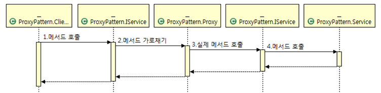
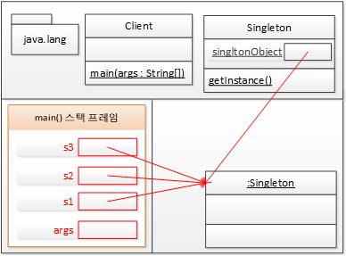
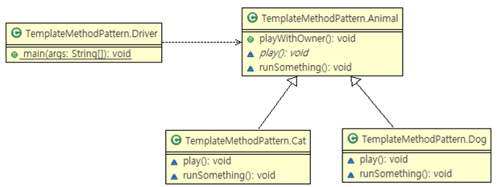
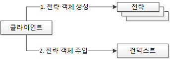

# 디자인 패턴

- 프로그램을 작성하다 보면 비슷 비슷한 상황에 직면하게 되는 경우가 많은데, 그러한 상황에서 이전의 많은 개발자들이 고민하고 정제한 사실 상의 표준 설계 패턴
- 실제 개발 현장에서 비즈니스 요구 사항을 프로그래밍으로 처리하면서 만들어진 다양한 해결책 중에서 많은 사람들이 인정한 베스트 프랙티스를 정리한 것
- 디자인 패턴은 당연히 객체 지향 특성과 설계 원칙을 기반으로 구현돼 있다.

> 💡스프링 프레임워크의 공식적인 정의  
> "자바 엔터프라이즈 개발을 편하게 해주는 오픈소스 경량급 애플리케이션 프레임워크"

# 어댑터 패턴(Adapter Pattern)

> 한 클래스의 인터페이스를 클라이언트에서 사용하고자하는 다른 인터페이스로 변환한다.
> 어댑터를 이용하면 인터페이스 호환성 문제 때문에 같이 쓸 수 없는 클래스들을 연결해서 쓸 수 있다,

- 합성, 즉 객체를 속성으로 만들어서 참조하는 디자인 패턴
- <strong>호출당하는 쪽의 메서드를 호출하는 쪽의 코드에 대응하도록 중간에 변환기를 통해 호출하는 패턴</strong>
- 변환기의 역할은 서로 다른 두 인터페이스 사이에 통신이 가능하게 하는 것

ODBC/JDBC가 어댑터 패턴을 이용해 다양한 데이터베이스 시스템을 단일한 인터페이스로 조작할 수 있게 해준다.  
'어플리케이션' - '어댑터' - '실제 구현체'

```java
package adapterPattern;

public class ServiceA {
    void runServiceA() {
        System.out.println("ServiceA");
    }
}

package adapterPattern;

public class ServiceB {
    void runServiceB() {
        System.out.println("ServiceB");
    }
}

```

```java
package adapterPattern;

public class AdapterServicA {
    ServiceA sa1 = new ServiceA();

    void runService() {
        sa1.runServiceA();
    }

}
```

```java
package adapterPattern;

public class AdapterServicB {
    ServiceB sb1 = new ServiceB();

    void runService() {
        sb1.runServiceB();
    }

}

```

```java
//어댑터 패턴이 적용되지 않은 코드 
package adapterPattern;

public class ClientWithNoAdapter {
    public static void main(String[] args) {
        ServiceA sa1 = new ServiceA();
        ServiceB sb1 = new ServiceB();

        sa1.runServiceA();
        sb1.runServiceB();
    }

}

//어댑터 패턴이 적용된 코드 package adapterPattern;
public class ClientWithAdapter {
    public static void main(String[] args) {
        AdapterServicA asa1 = new AdapterServicA();
        AdapterServicB asb1 = new AdapterServicB();

        asa1.runService();
        asb1.runService();
    }

}
```

클라이언트(ClientWithAdapter)가 변환기를 통해 runService()라는 동일한 메서드명으로 두 객체의 메서드를 호출하는 것을 볼 수 있다.

좀 더 개선해보자면 어탭터가 특정 인터페이스를 구현하게 해서 하나의 인터페이스에서 의존관계 주입을 통해 똑같은 메서드로 각각 다른 구현체의 메서드를 호출할 수 있다.

# 프록시 패턴(Proxy Pattern)

- 프록시는 대리자, 대변인(다른 누군가를 대신해 그 역할을 수행하는 존재)이라는 뜻을 가진다.
- 대리자는 실제 서비스와 같은 이름의 메서드를 구현하는데, 이를 위해 인터페이스를 사용한다.
- 대리자는 실제 서비스에 대한 참조 변수를 갖는다.(합성)
- 대리자는 실제 서비스의 같은 이름을 가진 메서드를 호출하고 그 값을 클라이언트에게 돌려준다.
- 대리자는 실제 서비스의 메서드 호출 전후에 별도의 로직을 수행할 수도 있다.
- <strong>프록시 패턴은 실제 서비스 메서드의 반환값에 가감하는 것을 목적으로 하지 않고 제어의 흐름을 변경하거나 다른 로직을 수행하기 위해 사용</strong>
- <strong>제어 흐름을 조정하기 위한 목적으로 중간에 대리자를 두는 패턴</strong>

```java
//IService.java
package proxyPattern;

public interface IService {
    String runSomething();
}
```

```java
//IService 인터페이스를 구현한 Service.java
package proxyPattern;

public class Service implements IService {
    public String runSomething() {
        return "서비스 짱!!!";
    }
}
```

```java
//IService 인터페이스를 구현한 Proxy.java
package proxyPattern;

public class Proxy implements IService {
    IService service1;

    public String runSomething() {
        System.out.println("호출에 대한 흐름 제어가 주목적, 반환 결과를 그대로 전달");

        service1 = new Service();
        return service1.runSomething();
    }
}
```

```java
//프록시를 사용하는 ClientWithProxy.java
package proxyPattern;

public class ClientWithProxy {
    public static void main(String[] args) {
//프록시를 이용한 호출
        IService proxy = new Proxy();
        System.out.prinln(proxy.runSomething());
    }
}
```

<프록시 패턴을 적용한 후 시퀀스 다이어그램>


# 데코레이터 패턴(Decorator Pattern)

- 데코레이터 패턴은 클라이언트가 받는 반환값에 장식을 더한다는 점만 빼면 프록시 패턴과 동일
- 장식자는 실제 서비스와 같은 이름의 메서드를 구현한다. 이때 인터페이스를 사용한다.
- 장식자는 실제 서비스에 대한 참조 변수를 갖는다(합성).
- 장식자는 실제 서비스의 같은 이름을 가진 메서드를 호출하고, 그 반환값에 장식을 더해 클라이언트에게 돌려준다.
- 장식자는 실제 서비스의 메서드 호출 전후에 별도의 로직을 수행할 수 있다.
- 메서드 호출의 반환값에 변화를 주기 위해 중간에 장식자를 두는 패턴

```java
//IService.java
package decoratorPattern;

public interface IService {
    public abstract String runSomething();
}
```

```java
//IService 인터페이스를 구현한 Service.java
package decoratorPattern;

public class Service implements IService {
    public String runSomething() {
        return "서비스 짱!!!";
    }
}
```

```java
//IService 인터페이스를 구현한 Decorator.java
package decoratorPattern;

public class Decoreator implements IService {
    IService service;

    public String runSomething() {
        System.out.println("호출에 대한 장식 주목적, 클라이언트에게 반환 결과에 장식을 더하여 전달");

        service = new Service();
        return "정말" + service.runSomething();
    }
}
```

```java
//데코레이터를 사용하는 ClientWithDecorator.java
package decoratorPattern;

public class ClientWithDecolator {
    public static void main(String[] args) {
        IService decoreator = new Decoreator();
        System.out.println(decoreator.runSomething());
    }
}
```

# 싱글턴 패턴(Singleton Pattern)

- private 생성자를 갖는다.
- 단일 객체 참조 변수를 정적 속성으로 갖는다.
- 단일 객체 참조 변수가 참조하는 단일 객체를 반환하는 getInstance() 정적 메서드를 갖는다.
- 단일 객체는 쓰기 가능한 속성을 갖지 않는 것이 정석이다.
- 클래스의 인스턴스, 즉 객체를 하나만 만들어서 사용하는 패턴(인스턴스를 하나만 만들고 그것을 재사용)

```java
//Singleton.java
package singletonPattern;

public class Singleton {
    static Singleton singletonObject; // 정적 참조 변수

    private Singleton() {
    }

    ; // private 생성자

    // 객체 반환 정적 메서드
    public static Singleton getInstance() {
        if (singletonObject == null) {     //정적 참조 변수에 객체가 할당돼 있지 않은 경우에만 new를 통해 객체를 만들고 정적 참조 변수에 할당
            singletonObject = new Singleton();
        }

        return singletonObject;
    }
}
```

```java
//Client.java
package singletonPattern;

public class Client {
    public static void main(String[] args) {
// private 생성자임으로 new 할 수 없다.
// Singleton s = new Singleton();

        Singleton s1 = Singleton.getInstance();
        Singleton s2 = Singleton.getInstance();
        Singleton s3 = Singleton.getInstance();

        System.out.println(s1);
        System.out.println(s2);
        System.out.println(s3);

        s1 = null;
        s2 = null;
        s3 = null;
    }
}
```

4개의 참조 변수가 하나의 단일 객체를 참조 → 싱글턴 패턴의 힘


단일 객체인 경우 결국 공유 객체로 사용되기 때문에 속성을 갖지 않게 하는 것이 정석이다.  
단일 객체가 속성을 갖게 되면 하나의 참조 변수가 변경한 단일 객체의 속성이 다른 참조 변수에 영향을 미치기 때문이다.  
읽기 전용 속성을 갖는 것은 문제가 되지 않는다. 단일 객체가 다른 단일 객체에 대한 참조를 속성으로 가진 것 또한 문제가 되지 않는다.

# 템플릿 메서드 패턴(Template Method Pattern)

- 상위 클래스에 공통 로직을 수행하는 템플릿 메서드와 하위 클래스에 오버라이딩을 강제하는 추상 메서드 또는 선택적으로 오버라이딩할 수 있는 훅(Hook) 메서드를 두는 패턴
- 템플릿 메서드: 공통 로직을 수행, 로직 중에 하위 클래스에서 오버라이딩한 추상 메서드/훅 메서드를 호출
- 템플릿 메서드에서 호출하는 추상 메서드: 하위 클래스가 반드시 오버라이딩해야 한다.
- 템플릿 메서드에서 호출하는 훅(Hook, 갈고리) 메서드: 하위 클래스가 선택적으로 오버라이딩한다.
- 상위 클래스의 견본 메서드에서 하위 클래스가 오버라이딩한 메서드를 호출하는 패턴

```java
public class Dog {
    public void playWithOwner() {
        System.out.println("귀염둥이 이리온...");
        **System.out.println("멍! 멍!");**
        System.out.println("꼬리 살랑 살랑~");
        System.out.println("잘했어");
    }
}

public class Cat {
    public void playWithOwner() {
        System.out.println("귀염둥이 이리온...");
        **System.out.println("야옹~ 야옹~");**
        System.out.println("꼬리 살랑 살랑~");
        System.out.println("잘했어");
    }
}
```

**이 붙어 있는 코드를 제외한 코드가 모두 비슷하다는 것을 관찰할 수 있다.

```java
//상위 클래스를 포함하는 Animal.java package templateMethodPattern;

public abstract class Animal { // 템플릿 메서드 public void playWithOwner() { System.out.println("귀염둥이 이리온..."); play();
    runSomething(); System.out.println("잘했어");}

    // 추상 메서드
    abstract void play();

    // Hook(갈고리) 메서드
    void runSomething() {
        System.out.println("꼬리 살랑 살랑~");
    }

}
```

```java
//하위 클래스를 포함하는 Dog.java package templateMethodPattern;

public class Dog extends Animal {
    @Override // 추상 메서드 오버라이딩 void play() { System.out.println("멍! 멍!"); }

    @Override
        // Hook(갈고리) 메서드 오버라이딩
    void runSomething() {
        System.out.println("멍! 멍!~ 꼬리 살랑 살랑~");
    }

}
```

```java
//하위 클래스를 포함하는 Cat.java package templateMethodPattern;

public class Cat extends Animal {
    @Override // 추상 메서드 오버라이딩 void play() { System.out.println("야옹~ 야옹~"); }

    @Override
        // Hook(갈고리) 메서드 오버라이딩
    void runSomething() {
        System.out.println("야옹~ 야옹~ 꼬리 살랑 살랑~");
    }

}
```

```java
//Driver.java package templateMethodPattern;

public class Driver {
    public static void main(String[] args) {
        Animal bolt = new Dog();
        Animal kitty = new Cat();

        bolt.playWithOwner();

        System.out.println();
        System.out.println();

        kitty.playWithOwner();
    }

}
```



# 팩터리 메서드 패턴(Factory Method Pattern)

- 팩터리 메서드는 객체를 생성 반환하는 메서드를 말한다.
- 하위 클래스에서 팩터리 메서드를 오버라이딩해서 객체를 반환하게 하는 것 오버라이드된 메서드가 객체를 반환하는 패턴

```java
//추상 클래스를 나타내는 Animal.java
package factoryMethodPattern;

public abstract class Animal {
    // 추상 팩터리 메서드
    abstract AnimalToy getToy();
}

```

```java
//추상 클래스를 나타내는 AnimalToy.java
package factoryMethodPattern;

// 팩터리 메서드가 생성할 객체의 상위 클래스 
public abstract class AnimalToy {
    abstract void identify();
}
```

```java
//Dog.java 
package factoryMethodPattern;

public class Dog extends Animal {
    // 추상 팩터리 메서드 오버라이딩 
    @Override
    AnimalToy getToy() {
        return new DogToy();
    }
}

```

```java
//DogToy.java 
package factoryMethodPattern;

//팩터리 메서드가 생성할 객체 
public class DogToy extends AnimalToy {
    public void identify() {
        System.out.println("나는 테니스공! 강아지의 친구 !");
    }
}
```

```java
//Cat.java 
package factoryMethodPattern;

public class Cat extends Animal {
    // 추상 팩터리 메서드 오버라이딩
    @Override
    AnimalToy getToy() {
        return new CatToy();
    }
}
```

```java
//CatToy.java 
package factoryMethodPattern;

//팩터리 메서드가 생성할 객체 
public class CatToy extends AnimalToy {
    @Override
    public void identify() {
        System.out.println("나는 캣타워! 고양이의 친구 !");
    }
}
```

```java
//Driver.java 
package factoryMethodPattern;

public class Driver {
    public static void main(String[] args) { // 팩터리 메서드를 보유한 객체들 생성 Animal bolt = new Dog(); Animal
        kitty = new Cat();

        // 팩터리 메서드가 반환하는 객체들
        AnimalToy boltBall = bolt.getToy();
        AnimalToy kittyTower = kitty.getToy();

        // 팩터리 메서드가 반환한 객체들을 사용
        boltBall.identify();
        kittyTower.identify();
    }

}
```

# 전략 패턴(Strategy Pattern)

- <strong>클라이언트가 전략을 생성해 전략을 실행할 컨텍스트에 주입하는 패턴</strong>
- 전략 패턴에는 OCP, DIP가 적용된다.

### 전략 패턴을 구성하는 세 요소

- 전략 메서드를 가진 전략 객체
- 전략 객체를 사용하는 컨텍스트(전략 객체의 사용자/소비자)
- 전략 객체를 생성해 컨텍스트에 주입하는 클라이언트(제3자, 전략 객체의 공급자)  
  

```java
//전략 인터페이스를 나타내는 Strategy.java 
package strategyPattern;

public interface Strategy {
    public abstract void runStrategy();
}

```

```java
//전략 인터페이스를 구현하는 StrategyGun.java 
package strategyPattern;

public class StrategyGun implements Strategy {
    @Override
    public void runStrategy() {
        System.out.println("탕, 타탕, 타다당");
    }
}
```

```java
//전략 인터페이스를 구현하는 StrategySword.java 
package strategyPattern;

public class StrategySword implements Strategy {
    @Override
    public void runStrategy() {
        System.out.println("챙.. 채쟁챙 챙챙");
    }
}
```

```java
//전략 인터페이스를 구현하는 StrategyBow.java 
package strategyPattern;

public class StrategyBow implements Strategy {
    @Override
    public void runStrategy() {
        System.out.println("슝.. 쐐액.. 쉑, 최종 병기");
    }
}
```

```java
//전략을 사용하는 컨텍스트 Soldier.java 
package strategyPattern;

public class Soldier {
    void runContext(Strategy strategy) {
        System.out.println("전투 시작");
        strategy.runStrategy();
        System.out.println("전투 종료");
    }
}

```

```java
//전략 패턴의 클라이언트 Client.java 
package strategyPattern;

public class Client {
    public static void main(String[] args) {
        Strategy strategy = null;
        Soldier rambo = new Soldier();

        //총을 람보에게 전달해서 전투를 수행하게 한다.
        strategy = new StrategyGun();
        ;
        rambo.runContext(strategy);

        System.out.println();

        // 검을 람보에게 전달해서 전투를 수행하게 한다.
        strategy = new StrategySword();
        rambo.runContext(strategy);

        System.out.println();

        // 활을 람보에게 전달해서 전투를 수행하게 한다.
        strategy = new StrategyBow();
        rambo.runContext(strategy);
    }

}
```

클라이언트는 전략을 다양하게 변경하면서 컨텍스트를 실행할 수 있다.

# 템플릿 콜백 패턴(Template Callback Pattern - 견본/회신 패턴)

- 전략 패턴의 변형으로, DI(의존성 주입)에서 사용하는 특별한 형태의 전략 패턴
- 전략을 익명 내부 클래스로 정의해서 사용한다는 것이 특징
- <strong>전략을 익명 내부 클래스로 구현한 전략 패턴</strong>

```java
//전략 인터페이스 Strategy.java 
package templateCallbackPattern;

public interface Strategy {
    public abstract void runStrategy();
}
```

```java
//전략을 사용하는 컨텍스트 Soldier.java 
package templateCallbackPattern;

public class Soldier {
    void runContext(Strategy strategy) {
        System.out.println("전투 시작");
        strategy.runStrategy();
        System.out.println("전투 종료");
    }
}
```

```java
//익명 내부 전략을 사용하는 클라이언트 Client.java 
package templateCallbackPattern;

public class Client {
    public static void main(String[] args) {
        Soldier rambo = new Soldier();

        /*
         * Strategy strategy = new StrategyGun();
         * rambo.runContext(strategy);
         */

        /*
         * Strategy strategy = new IStrategy() {
         *
         * @Override public void doStrategy() {
         * System.out.println("총! 총초종총 총! 총!"); } };
         *
         * rambo.runContext(strategy);
         */

        rambo.runContext(new Strategy() {
            @Override
            public void runStrategy() {
                System.out.println("총! 총초종총 총! 총!");
            }
        });

        System.out.println();

        rambo.runContext(new Strategy() {
            @Override
            public void runStrategy() {
                System.out.println("칼! 카가갈 칼! 칼!");
            }
        });

        System.out.println();

        rambo.runContext(new Strategy() {
            @Override
            public void runStrategy() {
                System.out.println("도끼! 독독..도도독 독끼!");
            }
        });
    }

}
```
익명 내부 클래스를 사용해서 오버라이드해서 사용하는 것을 볼 수 있다. (따로 클래스를 구현하지 않고 사용함 [콜백])

위 코드는 중복 코드가 발생한다. 즉, 리팩터링이 가능하다.
### 리팩터링 해보기

```java
//Strategy.java package 
templateCallbackPatternRefactoring;

public interface Strategy {
    public abstract void runStrategy();
}
```

```java
//Soldier.java 
package templateCallbackPatternRefactoring;

public class Soldier {
    void runContext(String weaponSound) {
        System.out.println("전투 시작");
        executeWeapon(weaponSound)
                .runStrategy();
        System.out.println("전투 종료");
    }

    private Strategy executeWeapon(final String weaponSound) {
        return new Strategy() {
            @Override
            public void runStrategy() {
                System.out.println(weaponSound);
            }
        };
    }

}
```

```java
//Client.java 
package templateCallbackPatternRefactoring;

public class Client {
    public static void main(String[] args) {
        Soldier rambo = new Soldier();

        rambo.runContext("총! 총초종총 총! 총!");

        System.out.println();

        rambo.runContext("칼! 카가갈 칼! 칼!");

        System.out.println();

        rambo.runContext("도끼! 독독..도도독 독끼!");
    }

}
```
중복되는 전략을 생성하는 코드가 컨텍스트 내부로 들어왔다. (중복되는 부분을 컨텍스트로 이관)

스프링은 이런 형식으로 리팩터링된 템플릿 콜백 패턴을 DI에 적극 활용하고 있다.


