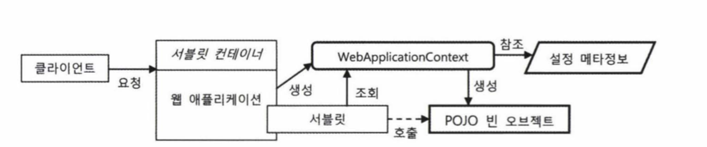
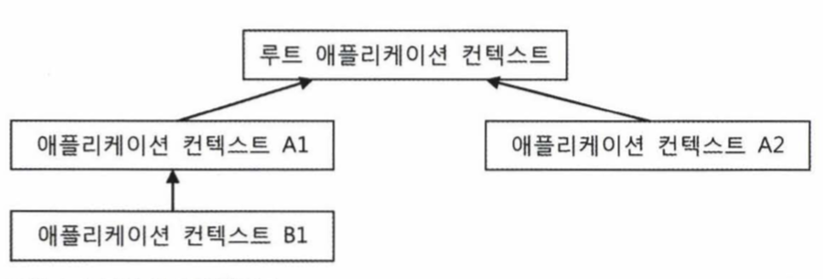
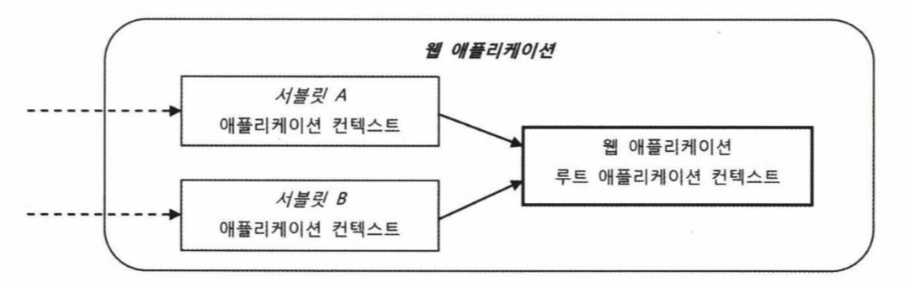
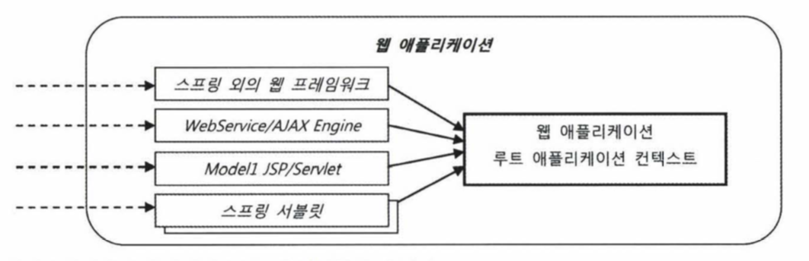

# 1. IoC 컨테이너와 DI

## 1.1 IoC 컨테이너 : 빈 팩토리와 애플리케이션 컨텍스트

- 스프링 애플리케이션에서는 오브젝트의 생성과 관계설정, 사용, 제거 등의 작업을 애플리케이션 코드 대신 독립된 컨테이너가 담당한다. 이를 컨테이너가 코드 대신 오브젝트에 대한 제어권을 갖고 있다고 해서 IoC라고 부른다. 그래서 스프링 컨테이너를 IoC 컨테이너라고도한다.
- 스프링 컨테이너는 단순한 DI 작업 보다 더 많은 일을 한다. DI를 위한 빈 팩토리에 엔터프라이즈 애플리케이션을 개발하는 데 필요한 여러 가지 컨테이너 기능을 추가한 것을 애플리케이션 컨텍스트라고 부른다.
- 스프링의 빈 팩토리와 애플리케이션 컨텍스트는 각각 기능을 대표하는 BeanFactory와 ApplicationContext라는 두 개의 인터페이스로 정의되어 있다. ApplicationContext 인터페이스는 BeanFactory 인터페이스를 상속한 서브인터페이스다.

 > 빈팩토리  
 > 오브젝트의 생성과 오브젝트 사이의 런타임 관계를 설정하는 DI 관점으로 볼 때는 컨테이너를 빈팩토리라고 한다.

>애플리케이션 컨텍스트  
>빈 팩토리 + 엔터프라이즈 애플리케이션을 개발하는 데 필요한 여러 가지 컨테이너 기능을 추가한 것
``` java
public interface ApplicationContext extends EnvironmentCapable, ListableBeanFactory, HierarchicalBeanFactory, MessageSource, ApplicationEventPublisher, ResourcePatternResolver {

	@Nullable
	String getId();

	String getApplicationName();

	String getDisplayName();

	long getStartupDate();
 
    @Nullable
	ApplicationContext getParent();

	AutowireCapableBeanFactory getAutowireCapableBeanFactory() throws IllegalStateException;
}
```

- 실제로 스프링 컨테이너 또는 IoC 컨테이너라고 말하는 것은 바로 이 ApplicationContext 인터페이스를 구현한 클래스의 오브젝트다.
- 스프링 애플리케이션은 최소한 하나 이상의 IoC 컨테이너, 즉 애플리케이션 컨텍스트 오브젝트를 갖고 있다. 하나 이상이라고하는 이유는 한 개 이상의 애플라케이션 컨텍스트 오브젝트를 갖고 있는 경우도 많기 때문이다.

### 1.1.1 IoC 컨테이너를 이용해 애플리케이션 만들기

IoC 컨테이너를 동작시키기 위해서는 크게 2가지가 필요하다. 하나는 POJO 클래스이며 다른 하나는 설정 메타 정보이다.

#### POJO 클래스

- 각자 기능에 충실하게 독립적으로 설계된 POJO 클래스를 만들고, 결합도가 낮은 유연한 관계를 가질 수 있도록 인터페이스를 이용해 연결해준다.

#### 설정 메타 정보

- POJO 클래스들 중에 애플리케이션에서 사용할 것을 선정하고 이를 IoC 컨테이너가 제어할 수 있도록 적절한 메타정보를 만들어 제공하는 작업이다.
- 스프링의 설정 메타정보는 BeanDefinition 인터페이스로 표현되는 순수한 추상 정보다.
- 스프링 IoC 컨테이너, 즉 애플리케이션 컨텍스트는 바로 이 BeanDefinition으로 만들어진 메타정보를 담은 오브젝트를 사용해 IoC와 DI 작업을 수행한다. 따라서 스프링의 메타정보는 특정한 파일 포맷이나 형식에 제한되거나 종속되지 않는다. 대신 XML이든 소스코드 애노테이션이든 자바 코드이든 프로퍼티 파일이든 상관없이 BeanDefinition으로 정의되는 스프링의 설정 메타정보의 내용을 표현한 것이 있다면 무엇이든 사용 가능하다.
- 원본의 포맷과 구조 자료의 특성에 맞게 읽어와 BeanDefinition 오브젝트로 변환해주는 BeanDefinitionReader가 있으면 된다. 당연히 BeanDefinitionReader도 인터페이스다. 따라서 이를 구현한 리더를 만들기만 하면 스프링의 설정 메타정보는 어떤 형식으로든 작성할 수 있다.

BeanDefinition 인터페이스로 정의되는, IoC 컨테이너가 사용하는 빈 메타정보는 대략 다음과 같다.

- 빈아이디, 이름, 별칭 : 빈오브젝트를 구분 할 수 있는 식별자
- 클래스 또는 클래스 이름 : 빈으로 만들 POJO 클래스 또는 서비스 클래스 정보
- 스코프 : 싱글톤, 프로토타입과 같은 빈의 생성 방식과 존재 범위
- 프로퍼티 값 또는 참조 : DI에 사용할 프로퍼티 이름과 값 또는 참조하는 빈의 이름
- 생성자 파라미터 값 또는 참조 : DI에 사용할 생성자 파라미터 이름과 값 또는 참조할 빈의 이름
- 지연된 로딩 여부, 우선 빈 여부, 자동와이어링 여부, 부모 빈 정보, 빈팩토리 이름 등

> 일반적으로 설정 메타정보는 XML 파일이나 애노테이션 같은 외부 리소스를 전용 리더가 읽어서 BeanDefinition 타입의 오브젝트로 만들어 사용한다. 원한다면 직접 코드에서 BeanDefinition 메타정보를 생성할 수도 있다.

- 빈은 오브젝트 단위로 등록되고 만들어지기 때문에 같은 클래스 타입이더라도 하나 이상의 빈으로 등록할 수 있다.

애플리케이션을 구성하는 빈 오브젝트를 생성하는 것이 IoC 컨테이너의 핵심기능이다. IoC 컨테이너는 일단 빈 오브젝트가 생성되고 관계가 만들어지면 그 뒤로는 거의 관여하지 않는다. 기본적으로 싱글톤 빈은 애플리케이션 컨텍스트의 초기화 작업 중에 모두 만들어진다.

### 1.1.2 IoC 컨테이너의 종류와 사용 방법

#### StaticApplicationContext

StaticApplicationContext는 코드를 통해 빈 메타정보를 등록하기 위해 사용한다. 스프링의 기능에 대한 학습 테스트를 만들 때를 제외하면 실제로 사용되지 않는다.

> 스태틱 애플리케이션 컨텍스트는 실전에서는 사용하면 안 된다. 테스트 목적으로 코드를 통해 빈을 등록하고 컨테이너가 어떻게 동작하는지 확인하고 싶을 때를 대비해 이런 컨테이너가 있다는 정도만 기억해두자.

#### GenericApplicationContext

- GenericApplicationContext는 가장 일반적인 애플리케이션 컨텍스트의 구현 클래스다. 실전에서 사용될 수 있는 모든 기능을 갖추고 있는 애플리케이션 컨텍스트다. 컨테이너의 주요 기능을 DI를 통해 확장할 수 있도록 설계되어 있다.
- GenericApplicationContext는 StaticApplicationContext외는 달리 XML 파일과 같은 외부의 리소스에 있는 빈 설정 메타정보를 리더를 통해 읽어들여서 메타정보로 전환해서 사용한다.
- 특정 포맷의 빈 설정 메타정보를 읽어서 이를 애플리케이션 컨텍스트가 사용할 수있는 BeanDefinition 정보로 변환하는 기능을 가진 오브젝트는 BeanDefinitionReader 인터페이스를 구현해서 만들고, 빈 설정 정보 리더라고 불린다. XML로 작성된 빈 설정 정보를 읽어서 컨테이너에게 전달하는 대표적인 빈 설정정보 리더는 XmlBeanDefinitionReader다.
- 스프링 IoC 컨테이너가 사용할 수 있는 BeanDefinition 오브젝트로 변환만 될 수 있다면 설정 메타정보는 어떤 포맷으로 만들어져도 상관없다. 스프링은 XML 말고도 프로퍼티 파일에서 빈 설정 메타정보를 가져오는 PropertiesBeanDefinitionReader도 제공한다. 이를 이용하면 프로퍼티 파일 안에 아래와 같이 빈 설정 메타정보를 작성할 수도 있다.

``` properties
printer.(Class)=springbook.learningtest.spring.ioc.bean.StringPrinter

hello.(Class)=springbook.learningtest.spring.ioc.bean.Hello
hello.name=Spring
hello.printer(ref)=printer
```

- GenericApplicationContext는 빈 설정 리더를 여러 개 사용해서 여러 리소스로부터 설정 메타정보를 읽어들이게도 할 수 있다. 모든 설정 메타정보를 가져온 후에 refresh( ) 메소드를 한 번 호출해서 애플리케이션 컨텍스트가 필요한 초기화 작업을 수행하게 해주면 된다.
- 아래와 같이 테스트 클래스를 만들었다면 테스트가 실행되면서 GenericApplicationContext가 생성되고 @ContextConfiguration에 지정한 XML 파일로 초기화돼서 테스트 내에서 사용할 수 있도록 준비된다.

``` java
@RunWith(SpringJUnit4ClassRunner.class)
@ContextConfiguration(locations = "/test-applicationContext.xml")
public class UserServiceTest {
	@Autowired ApplicationContext applicationContext;
}
```

#### GenericXmlApplicationContext

- 코드에서 GenericApplicationContext 를 사용하는 경우에는 번거롭게 XmlBeanDefinitionReader를 직접 만들지 말고, 이 두 개의 클래스가 결합된 GenericXmlApplicationContext를 사용하면 편리하다.
- GenericXmlApplicationContext는 XmlBeanDefinitionReader를 내장하고 있기 때문에, XML 파일을 읽어들이고 refresh()를 통해 초기화하는 것까지 한 줄로 끝낼 수 있다.

``` java
GenericApplicatonContext ac = new GenericXmlApplicationContext(
    "springbook/learningtest/spring/ioc/genericApplicationContext.xml");
Hello hello = ac.getBean("hello", Hello.class)
```

#### WebApplicationContext

스프링 애플리케이션에서 가장 많이 사용되는 애플리케이션 컨텍스트는 바로 WebApplicationContext다. WebApplicationContext는 ApplicationContext를 확장한 인터페이스이므로 정확히는 WebApplicationContext를 구현한 클래스를 사용하는 셈이다. 이름 그대로 웹 환경에서 사용할 때 필요한 기능이 추가된 애플리케이션 컨텍스트다. 스프링 애플리케이션은 대부분 서블릿 기반의 독립 웹 애플리케이션(WAR)으로 만들어지기 때문이다.

``` java
public interface WebApplicationContext extends ApplicationContext {

    // skip...
    
	/**
	 * Return the standard Servlet API ServletContext for this application.
	 */
	@Nullable
	ServletContext getServletContext();
}
```

- 가장 많이 사용되는건, XML 설정 파일을 사용하도록 만들어진 XmlWebApplicatoinContext다. 애노테이션을 이용한 설정 리소스만 사용한다면 AnnotationConfigWebApplicationContext를 쓰면 된다.

- 스프링 IoC 컨테이너는 빈 설정 메타정보를 이용해 빈 오브젝트를 만들고 DI 작업을 수행한다. 하지만 그것만으로는 애플리케이션이 동작하지 않는다. 마치 자바 애플리케이션의 main() 메소드처럼 어디에선가 특정 빈 오브젝트의 메소드를 호출함으로써 애플리케이션을 동작시켜야 한다. IoC 컨테이너의 역할은 초기에 빈 오브젝트를 생성하고 DI 한 후에 최초로 애플리케이션을 기동할 빈 하나를 제공해주는 것까지다.

- 웹 환경에서는 main() 메소드 대신 서블릿 컨테이너가 브라우저로부터 오는 HTTP 요청을 받아서 해당 요청에 매핑되어 있는 서블릿을 실행해주는 방식으로 동작한다. 서블릿이 일종의 main() 메소드와 같은 역할을 하는 셈이다.

- 그렇다면 웹 애플리케이션에서 스프링 애플리케이션을 기동시키는 방법은 무엇일까? 일단 main() 메소드 역할을 하는 서블릿을 만들어두고, 미리 애플리케이션 컨텍스트를 생성해둔 다음, 요청이 서블릿으로 들어올 때마다 getBean()으로 필요한 빈을 가져와 정해진 메소드를 실행해주면 된다.

  

- 위의 그림은 웹 환경에서 스프링 빈으로 이뤄진 애플리케이션이 동작하는 구조다.

    - 서블릿 컨테이너는 브라우저와 같은 클라이언트로부터 들어오는 요청을 받아서 서블릿을 동작시켜주는 일을 맡는다.
    - 서블릿은 웹 애플리케이션이 시작될 때 미리 만들어둔 웹 애플리케이션 컨텍스트에게 빈 오브젝트로 구성된 애플리케이션의 기동 역할을 해줄 빈을 요청해서 받아둔다.
    - 그리고 미리 지정된 메소드를 호출함으로써 스프링 컨테이너가 DI 방식으로 구성해둔 애플리케이션의 기능이 시작되는 것이다.

- 스프링은 이런 웹 환경에서 애플리케이션 컨텍스트를 생성하고 설정 메타 정보로 초기화해주고, 클라이언트로부터 들어오는 요청마다 적절한 빈을 찾아서 이를 실행해주는 기능을 가진 DispatcherServlet이라는 이름의 서블릿을 제공한다.

- WebApplicationContext의 특징은 자신이 만들어지고 동작하는 환경인 웹 모률에 대한 정보에 접근할 수 있다는 점이다. 이를 이용해 웹 환경으로부터 필요한 정보를 가져오거나, 웹 환경에 스프링 컨테이너 자신을 노출할 수 있다. 컨테이너가 웹 환경에 노출되면 같은 웹 모듈에 들어 있는 스프링 빈이 아닌 일반 오브젝트와 연동될 수 있다.

### 1.1.3 IoC 컨테이너 계층구조

#### 부모 컨텍스트를 이용한 계층구조 효과

- 모든 애플리케이션 컨텍스트는 부모 애플리케이션 컨텍스트를 가질 수 있다. 이를 이용하면 트리구조의 컨텍스트 계층을 만들 수 있다.
- 예를 들어 아래와 같은 구조의 애플리케이션 컨텍스트 계층이 만들어질 수 있다.



- 계층구조 안의 모든 컨텍스트는 각자 독립적인 설정정보를 이용해 빈 오브젝트를 만들고 관리한다. 각자 독립적으로 자신이 관리하는 빈을 갖고 있긴 하지만 DI를 위해 빈을 찾을 때는 부모 애플리케이션 컨텍스트의 빈까지 모두 검색한다.
- 먼저 자신이 관리하는 빈 중에서 필요한 빈을 찾아보고, 없으면 부모 컨텍스트에게 빈을 찾아달라고 요청한다. 부모 컨텍스트에서도 원하는 빈을 찾을 수 없다면 부모 컨텍스트의 부모 컨텍스트에게 다시 요청한다. 이렇게 계층구조를 따라서 가장 위에 존재하는 루트 컨텍스트까지 요청이 전달된다. 단 자신의 부모 컨텍스트에게만 빈 검색을 요청하지 자식 컨텍스트에게는 요청하지 않는다. 검색 순서는 항상 자신이 먼저이고, 그런 다음 직계 부모의 순서다.
- 부모 컨텍스트와 같은 이름의 빈을 자신이 정의해서 갖고 있다면 자신이 가진 것이 우선이고 부모 컨텍스트가 정의한 것은 무시된다. 미리 만들어진 애플리케이션 컨텍스트의 설정을 그대로 가져다가 사용하면서 그중 일부 빈만 설정을 변경하고 싶다면, 애플리케이션 컨텍스트를 두 개 만들어서 하위 컨텍스트에서 바꾸고 싶은 빈들을 다시 설정해줘도 된다.
- 계층구조를 이용하는 또 한 가지 이유는 여러 애플리케이션 컨텍스트가 공유하는 설정을 만들기 위해서다.
- 애플리케이션 컨텍스트의 계층구조를 사용할 때는 주의하지 않으면 자칫 예상치 못한 방식으로 동작할 수도 있기 때문에 조심해야 한다. 자신이 만든 스프링 애플리케이션이 어떻게 컨텍스트가 만들어지고, 어느 것이 루트 컨텍스트이고, 어느 것이 그 자식 컨텍스트가 되는지를 분명하게 알아야 한다. 자식 컨텍스트는 부모 컨텍스트의 빈을 사용할 수 있지만 그 반대는 안 된다는 사실을 기억해야 한다. AOP처럼 컨텍스트 안의 많은 빈에 일괄적으로 적용되는 기능은 대부분 해당 컨텍스트로 제한된다는 점도 주의하자.
- 기본적으로 스프링 웹 애플리케이션은 부모/자식 관계를 가진 두 개의 애플리케이션 컨텍스트로 구성된 계층구조로 만들어진다.
- 루트 컨텍스트는 반드시 스스로 완전한 빈 의존관계를 보장해야 한다.
- 자식 컨텍스트의 빈이 부모 컨텍스트 빈과 중복될 때는 자식 컨텍스트의 것이 우선한다는 사실을 확인 할 수 있다. 단 이때는 자식 컨텍스트에 빈 요청을 해야한다.

> 스프링이 일정한 규칙과 제어 방법을 제공하면서 중복 빈 정의를 계층 구조 내에서 허용한다고 하더라도 부모/자식 컨텍스트에 중복해서 빈이 정의되는 일은 가능한 한 피해야 한다. 개발자가 직관적으로 사용할 수 있는 구조를 제외하면 복잡한 계층구조 사이의 혼란스러운 빈 정의는 발견하기 매우 힘든 버그를 만들어낼 기능성이 높기 때문이다.

### 1.1.4 웹 어플리케이션의 IoC 컨테이너 구성

- 많은 웹 요청을 한 번에 받을 수 있는 대표 서블릿을 등록해두고, 공통적인 선행 작업을 수행하게 한 후에 각 요청의 기능을 담당하는 핸들러라고 불리는 클래스를 호출하는 방식으로 개발하는 경우가 일반적이다. 몇 개의 서블릿이 중앙 집중식으로 모든 요청을 다 받아서 처리하는 이런 방식을 프론트 컨트롤러 패턴이라고 한다. 스프링도 프론트 컨트롤러 패턴을 사용한다. 따라서 스프링 웹 애플리케이션에 사용되는 서블릿의 숫자는 하나이거나 많아야 두셋 정도다.

#### 웹 애플리케이션 컨텍스트 계층구조

- 웹 애플리케이션 안에서 동작하는 IoC 컨테이너는 두 가지 방법으로 만들어진다. 하나는 스프링 애플리케이션의 요청을 처리하는 서블릿 안에서 만들어지는 것이고, 다른 하나는 웹 애플리케이션 레벨에서 만들어지는 것이다. 일반적으로는 이 두 가지 방식을 모두 사용해 컨테이너를 만든다.
- 웹 애플리케이션 레벨에 등록되는 컨테이너는 보통 루트 웹 애플리케이션 컨텍스트라고 불린다. 이 컨텍스트는 서블릿 레벨에 등록되는 컨테이너들의 부모 컨테이너가 되고, 일반적으로 전체 계층구조 내에서 가장 최상단에 위치한 루트 컨텍스트가 되기 때문이다.
- 웹 애플리케이션에는 하나 이상의 스프링 애플리케이션의 프론트 컨트롤러 역할을 하는 서블릿이 등록될 수 있다. 이 서블릿에는 각각 독립적으로 애플리케이션 컨텍스트가 만들어진다. 이런 경우 각서블릿이 공유하게 되는 공통적인 빈들이 있을 것이고, 이런 빈들을 웹 애플리케이션 레벨의 컨텍스트에 등록하면 된다. 이런 경우 공통되는 빈들이 서블릿별로 중복돼서 생성되는 걸 방지할 수 있다.
- 아래 그림은 하나의 웹 애플리케이션 내에 두 개의 스프링 서블릿이 존재하는 경우에 만들어지는 애플리케이션 컨텍스트와 그 관계를 보여준다. 서블릿 A와 서블릿 B는 각각 자신의 전용 애플리케이션 컨텍스트를 갖고 있다. 동시에 두 컨텍스트가 공유해서 사용하는 빈을 담아놓을 수 있는 별도의 컨텍스트가 존재한다. 이 컨텍스트는 각 서블릿에 존재하는 컨텍스트의 부모 컨텍스트로 만든다. 또, 최상단에 위치하므로 계층구조에서 볼 때 루트 컨텍스트다.



- 서블릿 A와 서블릿 B의 컨텍스트는 서로 독립적으로 빈을 생성해서 동작하고, 공통적인 빈은 부모 컨텍스트인 루트 컨텍스트
  가 만든 것을 공유해서 사용할 수 있다.
- 일반적으로는 스프링의 애플리케이션 컨텍스트를 가지면서 프론트 컨트롤러 역할을 하는 서블릿은 하나만 만들어 사용한다.
- 스프링은 웹 애플리케이션마다 하나씩 존재하는 서블릿 컨텍스트를 통해 루트 애플리케이션 컨텍스트에 접근할 수 있는 방법을 제공한다. 다음과 같이 스프링의 간단한 유틸리티 메소드를 이용하면 스프링 밖의 어디서라도 웹 애플리케이션의 루트 애플리케이션 컨텍스트를 얻을 수 있다.

``` java
WebApplicationContextUtils.getWebApplicationContext(SevletContext sc)
```

- ServletContext는 웹 애플리케이션마다 하나씩 만들어지는 것으로, 서블릿의 런타임 환경정보를 담고 있다.
- 아래 그림은 스프링 외의 웹 기술을 포함해서 조합 가능한 웹 애플리케이션의 설정 구조를 보여준다.



#### 웹 애플리케이션의 컨텍스트 구성 방법

- 서블릿 컨텍스트와 루트 애플리케이션 컨텍스트 계층 구조 : 가장 많이 사용되는 기본적인 구성 방법이다. 스프링 웹 기술을 사용하는 경우 웹 관련 빈들은 서블릿의 컨텍스트에 두고 나머지는 루트 애플리케이션 컨텍스트에 등록한다. 루트 컨텍스트는 모든 서블릿 레벨 컨텍스트의 부모 컨텍스트가 된다
- 루트 애플리케이션 컨텍스트 단일 구조 : 스프링 웹 기술을 사용하지 않고 서드파티 웹 프레임워크나 서비스 엔진만을 사용해
  서 프레젠테이션 계층을 만든다면 스프링 서블릿을 둘 이유가 없다. 따라서 서블릿의 애플리케이션 컨텍스트도 사용하지 않게 된다.
- 서블릿 컨텍스트 단일 구조 : 스프링 웹 기술을 사용하면서 스프링 외의 프레임워크나 서비스 엔진에서 스프링의 빈을 이용할 생각이 아니라면 루트 애플리케이션 컨택스트를 생략할 수도 있다. 이때는 서블릿 안에 만들어지는 애플리케이션 컨텍스트가 부모 컨텍스트를 갖지 않기 때문에 스스로 루트 컨텍스트가 된다. 이렇게 만들어지는 서블릿 컨텍스트는 컨텍스트 계층 관점에서 보자연 루트 컨텍스트이지만 웹 애플리케이션 레벨에 두는 공유 가능한 루트 컨텍스트와는 구별된다.

#### 루트 애플리케이션 컨텍스트 등록

- 웹 애플리케이션 레벨에 만들어지는 루트 웹 애플리케이션 컨텍스트를 등록하는 가장 간단한 방법은 서블릿의 이벤트 리스너(event listener)를 이용하는 것이다.
- 스프링은 웹 애플리케이션의 시작과 종료 시 발생하는 이벤트를 처리하는 리스너인 ServletContextListener를 이용한다. 이를 이용해서 웹 애플리케이션이 시작될 때 루트 애플리케이션 컨텍스트를 만들어 초기화하고 웹 애플리케이션이 종료될 때 컨텍스트를 함께 종료하는 기능을 가진 리스너를 만들 수 있다. 스프링은 이러한 기능을 가진 리스너인 ContextLoaderListener를 제공한다.
- ContextLoaderListener는 웹 애플리케이션이 시작할 때 자동으로 루트 애플리케이션 컨텍스트를 만들고 초기화해준다. 그렇다면 이 리스너가 만들어주는 컨텍스트는 어떤 종류이고 어떤 설정파일을 사용할까? 별다른 파라미터를 지정하지 않으면, 디폴트로 설정된 다음의 값이 적용된다.
    - 애플리케이션 컨텍스트 클래스 : XmlWebApplicationContext
    - XML 설정파일 위치 : /WEB-INF/applicationContext.xml
- 컨텍스트 클래스와 설정파일 위치는 서블릿 컨텍스트 파라미터를 선언해서 변경할 수 있다. ContextLoaderListener가 이용할 파라미터를 \<context-param> 항목 안에 넣어주면 디폴트 설정 대신 파라미터로 지정한 내용이 적용된다.

#### 서블릿 애플리케이션 컨텍스트 등록

- 스프링의 웹 기능을 지원하는 프론트 컨트롤러 서블릿은 DispatcherServlet이다. DispatcherServlet은 이름에서 알 수 있듯이 web.xml에 등록해서 사용할 수 있는 평범한 서블릿이다.
- 서블릿 이름을 다르게 지정해주면 하나의 웹 애플리케이션에 여러 개의 DispatcherServlet을 등록할 수도 있다. 각 DispatcherServlet은 서블릿이 초기화 될 때 자신만의 컨텍스트를 생성하고 초기화한다. 동시에 웹 애플리케이션 레벨에 등록된 루트 애플리케이션 컨텍스트를 찾아서 이를 자신의 부모 컨텍스트로 사용한다.
- DispatcherServlet을 등록할 때 신경 써야 할 사항은 다음 두가이다.
    - \<servlet-name> : DispatcherServlet에 의해 만들어지는 애플리케이션 컨텍스트는 모두 독립적인 네임스페이스를 갖게 된다. 이 네임스페이스는 서블릿 단위로 만들어지는 컨텍스트를 구분하는 키가 된다. 네임스페이스는 \<servlet-name>으로 지정한 서블릿 이름에 "-servlet"을 붙여서 만든다. 서블릿 이름이 spnng이라면 네임스페이스는 spring-
      servlet이 된다. 네임스페이스가 중요한 이유는 DispatcherServlet이 사용할 디폴트 XML 설정 파일의 위치를 네임스페이스를 이용해서 만들기 때문이다. 서블릿 컨텍스트가 사용할 디폴트 설정파일은 다음와 같은 규칙으로 만들어진다. "/WEB-INF/ + 서블릿 네임스페이스 + ".xml""
    - \<load-on-startup> : 서블릿 컨테이너가 등록된 서블릿을 언제 만들고 초기화할지, 또 그 순서는 어떻게 되는지를 지정하는 정수 값이다. 이 항목을 아예 생략하거나 음의 정수로 넣으면 해당 서블릿은 서블릿 컨테이너가 임의로 정한 시점에서 만들어지고 초기화된다. 반대로 0 이상의 값을 넣으면 웹 애플리케이션이 시작되는 시점에서 서블릿을 로딩하고 초기화한다. 또한 여러 개의 서블릿이 등록되어 있다면 작은수를 가진 서블릿이 우선적으로 만들어진다. DispatcherServlet은 서블릿의 초기화 작업 중에 스프링 컨텍스트를 생성한다. 컨텍스트의 설정이나 환경에 문제가 있다면 컨텍스트 생성 시 대부분 확인이 가능하다. 따라서 웹 애플리케이션이 시작되고 가능한 한 빨리 서블릿 컨텍스트의 초기화가 진행되는 것이 바람직하다. 그래야만 컨텍스트와 빈의 초기화 작업을 통해 문제를 빨리 파악 할 수 있기 때문이다. 그래서 보통 1을 넣는다.


출처 : 토비의 스프링