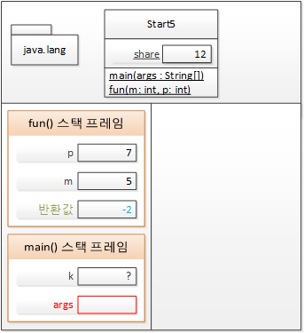

# 자바 프로그래밍 개발과 구동

자바는 자바 개발도구인 JDK를 이용해 개발되고 개발된 프로그램은 JRE에 의해 컴퓨터의 JVM 상에서 구동된다.

- JDK: 컴파일러 포함

- JRE: 자바 실행기 포함

- JVM: 자바 가상 기계


자바 개발자는 본인이 사용 중인 플랫폼에 설치된 JVM용으로 프로그램을 작성하고 배포하면 각 플랫폼에 맞는 JVM이 알아서 프로그램을 아무 문제없이 구동시켜준다.

-> 이러한 자바의 특성을 <strong>"Write Once Run Anywhere"</strong> 라고 한다.

### 객체 지향 프로그램의 메모리 사용 방식

  
메모리 구성

# 프로그램 실행에 따른 T 메모리 구조 변화


T메모리 구조는 <strong>스태틱 영역, 스택 영역, 힙 영역</strong>으로 나눌 수 있다.

실행 코드

```java
public class Start {
    public static void main(String[] args) {
        System.out.println("Hello OOP!!!");
    }
}
```

### main() 메서드 실행되기 전 JVM에서 수행하는 전처리 작업

- java.lang 패키지를 T 메모리 <strong>스태틱 영역에 배치</strong>
- import 된 패키지를 T 메모리 <strong>스태틱 영역에 배치</strong>
- 프로그램 상의 모든 클래스를 T 메모리 <strong>스태틱 영역에 배치</strong>

메인 메서드가 실행되려면 메인 메서드를 위한 <strong> "스택 프레임"</strong>이 필요하다. 이를 스택 영역에 확보해준다.

이후 메서드의 <strong>"인자를 저장할 변수공간"</strong>을 스택 프레임의 맨 밑에 확보한다.
  
메인 메서드 스택 프레임과 인자 변수 공간

간단한 프로그램을 시작하기 위해 JRE는 뒤에서 JVM이라는 가상 머신을 부팅하고 JVM은 메모리 구조를 만들어 각종 패키지 로딩, 메인 메서드 스택 프레임 배치, 변수 공간 배치 등의 일을 처리했다.

메서드의 끝을 나타내는 닫는 중괄호를 만나면 생성한 <strong>"스택 프레임"</strong>이 사라진다. <strong>프로그램의 시작점인 메인 메서드가 끝나면 JRE는 JVM을 종료하고 JRE 자체도 운영체제
상의 메모리에서 사라지게 된다.</strong>

# 변수와 블록을 생성하면 메모리 구조는 어떻게 변화할까?

실행 코드

```java
public class Start2 {
    public static void main(String[] args) {
        int i;
        i = 10;

        double d = 20.0;
    }
}
```

#### 실행 후 메모리 구조

  
i를 선언하게 되면 JVM이 i 변수를 위한 스택 공간을 확보한다. 이 후 값을 할당하면 변수 공간에 값을 할당하게 된다.

d는 선언과 동시에 값을 할당했다. <strong>똑같이 스택 공간을 먼저 확보하고 값을 할당하게 된다.</strong>

### 블록 스택 프레임


if 블록 사용시에도 <strong>새로운 스택 프레임</strong>이 생성된다.

이 때 if 블록 밖에 있는 메인 메서드 내 변수에는 접근이 가능하다.

하지만, 메인 메서드에서는 if문에 있는 변수에 접근할 수 없다.

-> 메인 메서드 실행 시에는 `[if 스택 프레임]`이 존재할 수 없으므로

# 변수는 어디에 존재할까?

"변수는 메모리에 존재한다."

변수는 스택, 힙, 스태틱 영역 3군데 모두에 존재한다.

<strong>지역 변수</strong>는 <strong>스택 프레임</strong> 안에서 일생을 보낸다.

<strong>클래스 멤버 변수</strong>는 <strong>스태틱 영역</strong>에서 일생을 보낸다. (스태틱 영역에 자리잡으면 JVM이 종료될 때까지 고정된(static)상태로 영역을 차지함)

<strong>객체 멤버 변수</strong>는 <strong>힙 영역</strong>에서 일생을 보낸다. (객체 멤버 변수들은 객체와 함께 <strong>"가비지 컬렉터"</strong>에 의해 일생을 마침)

# 메서드 호출과 메모리

실행 코드

```java
public class Start4 {
    public static void main(String[] args) {
        int k = 5;
        int m;

        m = square(k);
    }

    private static int square(int k) {
        int result;

        k = 25;

        result = k;

        return result;
    }

}
```

클래스에 square 메서드가 추가되고 메인 메서드 실행도중 square()메서드가 실행되면 메모리 구조는 어떻게 될까?

#### 메모리 구조


- sqaure메서드는 새로운 스택 프레임을 만든다.
- square메서드의 k와 메인 메서드의 k는 이름은 같지만 완전히 별도의 변수 공간을 가지므로 서로에게 영향을 주지 않는다.
- square의 result 값은 메서드 종료 시 사라지므로 <strong>"반환 값"</strong>에 복사하고 함수를 종료해야만 메인에서 값을 받을 수 있다.
- <strong>메서드의 블랙박스화 -> 입력값과 반환값에 의해서만 메서드 사이에 값이 전달될 뿐 서로 내부의 지역변수를 볼 수 없다.</strong>

### 메서드 간 변수 참조를 금지한 이유

1. 메서드는 자신만의 고유한 공간이므로 침범하면 안된다.

2. 서로의 변수를 참조하려면 위치(주소)를 알아야 하는데 그럴러면 포인터가 필요하다. (포인터 없는게 자바의 장점)

3. 포인터가 없어서 메서드간 변수 참조가 불가능하다.

자바는 메서드를 호출하면 인자를 저장한 값을 복사해서 전달하는 <strong>"Call by value"</strong>방식을 사용하고 있다.

객체를 넘기는 것도 객체의 주소값을 복사해서 넘기는 것이다.

-> 자바는 사실상 <strong>"Call by reference"가 없다.</strong>

# 전역변수와 메모리

실행 코드

```java
public class Start5 {
    static int share;

    public static void main(String[] args) {
        share = 55;

        int k = fun(5, 7);

        System.out.println(share);
    }

    private static int fun(int m, int p) {
        share = m + p;

        return m - p;
    }

}
```
#### 실행 중간 메모리 구조


전역 변수는 스태틱 영역에 할당되는 것을 확인할 수 있다.

또한, 메인 메서드와 fun()메서드 두 곳 모두에서 변수에 접근있다.
(스택 프레임에 독립전인 전역 변수)

전역 변수는 프로젝트 규모가 커지면 값의 변화를 추적하기가 어렵다. 되도록 피하자.

# 멀티 스레드 / 멀티프로세스의 이해

## 멀티스레드

  
멀티스레드는 스택영역을 분할해서 사용

## 멀티 프로세스

  
- 멀티 프로세스는 다수의 T메모리를 생성해 사용 멀티 스레드는 스택 영역만 분할했으므로 하나의 스레드에서 다른 스레드의 스태틱 영역과 힙 영역은 공유해서 사용할 수 있다. 
  - 멀티 프로세스 대비 메모리를 적게 사용하는 구조 
- 멀티 프로세스는 하나의 프로세스가 다른 프로세스의 T 메모리 영역을 절대 침범할 수 없는 구조 
  - 안전한 구조이지만 메모리 사용량은 크다. 

<strong>-> 요청당 스레드(Servlet)가 요청당 프로세스(CGI)보다 효율적인
이유</strong>

-> 멀티쓰레드에서 전역변수 사용은 문제를 발생시키고 해결을 위한 lock은 멀티스레드의 장점을 버린 것과 같다