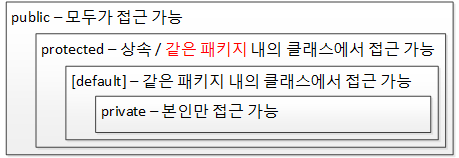

# 객체지향은 인간 지향이다

객체 지향의 큰 그림

- 세상의 모든 것은 "객체"다.
- 각각은 고유하다.
- 사물은 속성을 갖는다.
- 사물은 행위를 한다. 우리 인간은 사물을 "분류"를 통해 이해하고 인지한다.  
    
  클래스 : 객체

사람은 나이, 몸무게를 가지며 "먹거나, 자거나, 우는 등에 행동"을 하는 물체를 뜻한다. (개념에 따른 분류)

우리가 실제 사물을 인지하고 사고하는 방식대로 객체 단위의 프로그래밍이 객체 지향에서 가능하다.

# 객체 지향의 4대 특성 : "캡! 상추다"

- 캡슐화(Encapsulation): 정보 은닉(information hiding)
- 상속(Inheritance): 재사용 → extends(확장)
- 추상화(Abstraction): 모델링
- 다형성(Polymorphism): 사용 편의

> 클래스는 분류에 대한 개념이지 실체가 아니다. 객체는 실체다.

# 추상화: 모델링

추상의 사전적 의미 : 여러 가지 사물이나 개념에서 공통되는 특성이나 속성 따위를 추출하여 파악하는 작용

> "객체 지향의 추상화는 곧 모델이다" 라는 관점

추상화란 구체적인 것을 분해해서 관찰자가 관심 있는 특성(관심 영역, 애플리케이션 경계)만 가지고 재조합하는 것 = 모델링

여기서 모델은 실제 사물을 정확히 복제하는 게 아니라 목적에 맞게 관심 있는 특성만을 추출해서 표현하는 것이다. 즉 추상화를 통해 실제 사물을 단순하게 묘사하는 것이다. 이런 모델링(추상화)은 객체 지향에서 클래스를
설계할 때 필요한 기법이고 또한 데이터베이스의 테이블을 설계할 때 필요한 기법이다.

- OOP의 추상화는 모델링이다.
- 클래스 : 객체 = 펭귄 : 뽀로로
- 클래스 설계에서 추상화가 사용된다.
- 클래스 설계를 위해서는 애플리케이션 경계부터 정해야 한다.
- 객체 지향에서 추상화의 결과는 클래스다.
    - 상속을 통한 추상화, 구체화
    - 인터페이스를 통한 추상화
    - 다형성을 통한 추상화

> 객체 : 세상에 존재하는 유일무이한 사물  
> 클래스 : 분류, 집합. 같은 속성과 기능을 가진 객체를 총칭하는 개념

-> 자바는 이러한 객체 지향의 추상화를 "class 키워드"를 통해 지원하고 있다.

### static 변수

- 클래스 [멤버] 속성, 정적 변수, 정적 속성 ...
- 스태틱 영역

### 인스턴스 변수

- 객체 [멤버] 속성, 객체 변수 ...
- 힙 영역

### local 변수

- 지역 변수
- 스택 영역(스택 프레임 내부)

# 상속: 재사용 + 확장


- 재사용과 확장
- 객체 지향의 상속은 상위 클래스의 특성을 재사용하는 것
- 객체 지향의 상속은 상위 클래스의 특성을 확장하는 것
- 객체 지향의 상속은 is a kind of 관계를 만족해야 한다.
- 상속은 확장, 세분화, 슈퍼클래스 - 서브 클래스(상위 클래스 - 하위 클래스) 개념
- 상위 클래스 쪽으로 갈수록 추상화, 일반화됐다고 말하며, 하위 클래스 쪽으로 갈수록 구체화, 특수화됐다고 말함.
- <strong>상속의 개념은 조직도나 계층도가 아닌 분류도다!!</strong>
- "하위 클래스는 상위 클래스다"가 통해야 한다.

객체 참조 변수명은 객체스럽게, 클래스명은 클래스명답게 정하는 습관을 들이기  


### 상속

- 상속 관계: 하위 클래스 is a kind of 상위 클래스
- 해석: 하위 클래스는 상위 클래스의 한 분류다.
- 예제: 고래는 동물의 한 분류다. 다중 상속을 허용하지 않는다.

### 인터페이스

- 구현 클래스 is able to 인터페이스
- 해석: 구현 클래스는 인터페이스할 수 있다.
- 예제: 고래는 헤엄칠 수 있다.
- 인터페이스는 다중 상속의 문제를 해결

상위 클래스는 하위 클래스에게 특성(속성과 메서드)을 상속해 주고, 인터페이스는 클래스가 '무엇을 할 수 있다'라고 하는 기능을 구현하도록 강제한다.

- 상위 클래스는 하위 클래스에게 물려줄 특성이 많을수록 좋을까?
    - 리스코프 치환 원칙에 의해 상위 클래스가 풍성할수록 좋다.
- 인터페이스는 구현을 강제할 메서드가 많을수록 좋을까?
    - 인터페이스 분할 원칙에 의해 인터페이스 메서드는 적을수록 좋다.

### 상속과 T 메모리

하위 클래스의 인스턴스가 생성될 때 상위 클래스의 인스턴스도 함께 생성된다.

# 다형성: 사용편의성

- 다형성 오버라이딩(재정의): 상위 클래스의 메서드와 같은 메서드 이름, 같은 인자 리스트
- 오버로딩(중복정의): 같은 메서드 이름, 다른 인자 리스트

```java
package polymorphism01;

public class Animal {
    public String name;

    public void showName() {
        System.out.printf("안녕 나는 %s야. 반가워\n", name);
    }

}
```

```java
package polymorphism01;

public class Penguin extends Animal {
    public String habitat;

    public void showHabitat() {
        System.out.printf("%s는 %s에 살아\n", name, habitat);
    }

    //오버라이딩 - 재정의: 상위클래스의 메서드와 같은 메서드 이름, 같은 인자 리스트
    public void showName() {
        System.out.println("어머 내 이름은 알아서 뭐하게요?");
    }

    // 오버로딩 - 중복정의: 같은 메서드 이름, 다른 인자 리스트
    public void showName(String yourName) {
        System.out.printf("%s 안녕, 나는 %s라고 해\n", yourName, name);
    }

}
```

```java
package polymorphism01;

public class Driver {
    public static void main(String[] args) {
        Penguin pororo = new Penguin();

        pororo.name = "뽀로로";
        pororo.habitat = "남극";

        pororo.showName();
        pororo.showName("초보람보");
        pororo.showHabitat();

        Animal pingu = new Penguin();

        pingu.name = "핑구";
        pingu.showName(); // 어머 내 이름은 알아서 뭐하게요? 

        Animal pingu2 = new Animal();
        pingu2.name = "핑구2"
        pingu2.showName(); // 안녕 나는 핑구2야. 반가워
    }

}
```

위 코드에서 pingu의 showName() 메서드를 실행하면 Animal 객체에 의해 정의된 메서드가 아니라 Penguin 객체에 의해 재정의된 showName()메서드가 실행됨을 기억하자.  
→ 상위 클래스 타입의 객체 참조 변수를 사용하더라도 하위 클래스에서 오버라이딩(재정의)한 메서드가 호출된다.

하위 클래스가 재정의한 메서드를 알아서 호출해 줌으로써 형변환이나 instanceof 연산자를 써서 하위 클래스가 무엇인지 신경 쓰지 않아도 된다.

오버라이딩을 통한 메서드 재정의, 오버로딩을 통한 메서드 중복 정의를 통해 다형성을 제공함으로써 사용편의성을 준다.

# 캡슐화: 정보은닉

접근 제어자는 절대 단순하지 않다.

- 상속을 받지 않았다면 객체 멤버는 객체를 생성한 후 객체 참조 변수를 이용해 접근해야 한다. 
- 정적 멤버는 클래스명.정적멤버 형식으로 접근하는 것을 권장한다. 
  - 사람.인구, 고양이.다리개수 형식으로 접근하는 것이 홍길동.인구수, 키티.다리개수 형식으로 접근하는 것보다 권장

## 참조 변수의 복사 
기본 자료형 변수는 저장하고 있는 값을 그 값 자체로 해석하는 반면, 객체 참조 변수는 저장하고 있는 값을 주소로 해석