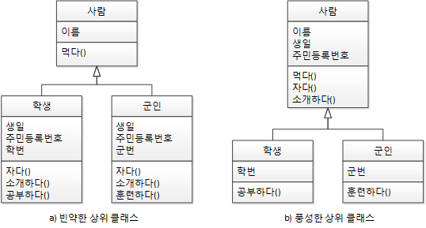

# 객체 지향 설계 5원칙 SOLID

- SRP(Single Responsibility Principle): 단일 책임 원칙
- OCP(Open Closed Principle): 개방 폐쇄 원칙
- LSP(Liskov Substitution Principle): 리스코프 치환 원칙
- ISP(Interface Segregation Principle): 인터페이스 분리 원칙
- DIP(Dependency Inversion Principle): 의존 역전 원칙

응집도는 높이고(High Cohesion), 결합도는 낮추라(Loose Coupling)는 고전 원칙을 객체 지향의 관점에서 재정립한 것

결합도는 모듈(클래스) 간의 상호 의존 정도로서 결합도가 낮으면 모듈 간의 상호 의존성이 줄어들어 객체의 재사용이나 수정, 유지보수가 용이하다.

응집도는 하나의 모듈 내부에 존재하는 구성 요소들의 기능적 관련성으로, 응집도가 높은 모듈은 하나의 책임에 집중하고 독립성이 높아져 재사용이나 기능의 수정, 유지보수가 용이하다.

# SRP - 단일 책임 원칙

> "어떤 클래스를 변경해야 하는 이유는 오직 하나뿐이어야 한다"   
> -로버트 C.마틴-

"책임과 기능을 분리하라" 라는 말이 곧 이 말이었다.

애플리케이션의 경계를 정하고 추상화를 통해 클래스들을 선별하고 속성과 메서드를 설계할 때 반드시 단일 책임 원칙을 고려하는 습관을 들이자. 또한 리펙터링을 통해 코드를 개선할 때도 단일 책임 원칙을 적용할 곳이
있는지 꼼꼼히 살피자

남자라고 하는 클래스와 남자 클래스에 의존하는 다양한 클래스가 있다고 생각해 보자. 남자는 여자친구의 남자친구로서, 어머니의 아들로서, 직장상사의 사원으로서, 소대장의 소대원으로서 역할을 하고 있다.  
  
여러 역할에 대한 기능들을 남자라고 하는 클래스에 묶어둔다면 남자는 참 피곤할 것 같다. 이러한 피곤함은 역할과 책임이 너무 많기 때문이다.

어느 날 여자친구와 헤어졌다고 가정한다면, 남자는 더 이상 남자친구로서의 기능들이 필요하지 않는데 이를 챙기느라 힘들어하게 된다. 이런 경우 역할(책임)을 분리하라는 것이 단일 책임 원칙이다. 남자친구, 사원,
아들, 소대원을 남자로 추상화 하면서 네 개의 클래스로 쪼갤 수 있다.  

단일 책임 원칙은 속성, 메서드, 패키지, 모듈, 컴포넌트, 프레임워크 등에도 적용할 수 있는 개념이다.

### 속성의 SRP 위배 
문제 코드 
```java
public class 사람 { String 군번;

	public static void main(String[] args) {
		사람 로미오 = new 사람();
		사람 줄리엣 = new 사람();

		줄리엣.군번 = "11-730411994";
	}

}
```


줄리엣은 여자이므로 '군번'을 가질 수 없다. 하지만 줄리엣은 군번 속성에 값을 할당하거나 읽어올 수 있는 코드이다.

**가질 수 없는 속성 개선**

이를 개선하기 위해선 남자 클래스만 군번을 갖게 하면된다. 여자와 남자의 공통적만 모아 사람 클래스를 상위 클래스로 만들 수도 있고 둘의 공통점이 없다면 남자 클래스와 여자 클래스로 나눠서 구현할 수 있다.

**하나의 속성이 여러 속성을 가지는 경우**

데이터베이스 테이블에 존재하는 하나의 필드가 여러 속성을 가르키게 되면 정규화를 통해 단일 책임 원칙을 유지하도록 해야한다.

### 메서드가 SRP 위배 문제 코드

```java
public class 강아지 {
    final static Boolean 숫컷 = true;
    final static Boolean 암컷 = false;
    Boolean 성별;

    void 소변보다() {
        if (this.성별 == 숫컷) {
            // 한쪽 다리를 들고 소변을 본다.
        } else {
            // 뒤다리 두 개로 앉은 자세로 소변을 본다.
        }
    }

}
```

강아지가 "수컷"인지 "암컷"인지에 따라 메서드에서 분기 처리가 진행되고 있다.

이는 강아지 클래스에서 "소변보다"의 암컷과 수컷 강아지의 행위를 모두 구현하려고 했기 때문에 "단일 책임 원칙"을 위배하게 되었다.

개선 코드

```java
package srp.good;

public abstract class 강아지 {
    abstract void 소변보다();
}

public class 숫컷강아지 extends 강아지 {
    void 소변보다() {
// 한쪽 다리를 들고 소변을 본다.
    }
}

public class 암컷강아지 extends 강아지 {
    void 소변보다() {
// 뒤다리 두 개로 앉은 자세로 소변을 본다.
    }
}
```

추상 메서드를 통해 행위가 다른 메서드의 구현을 하위 클래스에게 위임한다.

-> 암컷과 수컷 강아지의 서로 다른 행위의 구현을 하위 클래스에 맡겼기 때문에 "단일 책임 원칙"을 지킬 수 있었다.

<strong>"상속"</strong>은 "단일 책임 원칙"을 지키키 위한 도구로 사용한다.

모델링을 담당하는 <strong>"추상화"</strong>는 "단일 책임 원칙"과 가장 관계가 깊다.

-> <strong>"애플리케이션 경계(context)"</strong>를 정하고 추상화를 통해 클래스의 속성과 메서드를 설계할 때 반드시 단일 책임 원칙을 고려하자!!

# OCP - 개방 폐쇄 원칙

>"소프트웨어 엔티티(클래스, 모듈, 함수 등)는 확장에 대해서는 열려 있어야 하지만 변경에 대해서는 닫혀 있어야 한다."   
> -로버트 C.마틴-

→ 자신의 확장에는 열려 있고, 주변의 변화에 대해서는 닫혀 있어야 한다.

운전자가 기어수동조작() 메서드를 사용하는 트럭을 운전한다고 생각해보자.   
어느 날 운전자가 기어자동조작() 메서드를 사용하는 쏘나타로 차종을 변경했다고 가정한다면 운전자는 차량에 따라 운전하던 습관을 바꿔야만 할까?

차량을 바꿨다고 운전자가 운전방법에 영향을 받아야만 하는가를 생각해보자. 이는 상위 클래스 또는 인터페이스를 중간에 둠으로써 다양한 자동차가 생긴다고 해도 객체 지향 세계의 운전자는 운전 습관에 영향을 받지 않게
해결할 수 있다. 다양한 자동차가 생긴다고 하는 것은 자동차 입장에서는 자신의 확장에는 개방돼 있는 것이고, 운전자 입장에서는 주변의 변화에 폐쇄돼 있는 것이다.  


개방 폐쇄 원칙을 따르지 않는다고 해서 객체 지향 프로그램을 구현하는 것이 불가능한 것은 아니지만 개방 폐쇄 원칙을 무시하고 프로그램을 작성하면 객체 지향 프로그래밍의 가장 큰 장점인 <strong>유연성, 재사용성, 유지보수성</strong>
등을 얻을 수 없다. 

따라서 객체 지향 프로그래밍에서 개방 폐쇄 원칙은 반드시 지켜야 할 원칙이다.

# LSP - 리스코프 치환 원칙

> "서브 타입은 언제나 자신의 기반 타입(base type)으로 교체할 수 있어야 한다"  
> -로버트 C.마틴-

→ 하위 클래스의 인스턴스는 상위형 객체 참조 변수에 대입해 상위 클래스의 인스턴스 역할을 하는 데 문제가 없어야 한다.


객체 지향에서의 상속은 조직도나 계층도가 아닌 분류도가 돼야 한다.

리스코프 치환 원칙은 객체 지향의 상속이라는 특성을 올바르게 활용하면 자연스럽게 얻게 되는 것이다.

- 하위 클래스 is a kind of 상위 클래스 - 하위 분류는 상위 분류의 한 종류다. 
- 구현 클래스 is able to 인터페이스 - 구현 분류는 인터페이스할 수 있어야 한다.

리스코프 치환 원칙 위키
- 하위형에서 선행 조건은 강화될 수 없다. 
- 하위형에서 후행 조건은 약화될 수 없다. 
- 하위형에서 상위형의 불변 조건은 반드시 유지돼야 한다.

# ISP - 인터페이스 분리 원칙

> "클라이언트는 자신이 사용하지 않는 메서드에 의존 관계를 맺으면 안 된다."   
> -로버트 C.마틴-

기능을 인터페이스로써 분리한다.

단일 책임 원칙(SRP)과 인터페이스 분할 원칙(ISP)은 같은 문제에 대한 두 가지 다른 해결책이라고 볼 수 있다. 프로젝트 요구사항과 설계자의 취향에 따라 단일 책임 원칙이나 인터페이스 분할 원칙 중 하나를
선택해서 설계할 수 있다.

<인터페이스 분할 원칙이 적용된 남자 클래스>     
  


하지만 특별한 경우가 아니라면 단일 책임 원칙을 적용하는 것이 더 좋은 해결책이다.

### 인터페이스 최소주의 원칙 
- 최소주의란 인터페이스를 통해 외부에 메서드 제공시 최소한의 메서드만 제공해야한다.
- 상위 클래스는 풍성할수록 좋고 "인터페이스"는 작을수록 좋다.  
  

빈약한 상위클래스를 사용하면 속성과 메서드가 하위클래스에서 중복되는 경우가 발생한다.
하지만 풍성한 상위 클래스에서는 하위 클래스에서 공통으로 가질 속성과 메서드를 상속한다.


상위 클래스형의 참조 변수를 이용해야 상속의 가장 큰 혜택을 볼 수 있다.

# DIP - 의존 역전 원칙

> "고차원 모듈은 저차원 모듈에 의존하면 안 된다 이 두 모듈 모두 다른 추상화된 것에 의존해야 한다."  
"추상화된 것은 구체적인 것에 의존하면 안 된다. 구체적인 것이 추상화된 것에 의존해야 한다."  
"자주 변경되는 구체(Concrete)클래스에 의존하지 마라"  
-로버트 C.마틴-
>
→ 자신보다 변하기 쉬운 것에 의존하지 마라

자신보다 변하기 쉬운 것에 의존하던 것을 추상화된 인터페이스나 상위 클래스를 두어 변하기 쉬운 것의 변화에 영향받지 않게 하는 것이 의존 역전 원칙이다.

<의존 역전 원칙  적용 전(구체 클래스에 의존)>  
  
자동차가 스노우타이어에 의존하는 관계이다.

자동차는 10년이상도 탈 수 있지만 스노우타이어는 계절이 바뀌면 일반 타이어로 바꿔줘야 한다.  
-> 즉, 스노우타이어가 자동차보다 자주 변경된다.

<의존 역전 원칙 적용 후>  
  
위 그림처럼 자동차가 "스노우타이어"가 아닌 추상화된 타이어 인터페이스에 의존하게 해보자.  
인터페이스의 구현체가 변경(스노우 -> 일반)되도 자동차는 그 영향을 받지 않는다.

상위 클래스일수록, 인터페이스일수록, 추상 클래스일수록 변하지 않을 가능성이 높기에 하위 클래스나 구체 클래스가 아닌 상위 클래스, 인터페이스, 추상 클래스를 통해 의존하라는 것이 바로 의존 역전 원칙이다.

# 정리

- SRP(단일 책임 원칙): 어떤 클래스를 변경해야 하는 이유는 오직 하나뿐이어야 한다.
- OCP(개방 폐쇄 원칙): 자신의 확장에는 열려 있고, 주변의 변화에 대해서는 닫혀 있어야 한다.
- LSP(리스코프 치환 원칙): 서브 타입은 언제나 자신의 기반 타입으로 교체할 수 있어야 한다.
- ISP(인터페이스 분리 원칙): 클라이언트는 자신이 사용하지 않는 메서드에 의존 관계를 맺으면 안 된다.
- DIP(의존 역전 원칙): 자신보다 변하기 쉬운 것에 의존하지 마라.