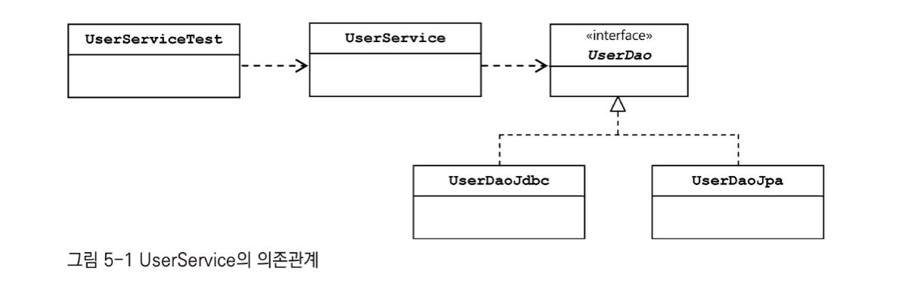
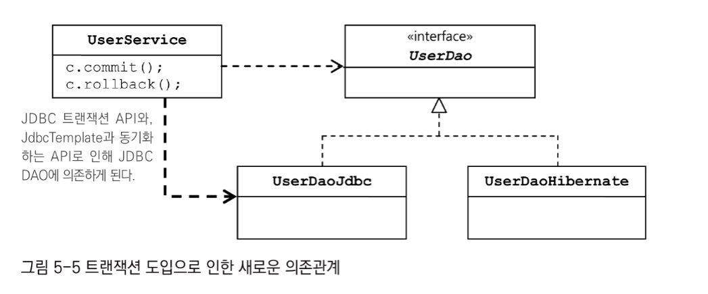
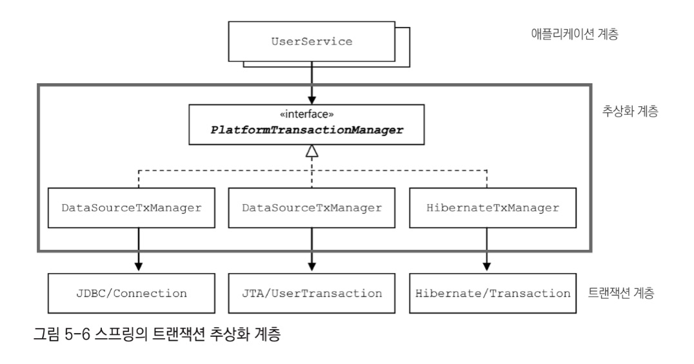
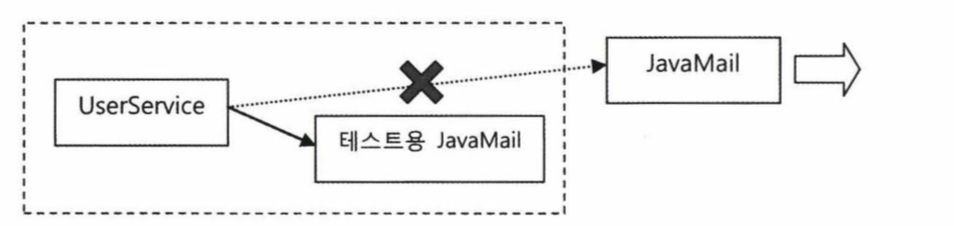
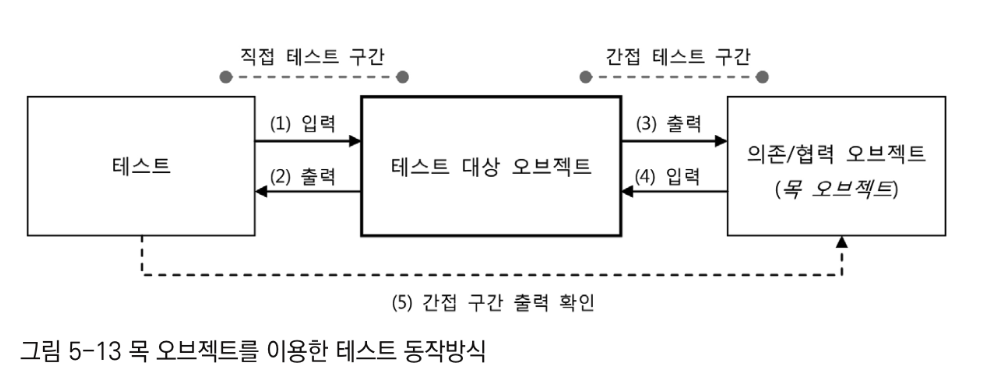

# 1. 서비스 추상화

## 1.1 사용자 레벨 관리 기능 추가

- 계급 관리를 위해 Level enum 생성
- 계급 관리를 위한 User 도메인 프로퍼티 추가
- DB 테이블 컬럼 추가
    - Level / tinyint / NN
    - Login / int / NN
    - Recommend / int / NN
- UserDao 테스트 픽스처 추가
```java
@BeforeEach
public void setUp(){
    this.dao = this.context.getBean("userDao", UserDaoJdbc.class);
    user1 = new User("gyumee", "박성철", "springno1", Level.BASIC, 1, 0);
    user2 = new User("leegw700", "이길원", "springno2", Level.SILVER, 55, 10);
    user3 = new User("bumjin", "박범진", "springno3", Level.GOLD, 100, 40);
}
```
- UserDaoJdbc 수정

## 1.2 사용자 수정 기능 추가

### 수정 기능 테스트 추가
<details>
<summary>1. 사용자 정보 수정 메서드 테스트 코드 작성</summary>
<div markdown="1">

```java
@Test
public void update(){
    dao.deleteAll();

    dao.add(user1);

    user1.setName("오민구");
    user1.setPassword("springno6");
    user1.setLevel(Level.GOLD);
    user1.setLogin(1000);
    user1.setRecommend(999);
    dao.update(user1);

    User user1update = dao.get(user1.getId());
    checkSameUser(user1, user1update);
}
```

</div>
</details>

<details>
<summary>2. UserDao와 UserDaoJdbc 수정</summary>
<div markdown="1">

```java
@Override
public void update(User user) {
    this.jdbcTemplate.update(
            "update users set name=?, password=?, level=?, login=?, " +
                    "recommend = ? where id = ?", user.getName(), user.getPassword(), user.getLevel().intValue(),
            user.getLogin(), user.getRecommend(), user.getId()
    );
}
```
</div>
</details>

### 수정 테스트 보완

현재 update() 테스트는 수정할 로우의 내용이 바뀐 것만을 확인할 뿐이지,
수정하지 않아야 할 로우의 내용이 그대로 남아 있는지는 확인해주지 못한다.

이 테스트 코드를 보완할 방법은 두 가지가 있다.
1. JdbcTemplate의 update()가 돌려주는 리턴값 확인

JdbcTemplate 의 update() 메서드는 영향받은 로우의 개수를 리턴해준다.
따라서 리턴 타입을 int 로 바꾸고 영향받은 로우의 개수와 비교해볼 수 있다.

2. 테스트를 보강해서 원하는 사용자 외의 정보는 변경되지 않았음을 직접 확인

사용자를 두 명 등록해서 그 중 하나만 수정한 뒤에 수정된 사용자와 그렇지 않은 사용자의 정보를 확인한다.


<details>
<summary>3. 보완된 update() 테스트</summary>
<div markdown="1">

```java
@Test
public void update(){
    dao.deleteAll();

    dao.add(user1);
    dao.add(user2);

    user1.setName("오민구");
    user1.setPassword("springno6");
    user1.setLevel(Level.GOLD);
    user1.setLogin(1000);
    user1.setRecommend(999);
    dao.update(user1);

    User user1update = dao.get(user1.getId());
    checkSameUser(user1, user1update);
    User user2same = dao.get(user2.getId());
    checkSameUser(user2, user2same);
}
```
</div>
</details>

보완된  update() 테스트에서 만약 SQL의 WHERE를 빼먹었다면 이 테스트는 실패로 끝날 것이다.

### 1.2.1 UserService.upgradeLevels()

사용자 관리 로직을 DAO에 두는 것은 옳지 않다.
DAO는 데이터를 어떻게 가져오고 조작할지를 다루는 곳이지 비즈니스 로직을 두는 곳이 아니기 때문이다.
UserService 클래스는 UserDao 의 구현 클래스가 변경되어도 영향받지 않도록 해야 한다.



<details>
<summary>1. UserService 클래스 생성</summary>
<div markdown="1">

```java
public class UserService {
    UserDao userDao;

    public void setUserDao(UserDao userDao) {
        this.userDao = userDao;
    }
}
```
</div>
</details>

<details>
<summary>2. xml 파일로 DI 주입</summary>
<div markdown="1">

```xml
<?xml version="1.0" encoding="UTF-8"?>
<beans xmlns="http://www.springframework.org/schema/beans"
       xmlns:xsi="http://www.w3.org/2001/XMLSchema-instance"
       xsi:schemaLocation="http://www.springframework.org/schema/beans http://www.springframework.org/schema/beans/spring-beans.xsd">

  <bean id="dataSource" class="org.springframework.jdbc.datasource.SimpleDriverDataSource">
    <property name="driverClass" value="com.mysql.cj.jdbc.Driver"/>
    <property name="url" value="jdbc:mysql://localhost/testdb?useUnicode=True&amp;serverTimezone=Asia/Seoul"/>
    <property name="username" value="sejun"/>
    <property name="password" value="1234"/>
  </bean>

  <bean id="userService" class="service.UserService">
    <property name="userDao" ref="userDao"/>
  </bean>

  <bean id="userDao" class="dao.UserDaoJdbc">
    <property name="dataSource" ref="dataSource"/>
  </bean>
</beans>
```

</div>
</details>

<details>
<summary>3. userService 클래스 테스트 코드 작성</summary>
<div markdown="1">

```java
@ExtendWith(SpringExtension.class)
@ContextConfiguration(locations = "/test-applicationContext.xml")
class UserServiceTest {
  @Autowired
  UserService userService;

  @Test
  public void bean(){
    assertNotNull(this.userService);
  }
}
```

</div>
</details>

<details>
<summary>4. UserService 클래스의 upgradeLevels() 메서드 작성</summary>
<div markdown="1">

```java
public void upgradeLevels() {
    List<User> users = userDao.getAll();
    for (User user : users) {
        Boolean changed = null;
        if (user.getLevel() == Level.BASIC && user.getLogin() >= 50) {
            user.setLevel(Level.SILVER);
            changed = true;
        } else if (user.getLevel() == Level.SILVER && user.getRecommend() >= 30) {
            user.setLevel(Level.GOLD);
            changed = true;
        } else if (user.getLevel() == Level.GOLD) {
            changed = false;
        } else {
            changed = false;
        }
        if (changed) {
            userDao.update(user);
        }
    }
}
```

</div>
</details>

- SILVER 계급으로 가기 위한 조건은 계급이 BRONZE 로그인 50번 이상일 때
- GOLD 계급으로 가기 위한 조건은 계급이 SILVER 이상이면서 추천을 30번이상 받았을 때
- 경계값을 조사해 테스트 픽스처를 설정한다.

<details>
<summary>5. upgradeLevels() 테스트</summary>
<div markdown="1">

```java
List<User> users;

@BeforeEach
public void setUp(){
    users = Arrays.asList(
    new User("bumjin", "박범진", "p1", Level.BASIC, 49, 0),
    new User("joytouch", "강명성", "p2", Level.BASIC, 50, 0),
    new User("erwins", "신승한", "p3", Level.SILVER, 60, 29),
    new User("madnite1", "이상호", "p4", Level.SILVER, 60, 30),
    new User("green", "오민규", "p5", Level.GOLD, 100, 100)
    );
}

@Test
public void upgradeLevels(){
        userDao.deleteAll();
        for(User user : users) userDao.add(user);
        userService.upgradeLevels();

        checkLevel(users.get(0), Level.BASIC);
        checkLevel(users.get(1), Level.SILVER);
        checkLevel(users.get(2), Level.SILVER);
        checkLevel(users.get(3), Level.GOLD);
        checkLevel(users.get(4), Level.GOLD);

}

private void checkLevel(User user, Level expectedLevel){
        User userUpdate = userDao.get(user.getId());
        assertEquals(userUpdate.getLevel(), expectedLevel);
}
```

</div>
</details>

### 1.2.2 UserService.add()

회원가입을 진행했을 때 그 유저는 Level.BASIC 이여야 한다.
DAO의 add 메서드에 직접 추가하는 것은 좋지 않은 방법이다.
따라서 UserService 클래스에 add() 메서드를 추가하고 해당 메서드 내에 알맞은 로직을 작성한다.

테스트 케이스는 두 종류를 만들어야 한다.
- 레벨이 미리 정해진 경우
- 레벨이 비어 있는 경우

<details>
<summary>1. UserService add() 메서드 테스트 코드 작성</summary>
<div markdown="1">

```java
@Test
public void add(){
    userDao.deleteAll();

    User userWithLevel = users.get(4);
    User userWithoutLevel = users.get(0);
    userWithoutLevel.setLevel(null);

    userService.add(userWithLevel);
    userService.add(userWithoutLevel);

    User userWithLevelRead = userDao.get(userWithLevel.getId());
    User userWithoutLevelRead = userDao.get(userWithoutLevel.getId());

    assertEquals(userWithLevelRead.getLevel(), userWithLevel.getLevel()); // 기존 유저는 레벨이 유지되는지 확인
    assertEquals(userWithoutLevelRead.getLevel(), Level.BASIC); // 신규 유저는 BASIC 인지 확인
}
```

</div>
</details>

<details>
<summary>2. UserService add() 메서드 작성</summary>
<div markdown="1">

```java
public void add(User user) {
    if(user.getLevel() == null) user.setLevel(Level.BASIC);
    userDao.add(user);
}
```

</div>
</details>

### 1.2.3 코드 개선

#### upgradeLevels() 메서드 코드의 문제점

for 루프 속의 if/elseif/else 구문을 보면 여러가지 비즈니스 로직이 섞여 있어 한 눈에 파악하기 힘들다.
그리고 if 조건이 Level 개수만큼 증가하므로 Level이 추가 됐을 때 Enum 클래스에 레벨을 추가하고
if 조건식과 블록도 수정해야 한다. 즉 변화에 너무 취약하다.

제대로 만들려면 조건을 두 단계에 걸쳐서 비교해야 한다.

- 첫 단계에서 레벨을 확인한다.
- 두번째 단계에서 레벨별로 다시 조건을 판단한다.


<details>
<summary>1. 기본 작업 흐름만 남겨둔 upgradeLevels()</summary>
<div markdown="1">

```java
public void upgradeLevels() {
    List<User> users = userDao.getAll();
    for (User user : users) {
        if (canUpgradeLevel(user)) {
            upgradeLevel(user);
        }
    }
}
```

</div>
</details>

<details>
<summary>2. 업그레이드 가능 확인 메서드(Java 14 향상된 switch 사용)</summary>
<div markdown="1">

```java
private boolean canUpgradeLevel(User user) {
    Level currentLevel = user.getLevel();
    return switch (currentLevel) {
        case BASIC -> (user.getLogin() >= 50);
        case SILVER -> (user.getLogin() >= 30);
        case GOLD -> false;
        default -> throw new IllegalArgumentException("Unknown Level: " + currentLevel);
    };
}
```

</div>
</details>

<details>
<summary>3. 레벨 업그레이드 작업 메서드</summary>
<div markdown="1">

```java
private void upgradeLevel(User user) {
    if(user.getLevel() == Level.BASIC) user.setLevel(Level.SILVER);
    else if(user.getLevel() == Level.SILVER) user.setLevel(Level.GOLD);
    userDao.update(user);
}
```

</div>
</details>

하지만 **3. 레벨 업그레이드 작업 메서드** 에도 단점이 있다.

> "다음 단계가 무엇인가?" 하는 로직과 사용자 오브젝트의 level 필드를 변경해준다는 로직이 함께 있는데다, 너무 드러나있다.
> 그리고 예외상황에 대한 처리가 없다.

이것을 해결하기 위해서 다음 단계 레벨이 무엇인지를 결정하는 일은 Level(enum) 에게 맡긴다.


<details>
<summary>4. 업그레이드 순서를 담고 있도록 수정한 Level</summary>
<div markdown="1">

```java
public enum Level {
    GOLD(3, null),
    SILVER(2, GOLD),
    BASIC(1, SILVER);

    private final int value;
    private final Level next;

    Level(int value, Level next) {
        this.value = value;
        this.next = next;
    }

    public int intValue(){
        return value;
    }

    public Level getNext() {
        return this.next;
    }

    public static Level valueOf(int value){
        return switch (value) {
            case 1 -> BASIC;
            case 2 -> SILVER;
            case 3 -> GOLD;
            default -> throw new AssertionError("Unknown value: " + value);
        };
    }
}
```
</div>
</details>

User 내부 정보가 변경되는 것은 UserService 보다 User가 스스로 다루는 게 적절하다.

<details>
<summary>5. User 도메인 클래스에 레벨 변경 로직 추가</summary>
<div markdown="1">

```java
public void upgradeLevel(){
    Level nextLevel = this.level.nextLevel();
    if (nextLevel == null) {
        throw new IllegalStateException(this.level + "은 업그레이드가 불가능합니다.");
    }else{
        this.level = nextLevel;
    }
}
```

</div>
</details>

User 클래스를 수정하고 나면 upgradeLevel() 메서드는 더욱 간단해진다.

<details>
<summary>6. 간결해진 upgradeLevel()</summary>
<div markdown="1">

```java
private void upgradeLevel(User user) {
    user.upgradeLevel();
    userDao.update(user);
}
```

</div>
</details>

객체지향적인 코드는 다른 오브젝트의 데이터를 가져와서 작업하는 대신 데이터를 갖고 있는 오브젝트에게 작업을 해달라고 요청한다.
처음 구현했던 UserService의 upgradeLevels() 메서드는 너무 많은 책임을 지니고 있었다.

- User 오브젝트에서 데이터를 가져온다.
- 그것을 가지고 직접 User 오브젝트의 데이터를 변경해버린다.

이보다는 UserService는 User에게 "레벨 업그레이드 작업을 해달라" 고 요청하고,
User는 Level에게 "다음 레벨이 무엇인지 알려달라" 고 요청하는 방식으로 동작하는 것이 바람직하다.
User 도메인에 레벨 업그레이드 로직이 생겼는데 아래는 해당 로직의 테스트 코드이다.

<details>
<summary>User 테스트</summary>
<div markdown="1">

```java
class UserTest {
    User user;

    @BeforeEach
    public void setUp() {
        user = new User();
    }

    @Test
    public void upgradeLevel() {
        Level[] levels = Level.values();
        for (Level level : levels) {
            if (level.nextLevel() == null) continue;
            user.setLevel(level);
            user.upgradeLevel();
            assertEquals(user.getLevel(), level.nextLevel());
        }
    }

    @Test
    public void cannotUpgradeLevel() {
        Level[] levels = Level.values();
        for (Level level : levels) {
            if (level.nextLevel() != null) continue;
            user.setLevel(level);
            assertThrows(IllegalStateException.class, () -> {
                user.upgradeLevel();
            });
        }
    }
}
```

</div>
</details>

기존 테스트는 checkLevel() 메서드를 호출할 때 일일이 다음 단계의 레벨이 무엇인지 넣어줬다.
Level이 갖고 있어야 할 정보를 테스트에 직접 넣어둘 이유가 없으므로 이 코드도 수정한다.

<details>
<summary>UserServiceTest 개선</summary>
<div markdown="1">

```java
@Test
public void upgradeLevels(){
    userDao.deleteAll();
    for(User user : users) userDao.add(user);
    userService.upgradeLevels();

    checkLevel(users.get(0), false);
    checkLevel(users.get(1), true);
    checkLevel(users.get(2), false);
    checkLevel(users.get(3), true);
    checkLevel(users.get(4), false);

}

private void checkLevel(User user, boolean upgraded){
    User userUpdate = userDao.get(user.getId());
    if (upgraded) {
        //업그레이드가 일어났는지 확인
        assertEquals(userUpdate.getLevel(), user.getLevel().nextLevel());
    }else{
        //업그레이드가 일어나지 않았는지 확인
        assertEquals(userUpdate.getLevel(), user.getLevel());
    }
}
```
</div>
</details>

# 2. 트랜잭션 서비스 추상화


> "정기 사용자 레벨 관리 작업을 수행하는 도중에 네트워크가 끊기거나 서버에 장애가 생겨서 작업을 완료할 수 없다면
> , 그때까지 변경된 사용자의 레벨은 그대로 둘까요? 아니면 모두 초기 상태로 되돌려 놓아야 할까요?"

이런 질문이 나왔을 때 고객이 차별을 느끼지 않도록 **지금까지 진행됐던 변경 작업을 모두 취소하는 방향**으로
결정한다고 가정한다.

## 2.1 테스트 방식

시스템 예외상황을 만들기란 쉽지 않다.
1초도 안 걸리는 짧은 업그레이드 작업 중간에 DB 서버를 다운시키거나 네트워크를 끊는 등의
강제적인 장애상황을 연출하는 것은 불가능하다.
그래서 장애가 발생했을 때 예외가 던져지는 상황을 의도적으로 만드는 것이 낫다.

### 테스트용 UserService 대역

1. 테스트용으로 UserService 를 상속한 클래스를 하나 만든다.
  1. 테스트용이기 때문에 테스트 클래스 내부에 스태틱 클래스로 생성한다.
  2. 업그레이드를 실행하는 메서드가 private이기 때문에 상속이 불가능하다.
  3. 따라서 이번 테스트를 만들기 위해 해당 접근 제한자를 protected로 수정한다.

<details>
<summary>[UserServiceTest.java] UserService의 테스트용 대역 클래스</summary>
<div markdown="1">

```java
static class TestUserService extends UserService{
    private String id;

    private TestUserService(String id) {
        this.id = id;
    }

    protected void upgradeLevel(User user) {
        // 지정된 id의 User 오브젝트가 발견되면 예외를 던져서 작업을 강제로 중단시킨다.
        if(user.getId().equals(this.id)) throw new TestUserServiceException();
        super.upgradeLevel(user);
    }
}

static class TestUserServiceException extends RuntimeException{}
```

</div>
</details>

<details>
<summary>[UserServiceTest.java] 예외 발생 시 작업 취소 여부 테스트</summary>
<div markdown="1">

```java
@Test
public void upgradeAllOrNothing(){
    // 4번째에 exception 을 강제로 발생시키기 위해 3번 리스트에 동일 userID를 집어넣는다.
    TestUserService testUserService = new TestUserService(users.get(3).getId());
    testUserService.setUserDao(this.userDao);
    userDao.deleteAll();
    for(User user : users) userDao.add(user);

    try{
        //TestUserService는 업그레이드 작업 중에 예외가 발생해야한다.
        //정상 종료라면 문제가 있으므로 fail 구문 추가
        testUserService.upgradeLevels();
        fail("TestUserServiceException expected");
    }catch (TestUserServiceException e){
        //예외를 잡아서 계속 진행하도록 한다.
        //그 외의 예외라면 실패
    }
    //예외가 발생하기 전에 레벨 변경이 있었던 사용자의 레벨이 처음 상태로 바뀌었나 확인
    checkLevel(users.get(1), false);
}
```
</div>
</details>

이 테스트는 당연히 실패한다.

### 테스트 실패의 원인

테스트 실패의 원인은 트랜잭션이다.
모든 사용자의 레벨을 업그레이드하는 작업인 upgradeLevels() 메서드가 하나의 트랜잭션 안에서 동작하지 않았기 때문이다.

## 2.2 트랜잭션 경계설정

DB는 그 자체로 완벽한 트랜잭션을 지원한다.
SQL을 이용해 다중 로우의 수정이나 삭제를 위한 요청을 했을 때 일부 로우만 삭제되고 나머지는 안 된다거나,
일부 필드는 수정했는데 나머지 필드는 수정이 안 되고 실패로 끝나는 경우는 없다.

하지만 여러 개의 SQL이 사용되는 작업을 하나의 트랜잭션으로 취급해야 하는 경우도 있다.
예를 들어 계좌이체라거나, 위의 사용자에 대한 레벨 수정 작업이 그렇다.
트랜잭션이 보장되려면 첫 번째 SQL을 성공적으로 실행했지만 두 번째 SQL이 성공하기 전에 작업이 중단됐을 때, 첫 번째 SQL 작업을 취소시켜야 한다.
이런 취소 작업을 **트랜잭션 롤백**이라고 한다.
반대로 여러 개의 SQL을 하나의 트랜잭션으로 처리하는 경우에 모든 SQL 수행 작업이 성공적으로 마무리됐다고
DB에 알려줘서 작업을 확정시켜야 한다. 이것을 **트랜잭션 커밋**이라고 한다.

### JDBC 트랜잭션의 트랜잭션 경계설정

애플리케이션 내에서 트랜잭션이 시작되고 끝나는 위치를 트랜잭션의 경계라고 한다.
복잡한 로직 흐름 사이에서 이 경계를 설정하는 일은 매우 중요하다.
JDBC의 트랜잭션은 하나의 Connection을 가져와 사용하다가 닫는 사이에서 일어난다.
그리고 JDBC에서 트랜잭션을 시작하려면 자동커밋 옵션을 false로 만들어주면 된다.

```java
Connection c = dataSource.getConnection();
c.setAutoCommit(false);

try{
    //TODO
    c.commit();    
}catch(Exception e){
    c.rollback();
}
```

이렇게 setAutoCommit(false)로 트랜잭션의 시작을 선언하고 commit() 또는 rollback()으로
트랜잭션을 종료하는 작업을 **트랜잭션 경계설정**이라고 한다. 그리고 이렇게 하나의 DB 커넥션 안에서 만들어지는 트랜잭션을 **로컬 트랜잭션**이라고도 한다.

### UserService와 UserDao의 트랜잭션 문제

지금까지 만든 코드 어디에도 트랜잭션 경계설정 코드가 존재하지 않는다.
JdbcTemplate은 하나의 템플릿 메서드 안에서 DataSource의 getConnection() 메서드를 호출해서 Connection 오브젝트를 가져온다.
결국 템플릿 메서드 호출 한 번에 한 개의 DB 커넥션이 만들어지고 닫히는 일이 발생하는 것이다.

즉 JdbcTemplate의 메서드를 사용하는 UserDao는 각 메서드마다 하나씩의 독립적인 트랜잭션으로 실행될 수 밖에 없다.
upgradeAllOrNothing() 테스트 메서드는 각각의 User 마다 업그레이드 작업이 일어난다.
업데이트가 한 번 일어날 때마다 커밋이 되기 때문에 4번째에 예외가 발생했다고 해서 여태까지 했던 작업들을 모두 롤백하지 않는 것이다.


데이터 액세스 코드를 DAO로 만들어서 분리한 경우에는 **DAO 메서드를 호출할 때마다 하나의 트랜잭션이 만들어지는 구조가 될 수 밖에 없다.**
메서드 내에서 JDBC API를 직접 사용하든 JdbcTemplate을 이용하든 마찬가지이다.
이것은 DAO 메서드에서 DB 커넥션을 매번 만들기 때문에 어쩔 수 없이 나타나는 결과이다.

### 비즈니스 로직 내의 트랜잭션 경계설정

이 문제를 해결하려고 DAO 메서드 안으로 upgradeLevels() 메서드의 내용을 옮기는 방법을 생각해 볼 수 있다.
하지만 이렇게 하면 지금까지 성격과 책임을 다른 코드를 분리했던 노력은 모두 물거품이 된다.
UserService와 UserDao를 그대로 둔 채로 트랜잭션을 적용하려면 결국 트랜잭션의 경계설정 작업을 UserService 쪽으로 가져와야 한다.

```java
public void upgradeLevels() throws Exception{
        (1) DB Connection 생성
        (2) 트랜잭션 시작
        try{
            (3) DAO 메서드 호출
            (4) 트랜잭션 커밋
        }catch(Exception e){
            (5) 트랜잭션 롤백
            throw e;
        }finally{
            (6) DB Connection 종료
        }
}
```

하지만 이 코드의 문제점은 Connection 오브젝트가 UserDao의 메서드 안에 전달되야 한다는 점이다.
왜냐햐면 하나의 Connection 이 반환될 때마다 트랜잭션이 끝나고 commit() 메서드가 호출되기 때문이다.
따라서 UserDao 인터페이스에 Connection 오브젝트를 매개변수로 전달해야 한다.

```java
public interface UserDao{
    public void add(Connection c, User user);
    public void get(Connection c, String id);
}
```

```java
public void upgradeLevels() {
    List<User> users = userDao.getAll();
    for (User user : users) {
        if (canUpgradeLevel(user)) {
            upgradeLevel(user);
        }
    }
}
```
문제는 upgradeLevels() 메서드는 UserDao 메서드를 바로 실행하지 않는다.
따라서 upgradeLevel 메서드 파라미터에도 Connection 을 전달시켜줘야 한다.
이렇게 Connection 오브젝트를 전달해서 사용하면 트랜잭션 경계설정이 가능하다.
하지만 이 해결 방법은 여러 문제점을 가지고 있다.

### UserService 트랜잭션 경계설정의 문제점

- JdbcTemplate를 더 이상 활용할 수 없다. 결국 JDBC API를 직접 사용하는 방식으로 돌아가야 한다.
- DAO의 메서드와 비즈니스 로직을 담고 있는 UserService의 메서드에 Connection 파라미터가 추가되야 한다.
- Connection 파라미터가 UserDao 인터페이스 메서드에 추가되면 UserDao는 더 이상 데이터 액세스 기술에 독립적일 수 없다.
  예를 들어, JPA나 하이버네이트로 구현 방식을 바꾸려면 Connection 대신 EntityManager나 Session 오브젝트를 전달받아야 한다.

## 2.3 트랜잭션 동기화

하지만 스프링은 이런 문제점들을 해결할 수 있는 방법을 제공한다.

### Connection 파라미터 제거

Connection 오브젝트를 계속 메서드의 파라미터로 전달하다가 DAO를 호출할 때 사용하는 것은 피하고 싶다.
이를 위해 스프링은 **독립적인 트랜잭션 동기화(transaction synchronization)** 방식을 제공한다.

> **트랜잭션 동기화?** <br>
> Connection 오브젝트를 특별한 저장소에 보관해두고, 이후에 호출되는 DAO 메서드에서 저장된 Connection 오브젝트를 가져다가 사용하게 하는 방식을 말한다.

그림으로 표현하면 아래와 같다.


1. UserService 는 Connection 객체 생성
2. 이를 트랜잭션 동기화 저장소에 저장
3. 첫 번째 update() 메서드 호출
4. update() 내부의 JdbcTemplate 메서드는 트랜잭션 동기화 저장소에서 현재 시작된 트랜잭션을 가진 Connection 오브젝트가 존재하는지 확인
5. upgradeLevels() 메서드 시작 부분에서 저장해둔 Connection을 발견하고 이를 가져옴
6. 가져온 Connection을 이용해 PreparedStatement를 만들어 수정 SQL을 실행

트랜잭션 동기화 저장소에서 DB 커넥션을 가져왔을 때 JdbcTemplate은 Connection을 닫지 않은 채로 작업을 끝낸다.
모든 작업이 끝나면 Connection의 commit() 을 호출한다.

트랜잭션 동기화 저장소는 작업 스레드마다 독립적으로 Connection 오브젝트를 저장하고 관리한다.
따라서 멀티쓰레드 환경에서도 충돌이 날 염려는 없다.

### 트랜잭션 동기화 적용

<details>
<summary>[UserService.java] 트랜잭션 동기화 방식을 적용한 UserService</summary>
<div markdown="1">

```java
public void upgradeLevels() throws Exception {
    // 트랜잭션 동기화 관리자를 이용해 동기화 작업 초기화
    TransactionSynchronizationManager.initSynchronization();
    // DB 커넥션을 생성하고 트랜잭션을 시작
    // DataSourceUtils : DB 커넥션 생성과 동기화를 함께 해주는 유틸리티 메서드
    Connection c = DataSourceUtils.getConnection(dataSource);
    c.setAutoCommit(false);

    try{
        List<User> users = userDao.getAll();
        for (User user : users) {
            if (canUpgradeLevel(user)) {
                upgradeLevel(user);
            }
        }
        c.commit();
    }catch (Exception e){
        c.rollback();
    }finally {
        // 스프링 유틸리티 메서드를 이용해 DB 커넥션을 닫음
        DataSourceUtils.releaseConnection(c, dataSource);
        // 동기화 작업 종료 및 정리
        TransactionSynchronizationManager.unbindResource(this.dataSource);
        TransactionSynchronizationManager.clearSynchronization();
    }
}
```

</div>
</details>

DataSourceUtils.getConnection() 메서드는 Connection 오브젝트를 생성해줄 뿐만 아니라
트랜잭션 동기화에 사용되도록 저장소에 바인딩해주는 역할을 한다.

### 트랜잭션 테스트 보완

<details>
<summary>[UserServiceTest.java] 동기화가 적용된 UserService에 따라 수정된 테스트</summary>
<div markdown="1">

```java
@Test
public void upgradeAllOrNothing() throws Exception {
    TestUserService testUserService = new TestUserService(users.get(3).getId());
    testUserService.setUserDao(this.userDao);
    testUserService.setDataSource(this.dataSource);
    userDao.deleteAll();
    for (User user : users) userDao.add(user);
    
    try {
        testUserService.upgradeLevels();
    } catch (TestUserServiceException e) {
    }
    checkLevel(users.get(1), false);
}
```
</div>
</details>

## 2.4 트랜잭션 서비스 추상화

### 기술과 환경에 종속되는 트랜잭션 경계설정 코드

한 개 이상의 DB로의 작업을 하나의 트랜잭션으로 만드는 건 로컬 트랜잭션 방식으로는 불가능하다.
로컬 트랜잭션은 하나의 Connection에 종속되기 때문이다.
이럴 때는 별도의 트랜잭션 관리자를 통해 트랜잭션을 관리하는 **글로벌 트랜잭션** 방식을 이용해야 한다.
글로벌 트랜잭션을 적용해야 트랜잭션 매니저를 통해 여러 개의 DB가 참여하는 작업을 하나의 트랜잭션으로 만들 수 있다.

자바는 JDBC 이외에 글로벌 트랜잭션을 지원하는 **JTA(Java Transaction API)** 를 제공하고 있다.

- JTA를 이용한 트랜잭션 코드 구조
```java
InitialContext ctx = new InitialContext();
UserTransaction tx = (UserTrnasaction)ctx.lookup(USER_TX_JNDI_NAME);

tx.begin();
Connection c = dataSource.getConnection();
try{
    // 데이터 액세스 코드
    tx.commit();    
}catch(Exception e){
    tx.rollback();
    throw e;
}finally{
    c.close();
}
```

코드 형식은 로컬 트랜잭션을 사용할 때와 비슷하다.
하지만 JDBC 로컬 트랜잭션을 JTA를 이용하는 글로벌 트랜잭션으로 바꾸려면 UserService의 코드를 수정해야 한다.
UserService는 자신의 로직은 변경되지 않았음에도 기술 환경에 따라 코드가 바뀌는 코드가 돼버렸다.

### 트랜잭션 API의 의존관계 문제와 해결책

UserService의 각 기술마다 다른 트랜잭션 경계 설정을 해야 할 필요가 생기면서 다시 특정 액세스 기술에 종속되는 구조가 되었다.
아래 그림처럼 말이다.



하지만 트랜잭션의 경계설정을 담당하는 코드는 일정한 패턴을 갖는다.
이럴 때 하위 시스템의 공통점을 뽑아내서 추상화 하는 것을 생각해볼 수 있다.

### 스프링의 트랜잭션 서비스 추상화



스프링은 트랜잭션 기술의 공통점을 담은 트랜잭션 추상화 기술을 제공하고 있다.

<details>
<summary>[UserService.java] 스프링의 트랜잭션 추상화 API를 적용한 upgradeLevels()</summary>
<div markdown="1">

```java
public void upgradeLevels() throws Exception {
    PlatformTransactionManager transactionManager = new DataSourceTransactionManager(dataSource);
    TransactionStatus status = transactionManager.getTransaction(new DefaultTransactionDefinition());

    try{
        List<User> users = userDao.getAll();
        for (User user : users) {
            if (canUpgradeLevel(user)) {
                upgradeLevel(user);
            }
        }
        transactionManager.commit(status);
    }catch (Exception e){
        transactionManager.rollback(status);
    }
}
```

</div>
</details>

스프링이 제공하는 트랜잭션 경계설정을 위한 추상 인터페이스는 **PlatformTransactionManager**다.
JDBC는 Connection을 생성해야 했지만 PlatformTransactionManager는 getTransaction() 메서드를 호출해주기만 하면 된다.
DefaultTransactionDefinition 오브젝트는 트랜잭션에 대한 속성을 담고 있다.

### 트랜잭션 기술 설정의 분리

- JTA를 이용하는 글로벌 트랜잭션으로 변경하려면 JTATransactionManager 를 생성하면 된다.
- 하이버네이트를 이용한다면 HibernateTransactionManager 를 생성한다.
- JPA를 적용했다면 JPATransactionManager를 이용한다.

이제 자신이 사용할 클래스를 컨테이너를 통해 외부에서 제공받게 하는 스프링의 DI 방식으로 바꾸자.

<details>
<summary>[test-applicationContext.xml]트랜잭션 매니저 빈을 등록한 설정 파일</summary>
<div markdown="1">

```xml
<bean id="userService" class="service.UserService">
    <property name="userDao" ref="userDao"/>
    <property name="transactionManager" ref="transactionManager"/>
</bean>

<bean id="transactionManager" class="org.springframework.jdbc.datasource.DataSourceTransactionManager">
    <property name="dataSource" ref="dataSource"/>
</bean>
```

</div>
</details>

<details>
<summary>[UserService.java]트랜잭션 매니저를 빈으로 분리시킨 UserService</summary>
<div markdown="1">

```java
private PlatformTransactionManager transactionManager;

public void setTransactionManager(PlatformTransactionManager transactionManager) {
    this.transactionManager = transactionManager;
}

public void upgradeLevels() throws Exception {
    TransactionStatus status = this.transactionManager.getTransaction(new DefaultTransactionDefinition());

    try{
        List<User> users = userDao.getAll();
        for (User user : users) {
            if (canUpgradeLevel(user)) {
                upgradeLevel(user);
            }
        }
        this.transactionManager.commit(status);
    }catch (Exception e){
        this.transactionManager.rollback(status);
    }
}
```

</div>
</details>

# 3. 서비스 추상화와 단일 책임 원칙

### 수직, 수평 계층구조와 의존관계

기술과 서비스에 대한 추상화 기법을 이용하면 특정 기술환경에 종속되지 않는 포터블한 코드를 만들 수 있다.
UserDao와 UserService는 각각 담당하는 코드의 기능적인 관심에 따라 분리되고,
서로 불필요한 영향을 주지 않으면서 독자적으로 확장가능하다. 같은 계층에서 **수평적인 분리**라고 할 수 있다.

트랜잭션의 추상화는 이것과 좀 다르다. 애플리케이션 비즈니스 로직과 그 하위에서 동작하는 로우레벨의 트랜잭션 기술이라는
아예 다른 계층의 특성을 갖는 코드를 분리한 것이다. 이것을 **수직적인 분리**라고 부른다.

애플리케이션 로직의 종류에 따른 수평적인 구분이든, 로직과 기술이라는 수직적인 구분이든, 낮은 결합도를 유지하면서
자유롭게 확장될 수 있는 구조를 만들 수 있는 것은 **스프링의 DI** 덕분이다.

### 단일 책임 원칙

이런 적절한 분리가 가져오는 특징은 객체지향 설계의 원칙 중의 하나인 **단일 책임 원칙**으로 설명할 수 있다.
만약 UserService에 트랜잭션 관리와 사용자 레벨 관리 두 가지 책임이 모두 있는 경우는 단일 책임 원칙이 잘 지켜지지 않은 경우이다.

#### 단일 책임 원칙의 장점

단일 책임 원칙을 잘 지키고 있다면, 어떤 변경이 필요할 때 수정 대상이 명확하다.
만약 기술이 바뀌면 기술 계층과의 연동을 담당하는 기술 추상화 계층의 설정만 바꿔주면 된다.
데이터를 가져오는 테이블의 이름이 바뀌었다면 데이터 액세스 로직을 담고 있는 UserDao를 변경하면 된다.

단일 책임 원칙을 잘 지키는 코드를 만들려면 **인터페이스를 도입하고 이를 DI로 연결해야 한다.**
그 결과로 단일 책임 원칙뿐 아니라 개방 폐쇄 원칙도 잘 지켜지는 부수 효과를 만든다.

# 4. 메일 서비스 추상화

## 4.1 JavaMail을 이용한 메일 발송 기능

<details>
<summary>[UserService.java] JavaMail을 이용한 메일 발송 메서드</summary>
<div markdown="1">

```java
private void sendUpgradeEmail(User user) {
    Properties props = new Properties();
    props.put("mail.smtp.host", "mail.ksug.org");
    Session s = Session.getInstance(props, null);

    MimeMessage message = new MimeMessage(s);
    try {
        message.setFrom(new InternetAddress("admin@naver.com"));
        message.addRecipient(Message.RecipientType.TO, new InternetAddress(user.getEmail()));
        message.setSubject("Upgrade 안내");
        message.setText("사용자님의 등급이 " + user.getLevel().name() + "로 업그레이드되었습니다.");
    } catch (AddressException e){
        throw new RuntimeException(e);
    } catch (MessagingException e){
        throw new RuntimeException(e);
    }
}
```

</div>
</details>

## 4.2 JavaMail이 포함된 코드의 테스트

여기서 문제는 메일 서버가 준비되지 않은 상태에서 테스트를 하면 SMTP 서버에 연결할 수 없다는 에러가 발생한다.
물론 메일 서버를 제대로 준비해두면 메일이 가지만 테스트할 때마다 매번 메일을 보낼 것인지 의문이 있다.
메일 발송 자체가 부하가 큰 작업이기 때문이다.

메일 발송 테스트를 위해서 JavaMail을 통해 메일 서버까지만 메일이 잘 전달됐으면,
결국 사용자에게도 메일이 잘 보내졌을 것이라고 생각할 수 있다.

SMTP라는 표준 메일 발송 프로토콜로 메일 서버에 요청이 전달되기만 하면 메일이 발송될 것이라고 믿고,
실제 메일 서버가 아닌 테스트용으로 따로 준비한 메일 서버를 사용해 테스트를 수행한다.
JavaMail API를 통해 요청이 들어간다는 보장만 있으면 굳이 테스트할 때마다 JavaMail을 직접 구동시킬 필요가 없는 것이다.




## 4.3 테스트를 위한 서비스 추상화

### JavaMail을 이용한 테스트의 문제점

하지만 JavaMail의 API는 이 방법을 적용할 수 없다.
- JavaMail의 핵심 API에는 DataSource처럼 인터페이스로 만들어져서 구현을 바꿀 수 있는게 없다.

```java
Session s = Session.getInstance(props, null);
```

- Session 오브젝트를 만들어야만 메일 메시지 생성 가능
- Session은 인터페이스가 아니라 클래스
- 생성자가 모두 private이기 때문에 스태틱 팩토리 메소드를 이용해 오브젝트를 만드는 방법밖에 없음
- Session 클래스는 상속이 불가능한 final 클래스

### 메일 발송 기능 추상화

스프링은 JavaMail에 대한 추상화 기능을 가지고 있다.

<details>
<summary>[MailSender.java] JavaMail의 서비스 추상화 인터페이스</summary>
<div markdown="1">

```java
public interface MailSender {
    void send(SimpleMailMessage simpleMessage) throws MailException;
    void send(SimpleMailMessage[] simpleMessages) throws MailException;
}
```

</div>
</details>

<details>
<summary>[UserService.java] 스프링의 MailSender를 이용한 메일 발송 메서드</summary>
<div markdown="1">

```java
private void sendUpgradeEmail(User user) {
    JavaMailSenderImpl mailSender = new JavaMailSenderImpl();
    mailSender.setHost("mail.server.com");

    SimpleMailMessage mailMessage = new SimpleMailMessage();
    mailMessage.setTo(user.getEmail());
    mailMessage.setFrom("semineun@naver.com");
    mailMessage.setSubject("Upgrade 안내");
    mailMessage.setText("사용자님의 등급이 " + user.getLevel().name());

    mailSender.send(mailMessage);
}
```

</div>
</details>

MailSender 에 DI를 적용하기 위해 setter 메서드와 applicationContext.xml 파일에
mailSender의 값들을 넣어준다.

<details>
<summary>[UserService.java] 메일 전송 기능을 가진 오브젝트를 DI 받도록 수정한 UserService</summary>
<div markdown="1">

```java
private MailSender mailSender;

public void setMailSender(MailSender mailSender) {
    this.mailSender = mailSender;
}

private void sendUpgradeEmail(User user) {
        SimpleMailMessage mailMessage = new SimpleMailMessage();
        mailMessage.setTo(user.getEmail());
        mailMessage.setFrom("admin@naver.com");
        mailMessage.setSubject("Upgrade 안내");
        mailMessage.setText("사용자님의 등급이 " + user.getLevel().name());

        this.mailSender.send(mailMessage);
}
```

</div>
</details>

### 테스트와 서비스 추상화

일반적으로 서비스 추상화라고 하면 로우레벨의 다양한 기술에 대한 추상 인터페이스와 일관성 있는 접근 방법을 제공해주는 것을 말한다.
하지만 JavaMail 처럼 테스트를 어렵게 만드는 방식으로 설계된 API를 사용할 때도 유용하게 쓰인다.
JavaMail 테스트에도 추상화 기법을 적용했지만 한 가지 부족한 점은 역시 트랜잭션이다. 이것을 해결할 방법은 두 가지가 있다.

1. 메일을 바로 발송하지 않고 별도의 목록에 저장해둔다.
   유저 레벨 업그레이드가 완료됐을 때 한 번에 메일을 전송한다.
  1. **단점** : 메일 저장용 리스트 등을 파라미터로 계속 갖고 있어야 한다.
2. MailSender를 확장해서 메일 전송에 트랜잭션 개념을 적용한다.

2번 방법이 서로 다른 종류의 작업을 분리해 처리한다는 면에서 전자보다 낫다고 할 수 있다.

> 서비스 추상화란 원활한 테스트만을 위해서도 충분한 가치가 있다.
> JavaMail처럼 확장이 불가능하게 설계해놓은 API를 사용해야 하는 경우, 추상화 계층의 도입을 고려하자.

## 4.4 테스트 대역

다음은 MailSender 을 확장한 DummyMailSender 클래스이다.

```java
public class DummyMailSender implements MailSender {
    @Override
    public void send(SimpleMailMessage simpleMessage) throws MailException {

    }

    @Override
    public void send(SimpleMailMessage[] simpleMessages) throws MailException {

    }
}
```

이 클래스를 따로 만든 이유는 JavaMail 테스트를 쉽고 빠르게 만들어준다는 것에 의미가 있다.
DummyMailSender 클래스 없이 실제로 메일 전송 기능이 수행됐다면, 속도도 느리고 테스트를 많이 시도해 볼 생각도 들지 않을 것이다.

### 의존 오브젝트의 변경을 통한 테스트 방법

테스트 대상인 오브젝트가 의존 오브젝트를 갖고 있다는 것 자체만으로 여러가지 문제점이 있다.
간단한 오브젝트의 코드를 테스트하는 데 너무 거창한 작업이 뒤따르는 경우가 그 예이다.
이럴 때는 다음과 같은 해결책이 있다.

- 테스트를 위해 간단한 환경을 만들어준다.(UserDao의 DataSource 오브젝트 주입)
- 아예 아무런 일도 하지 않는 빈 오브젝트로 대치해준다.(UserService 메일 발송의 DummyMailSender)

### 테스트 대역의 종류와 특징

>테스트 환경을 만들어주기 위해, 테스트 대상이 되는 오브젝트의 기능에만 충실하게 수행하면서 빠르게,
>자주 테스트를 실행할 수 있도록 사용하는 오브젝트를 통틀어서 **테스트 대역**이라고 부른다.

대표적인 테스트 대역은 **테스트 스텁**이다.

- 테스트 스텁 : 테스트 대상 오브젝트의 의존객체로서 존재하면서 테스트 동안에 코드가 정상적으로 수행할 수 있도록 돕는 것을 말한다.

테스트 스텁은 테스트 코드 내부에서 간접적으로 사용된다. 즉 DI를 통해 미리 의존 오브젝트를 테스트 스텁으로 변경해야 한다.
DummyMailSender이 가장 단순한 테스트 스텁의 예이다.

만약 테스트 대상 오브젝트의 메서드가 돌려주는 결과뿐 아니라 테스트 오브젝트가 간접적으로
의존 오브젝트에 넘기는 값과 그 행위를 검증하고 싶다면 **목 오브젝트**를 사용해야 한다.
목 오브젝트는 스텁처럼 테스트 오브젝트가 정상적으로 실행되도록 도와주면서,
테스트 오브젝트와 자신의 사이에서 일어나는 커뮤니케이션 내용을 저장해뒀다가 테스트 결과를 검증하는 데
활용할 수 있게 해준다.



테스트 대상 오브젝트는 테스트로부터만 입력을 받지 않는다.
테스트가 수행되는 동안 실행되는 코드는 **테스트 대상이 의존하고 있는 다른 의존 오브젝트와도 값을 주고 받는다.**
이 때 간접적으로 테스트 대상이 받아야 할 입력 값은 필수이다.
이를 위해 별도로 준비해둔 스텁 오브젝트가 메서드 호출 시 특정 값을 리턴하도록 만들어두면 된다.

때로는 의존 오브젝트를 얼마나 사용했는가 하는 커뮤니케이션 행위 자체에 관심이 있을 수 있다.
문제는 이 정보는 테스트에서는 직접 알 수가 없다.
이 때는 목 오브젝트를 만들어서 목 오브젝트에게 테스트 대상과 일어났던 일에 대한 확인을 요청해야 한다.

### 목 오브젝트를 이용한 테스트

upgradeLevels() 테스트는 **메일 전송 자체에 대해서도 검증**할 필요가 있다.
조건을 만족하는 사용자의 레벨을 수정했다면, 메일도 발송해야하기 때문이다.

목 오브젝트를 UserServiceTest에 static 클래스로 생성한다.

<details>
<summary>[UserServiceTest.java] 목 오브젝트로 만든 메일 전송 확인용 클래스</summary>
<div markdown="1">

```java
 static class MockMailSender implements MailSender {
     private List<String> requests = new ArrayList<>();

     public List<String> getRequests(){
         return requests;
     }

     @Override
     public void send(SimpleMailMessage mailMessage) throws MailException {
         //전송 요청을 받은 이메일 주소 저장
         //간단하게 첫 번째 수신자 메일 주소만 저장
         requests.add(mailMessage.getTo()[0]);
     }

     @Override
     public void send(SimpleMailMessage[] mailMessage) throws MailException {
     }
 }
```

</div>
</details>

<details>
<summary>[UserServiceTest.java] 메일 발송 대상을 확인하는 테스트</summary>
<div markdown="1">

```java
 @Test
 @DirtiesContext
 public void upgradeLevels() throws Exception {
     userDao.deleteAll();
     for (User user : users) userDao.add(user);

     //메일 발송 결과를 테스트할 수 있도록 목 오브젝트 생성
     //userService에 주입
     MockMailSender mockMailSender = new MockMailSender();
     userService.setMailSender(mockMailSender);

     userService.upgradeLevels();
     
     // true = 계급 업그레이드
     // false = 계급 그대로
     checkLevel(users.get(0), false);
     checkLevel(users.get(1), true);
     checkLevel(users.get(2), false);
     checkLevel(users.get(3), true);
     checkLevel(users.get(4), false);

     List<String> request = mockMailSender.getRequests();
     // true 가 두 번이기 때문에 request.size()는 2여야 한다.
     assertEquals(request.size(), 2);
     assertEquals(request.get(0), users.get(1).getEmail());
     assertEquals(request.get(1), users.get(3).getEmail());
 }
```

</div>
</details>

```java
 protected void upgradeLevel(User user) {
     user.upgradeLevel();
     userDao.update(user);
     sendUpgradeEmail(user);
 }
```

upgradeLevels 내의 upgradeLevel() 메서드를 보면 sendUpgradeEmail(user) 메서드가 있다.
테스트를 할 때 mockMailSender 에게 강제 의존 주입을 시켜줬기 때문에,
업그레이드가 될 때마다 mockMailSender 에게 정보를 전달하고(여기서 requests)
이 requests 정보를 얻어와 두 번 메일을 보냈는지 확인하는 테스트 코드이다.

요약하면 목 오브젝트를 통해 메일을 보내는 행위 자체를 테스트한 것이다.
그 후에 리스트의 첫 번째 메일 주소와 두 번째 사용자의 메일 주소를 비교한다.
그리고 두 번째 메일 주소와 네 번째 사용자의 메일 주소가 같은지 검증한다.

테스트가 수행될 수 있도록 의존 오브젝트에 **간접적으로 입력 값을 제공해주는 스텁 오브젝트**와
**간접적인 출력 값까지 확인이 가능한 목 오브젝트**, 이 두 가지는 테스트 대역의 가장 대표적인 방법이며
효과적인 테스트 코드를 작성하는 데 빠질 수 없는 중요한 도구이다.

출처 : 토비의 스프링