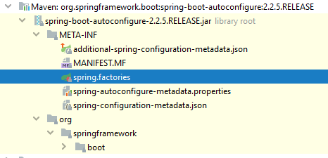

# Introduction
Spring Boot는 Spring 플랫폼과 써드 파티 라이브러리에 대한 *주관을 가지고 있기에 *요란한 동작 없이 Spring Boot로 애플리케이션 개발을 시작할 수 있다.

- 주관이란 opinionated view를 말한다.
- 요란한 동작이란 대부분의 경우 똑같은 따분한 설정을 말한다.

지금부터 Spring Boot가 어떻게 수많은 자동 설정을 지원하는지(예를 들어, Spring Boot 프로젝트를 만들고 main 메소드를 실행시켰을 때, 아무것도 설정한 게 없는데 어떻게 톰캣 서버가 뜨는지) 살펴보자.


# @Conditional
Spring Boot를 알아보기 앞서 먼저 Spring의 @Conditional에 대해 알아야 한다.

모든 Spring 프로젝트의 Configuration에서 공통되는 부분이 있다면?


우리가 ReallyBigCompany라는 회사에서 일하고 있다고 생각해보자. 이 회사의 여러 팀은 서로 다른 Spring 프로젝트를 진행하고 있다. 모든 Spring 프로젝트에서 공유하는 공통의 bean들이 있어서 이러한 공통 bean들을 하나의 Configuration으로 추출하고 싶다고 가정해보자.
```java
@Configuration
public class ReallyBigCompanySharedContextConfiguration { // (1)

    @Bean
    public ReallyBigCompanyProprietaryFlywayClone flywayClone() {
        return new ReallyBigCompanyProprietaryFlywayClone(); // (2)
    }
```
(1) 회사 내의 모든 Spring 프로젝트는 ReallyBigCompanySharedContextConfiguration을 포함하는 프로젝트의 .jar 파일을 import 해서 쓰면 된다.


(2) 회사 내의 모든 프로젝트는 관계형 데이터베이스를 사용하고 있다고 가정하자. Flyway는 데이터베이스를 초기화하고 관리할 때 사용되는 것으로 이 역시 모든 프로젝트의 공통 bean이다.

실제 프로젝트의 Configuration은 다음과 같은 모습일 것이다.

```java
@Configuration
@Import(ReallyBigCompanySharedConfiguration.class) // (1)
public class EarlyExitUnicornProjectContextConfiguration {

   // (2)
}
```

(1) 모든 회사 프로젝트는 ReallyBigCompanySharedContextConfiguration을 import한다.


(2) 해당 프로젝트에서만 사용하는 bean이 있다면 명시하면 된다.


이렇게 공통되는 설정을 분리해내고 이를 공유하도록 할 때 어떤 문제가 있을 수 있을까?

###Configuration이 공유될 때 발생할 수 있는 문제


회사에서 신규 Spring 프로젝트를 시작해야 하는데, 대부분의 bean은 역시 공통되므로 공유되는 Configuration을 사용하고 싶으나 신규 프로젝트에서는 관계형 데이터베이스를 사용하지 않아서 ReallyBigCompanyProprietaryFlywayClone은 빼고 싶을 수 있다.

이럴 때 바로 Spring의 @Conditional이 사용된다.

### @Conditional


Spring 4.0(released on 2013)부터 @Conditional을 제공한다. @Bean, @Component, @Configuration와 함께 쓰일 수 있다.

```java
@Conditional(SomeCondition.class) // (1)
```

@Conditional에는 Condition 클래스를 주어야 한다. Condition 클래스는 “matches”라는 메소드를 가지고 있는데, 이 메소드의 리턴 타입은 불린이다. 리턴이 true일 경우 조건 통과를 의미하고 bean이 만들어진다. (@Configuration이라면 @Configuration이 적용된다.)


### @Conditional을 이용한 개선

```java
@Configuration
public class ReallyBigCompanySharedContextConfiguration {

    @Bean
    @Conditional(IsRelationalDatabaseCondition.class) // (1)
    public ReallyBigCompanyProprietaryFlywayClone flywayClone() {
        return new ReallyBigCompanyProprietaryFlywayClone();
    }

}
```

(1) IsRelationalDatabaseCondition이라는 클래스의 matches 메소드가 true를 리턴해야만 ReallyBigCompanyProprietaryFlywayClone이 bean으로 등록된다.

@Conditional 덕분에 특정 프로퍼티 값에 따라 bean이 생성되게 할 수도 있고, 클래스패스에 특정 라이브러리가 있느냐에 따라 bean이 생성되도록 할 수도 있다.


# AutoConfiguration
##Spring Boot 애플리케이션을 실행하면 일어나는 일


Spring Boot 애플리케이션의 main 메소드는 아래와 같이 생겼다.

```java
package com.example;

import org.springframework.boot.SpringApplication;
import org.springframework.boot.autoconfigure.SpringBootApplication;

@SpringBootApplication
public class MySpringBootApp {

    public static void main(String[] args) { // (1)
        SpringApplication.run(MySpringBootApp.class, args);
    }

}
```

main 메소드를 실행하면 톰캣 서버가 뜨고, application.properties 파일이 읽히고, 즉시 @RestController를 작성할 수 있다.

어떻게 이게 가능할까?

##Spring Boot의 핵심적인 특징 세 가지


SpringApplication을 실행하면 많은 일들이 벌어지는데 그중에서도 아래의 세 가지 특징을 알아야 어떻게 이런 마법이 가능한지 알 수 있다.

1. @PropertySources를 등록한다.  
   Spring Boot는 자동으로 커맨드 라인, OS 환경 변수, application.properties와 같은 애플리케이션 프로퍼티를 포함한 17개의 경로에서 프로퍼티를 읽어온다. (경로는 우선순위가 정해져 있어서 서로 다른 경로에서 같은 프로퍼티를 갖는 경우 높은 우선순위의 경로에 있는 값이 낮은 우선순위의 값을 덮어쓴다.)

2. META-INF/spring.factories를 읽는다.  
   모든 Spring Boot 프로젝트는 org.springframework.boot:spring-boot-autoconfigure라는 라이브러리에 의존한다. 이는 단순한 .jar 파일로 수많은 Spring Boot의 마법(자동 설정)을 담고 있다.

```
# Auto Configure
org.springframework.boot.autoconfigure.EnableAutoConfiguration=\
org.springframework.boot.autoconfigure.admin.SpringApplicationAdminJmxAutoConfiguration,\
org.springframework.boot.autoconfigure.aop.AopAutoConfiguration,\
org.springframework.boot.autoconfigure.amqp.RabbitAutoConfiguration,\
org.springframework.boot.autoconfigure.batch.BatchAutoConfiguration,\
org.springframework.boot.autoconfigure.cache.CacheAutoConfiguration,\
org.springframework.boot.autoconfigure.cassandra.CassandraAutoConfiguration,\
org.springframework.boot.autoconfigure.cloud.CloudServiceConnectorsAutoConfiguration,\
org.springframework.boot.autoconfigure.context.ConfigurationPropertiesAutoConfiguration,\
org.springframework.boot.autoconfigure.context.MessageSourceAutoConfiguration,\
org.springframework.boot.autoconfigure.context.PropertyPlaceholderAutoConfiguration,\
org.springframework.boot.autoconfigure.couchbase.CouchbaseAutoConfiguration,\
org.springframework.boot.autoconfigure.dao.PersistenceExceptionTranslationAutoConfiguration,\
// 100+ more lines
```
   `#Auto configure` 섹션을 보면 백 개가 넘는 AutoConfiguration들이 명시되어 있다. 각각의 AutoConfiguration은 평범한 Spring의 Configuration으로, 수많은 @Conditional 어노테이션을 가지고 있다. Spring Boot는 이들을 읽고, 애플리케이션이 실행될 때마다 Condition을 검사하여 각각의 AutoConfiguation을 적용한다.  
   참고로 @EnableAutoConfiguartion은 @SpringBootApplication에 메타 어노테이션으로 붙어있다.

   >@EnableAutoConfiguration  
   >- Spring Boot에서 Spring에서 많이 쓰는 스프링 빈들을 자동적으로 컨테이너에 등록하는 역할
   >- autoconfiguration기능을 사용하겠다는 설정
   >- component scan을 통해서 모든 component 들의 정보와 Spring Boot가 spring.factories 파일에 사전에 정의한 AutoConfiguration 내용에 의해 bean 생성이 진행된다.
   >- Spring Boot의 meta 파일(spring-boot-autoconfigure/META-INF/spring.factories)을 읽어서 미리 정의 되어있는 자바 설정 파일(@Configuration)들을 빈으로 등록하는 역할을 수행 한다.
```java
@Target(ElementType.TYPE)
@Retention(RetentionPolicy.RUNTIME)
@Documented
@Inherited
@SpringBootConfiguration
@EnableAutoConfiguration
@ComponentScan(excludeFilters = { @Filter(type = FilterType.CUSTOM, classes = TypeExcludeFilter.class),
        @Filter(type = FilterType.CUSTOM, classes = AutoConfigurationExcludeFilter.class) })
public @interface SpringBootApplication {
        //요약
}
```
3. @Conditional의 확장을 제공한다.
```
   @ConditionalOnBean(.class)  
   @ConditionalOnClass(.class)  
   @ConditionalOnCloudPlatform(.class)  
   …
```


대부분의 condition의 경우 직접 작성할 필요 없이 다양한 Conditional의 확장을 이용하여 손쉽게 작성할 수 있다.


참고 :
- https://www.marcobehler.com/guides/spring-boot
- https://docs.spring.io/spring-boot/docs/current/reference/html/using.html#using.auto-configuration