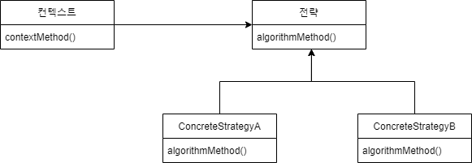
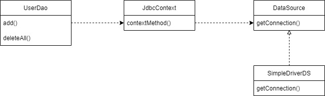

# 3. 템플릿

## 3.1 예외처리 기능을 갖춘 DAO

```java
public void deleteAll() throws SQLException {
        Connection c = dataSource.getConnection();

        PreparedStatement ps = c.prepareStatement(
                "delete from users"
        );
        ps.executeUpdate();

        ps.close();
        c.close();
}
```

위 코드는 예외가 발생하면 close() 메서드를 실행하지 않고 바로 SQLException 을 던진다.
풀(Pool) 방식으로 운영되는 JDBC는 close() 메서드를 통해 리소스를 반환하는데,
Exception 때문에 close 메서드를 계속 수행하지 못하는 상황이 발생하면 리소스가 고갈되고 문제가 발생한다.

그래서 JDBC 코드에서는 try/catch/finally 구문 사용을 권장하고 있다.
이 구문을 적용하면 코드는 아래와 같이 변경된다.

```java
public void deleteAll() throws SQLException {
        Connection c = dataSource.getConnection();
        PreparedStatement ps = null;

        try {
            ps = c.prepareStatement(
                    "delete from users");
            ps.executeUpdate();
        } catch (SQLException e) {
            throw e;
        } finally {
            if (ps != null) {
                try {
                    ps.close();
                } catch (SQLException e) {
                }
            }
            if (c != null) {
                try {
                    c.close();
                } catch (SQLException e) {
                }
            }
        }
    }
```

## 3.2 변하는 것과 변하지 않는 것

### 3.2.1 JDBC try/catch/finally 코드의 문제점

- 코드가 너무 지저분하다.
- 만약 close() 메서드를 빠뜨리면 이것이 누적되어 서버에 장애를 일으킬 수 있다.

### 3.2.2 분리와 재사용을 위한 디자인 패턴 적용

- **메서드 추출**

위 코드는 변하는 부분이 변하지 않는 부분보다 많다.
변하는 부분을 따로 메서드를 추출해도 이 메서드는 재사용성이 없기 때문에 별로 좋지 않은 방법이다.

- **템플릿 메서드 패턴의 적용**

이 방법은 변하지 않는 부분을 상위 클래스에 두고 변하는 부분은 추상 메서드로 정의해둬서 하위 클래스에서 오버라이드하여 새롭게 정의해 쓰도록 하는 것이다.
하지만 DAO 로직마다 상속을 통해 새로운 클래스를 만들어야 하기 때문에 여기서는 좋지 않은 방법이다.
또 확장 구조가 컴파일 시점에서 고정되어 버리기 때문에 그 관계에 대한 유연성이 떨어진다.
이것은 상속을 통해 확장을 꾀하는 템플릿 메서드 패턴의 한계이다.

- **전략 패턴의 적용**

오브젝트를 둘로 분리하고 클래스 레벨에서는 인터페이스를 통해서만 의존하도록 만드는 것이 전략 패턴이다.
OCP 관점에서 보면 확장에 해당하는 변하는 부분을 별도의 클래스로 만들어 추상화된 인터페이스를 통해 위임하는 방식이다.



전략 패턴은 컨텍스트, 전략, 컨텍스트를 호출하는 클라이언트로 나뉜다.
컨텍스트를 따로 분리하면 아래와 같은 코드가 된다.

```java
public void jdbcContextWithStatementStrategy(StatementStrategy stmt) throws SQLException {
        Connection c = null;
        PreparedStatement ps = null;

        try {
            c = dataSource.getConnection();
            ps = stmt.makePreparedStatement(c);
            ps.executeUpdate();
        } catch (SQLException e) {
            throw e;
        } finally {
            if (ps != null) {
                try {
                    ps.close();
                } catch (SQLException e) {
                }
            }
            if (c != null) {
                try {
                    c.close();
                } catch (SQLException e) {
                }
            }
        }
    }
```
클라이언트로부터 StatementStrategy 타입의 전략 오브젝트를 제공받고 JDBC try/catch/finally 구조로
만들어진 컨텍스트 내에서 작업을 수행한다. 제공받은 전략 오브젝트는 PrepareStatement 생성이 필요한 시점에
호출해서 사용한다. 모든 JDBC 코드의 고정된 작업이 이 컨텍스트 메서드에 담겨 있는 것이다.

다음은 클라이언트의 책임을 담당하는 deleteAll() 메서드이다.
deleteAll() 은 전략 객체를 생성하고 컨텍스트를 호출하는 책임을 가지고 있다.

```java
public void deleteAll() throws SQLException {
        StatementStrategy st = new DeleteAllStatement();
        jdbcContextWithStatementStrategy(st);
}
```

## 3.3 JDBC 전략 패턴 최적화

기존 JDBC 의 add 메서드도 전략 패턴을 이용해 작성할 수 있다.

```java
public void add(User user) throws ClassNotFoundException, SQLException {
    StatementStrategy st = new AddStatement(user);
    jdbcContextWithStatementStrategy(st);
}
```
```java
public class AddStatement implements StatementStrategy{
    User user;

    public AddStatement(User user) {
        this.user = user;
    }

    @Override
    public PreparedStatement makePreparedStatement(Connection c) throws SQLException {
        PreparedStatement ps = c.prepareStatement(
                "insert into users(id, name, password) values (?, ?, ?)"
        );
        ps.setString(1, user.getId());
        ps.setString(2, user.getName());
        ps.setString(3, user.getPassword());

        return ps;
    }
}
```

하지만 이 구조에도 단점이 있는데, DAO 메서드마다 새로운 StatementStrategy 구현 클래스를 만들어야 한다는 점이다.
이렇게 되면 기존 UserDao 때보다 클래스 파일의 개수가 늘어난다.
이래서는 런타임 시에 다이나믹하게 DI 해준다는 점을 제외하면 템플릿 메서드 패턴과 다른게 없다.

또다른 단점은 DAO 메서드에서 StatementStrategy 에 전달할 User와 같은 부가적인 정보가 있는 경우,
이를 위해 생성자와 이를 저장해둘 인스턴스 변수를 만들어야 한다는 점이다.

### 해결 방법. 익명 내부 클래스

생성자가 필요하고 그 클래스가 한 번 쓰고 안 쓰일 클래스라면 익명 내부 클래스로 선언할 수 있다.

```java
public void add(final User user) throws SQLException {
        jdbcContextWithStatementStrategy(new StatementStrategy() {
            @Override
            public PreparedStatement makePreparedStatement(Connection c) throws SQLException {
                PreparedStatement ps = c.prepareStatement("insert into users(id, name, password) values (?, ?, ?)");
                ps.setString(1, user.getId());
                ps.setString(2, user.getName());
                ps.setString(3, user.getPassword());

                return ps;
            }
        });
    }
```

Java 8 의 람다를 이용하면 더욱 간단하게 변경할 수 있다.

```java
public void add(final User user) throws SQLException {
        jdbcContextWithStatementStrategy(c -> {
            PreparedStatement ps = c.prepareStatement("insert into users(id, name, password) values (?, ?, ?)");
            ps.setString(1, user.getId());
            ps.setString(2, user.getName());
            ps.setString(3, user.getPassword());

            return ps;
        });
    }
```

### 3.3.1 JdbcContext의 특별한 DI

JdbcContext 를 따로 클래스를 생성한다.

```java
public class JdbcContext {
    private DataSource dataSource;

    public void setDataSource(DataSource dataSource) {
        this.dataSource = dataSource;
    }

    public void workWithStatementStrategy(StatementStrategy stmt) throws SQLException {
        Connection c = null;
        PreparedStatement ps = null;

        try {
            c = dataSource.getConnection();
            ps = stmt.makePreparedStatement(c);
            ps.executeUpdate();
        } catch (SQLException e) {
            throw e;
        } finally {
            if(ps != null) { try {ps.close(); }catch (SQLException e){}}
            if(c != null){ try {c.close(); }catch (SQLException e){}}
        }
    }
}
```

#### 스프링 빈으로 DI

```xml
<bean id="dataSource" class="org.springframework.jdbc.datasource.SimpleDriverDataSource">
    <property name="driverClass" value="com.mysql.jdbc.Driver"/>
    <property name="url" value="jdbc:mysql://localhost/testdb?useUnicode=True&amp;serverTimezone=Asia/Seoul"/>
    <property name="username" value="sejun"/>
    <property name="password" value="1234"/>
</bean>

<bean id="jdbcContext" class="dao.JdbcContext">
    <property name="dataSource" ref="dataSource" />
</bean>

<bean id="userDao" class="dao.UserDao">
    <property name="dataSource" ref="dataSource"/>
    <property name="jdbcContext" ref="jdbcContext"/>
</bean>
```

JdbcContext 는 내부적으로 DataSource 를 주입받아야 한다.
그리고 이것을 사용하는 UserDao 클래스에 setJdbcContext 메서드를 추가하면 아래의 그림과 같은 관계가 된다.



자세히 보면 UserDao 와 JdbcContext 가 주입받고 있지만 서로 강하게 결합되어 있다.
DI 개념을 충실히 따르면, 인터페이스를 사이에 둬서 클래스 레벨에서는 의존관계가 고정되지 않게 하고,
런타임 시에 의존할 오브젝트와의 관계를 다이내믹하게 주입해주는 것이 맞다.

그러나 스프링 DI를 넓게 보면 객체의 생성과 관계설정에 대한 제어권한을 오브젝트에서 제거하고 외부로 위임했다는 IoC라는 개념을 포괄한다.
그런 의미에서 JdbcContext를 스프링을 이용해 UserDao 객체에서 사용하게 주입했다는 건 DI의 기본을 따르고 있다고 볼 수 있다.

실제로 스프링에서는 드물지만 이렇게 **인터페이스를 사용하지 않는 클래스를 직접 의존하는 DI**가 등장하는 경우도 있다.
비록 클래스는 구분되어 있지만 UserDao 와 JdbcContext 는 서로 강한 응집도를 가지고 있다.
JdbcContext는 달리 테스트에서도 다른 구현으로 대체해서 사용할 일이 없기 때문에 가능한 일이다.

이런 경우에, 싱글톤으로 만드는 것과 JdbcContext에 대한 DI 필요성을 위해 스프링 빈으로 등록해서 UserDao에 DI 되도록 만들어도 좋다.


#### 코드를 이용하는 수동 DI

이 방법을 쓰러면 JdbcContext 를 싱글톤으로 만들려는 것은 포기해야 한다.
JdbcContext 를 스프링 빈으로 등록하지 않으면 이 클래스의 제어권은 UserDao 가 갖는 것이 맞다.
이것을 구현하려면 기존 application-context.xml 에 JdbcContext 와 관련된 설정 정보를 제외하고,
UserDao의 set 메서드에 아래와 같이 작성한다.

```java
public class UserDao {
    private DataSource dataSource;
    private JdbcContext jdbcContext;

    public void setDataSource(DataSource dataSource) {
        this.jdbcContext = new JdbcContext(); // JdbcContext 생성(IoC)
        this.jdbcContext.setDataSource(dataSource); // 의존 오브젝트 주입(DI)
        this.dataSource = dataSource; // 아직 JdbcContext를 적용하지 않은 메서드를 위해 존재함
    }
    ...
}
```

이 방법의 장점은 굳이 인터페이스를 두지 않아도 될 만큼 긴밀한 관계를 갖는 DAO 클래스와 JdbcContext를 어색하게 따로 빈으로 분리하지 않고 내부에서 직접 만들어 사용하면서도 DI를 적용할 수 있다는 점이다.
이렇게 한 오브젝트의 수정자 메서드에서 다른 오브젝트를 초기화하고 코드를 이용해 DI 하는 것은 스프링에서 종종 사용되는 기법이다.

# 3.5 템플릿과 콜백

전략 패턴의 기본 구조에 익명 내부 클래스를 활용한 방식을 스프링에서는 **템플릿/콜백 패턴**이라고 부른다.

- 전략 패턴의 **컨텍스트** : 템플릿/콜백 패턴의 **템플릿**
- 익명 내부 클래스로 만들어지는 오브젝트 : **콜백**

```text
템플릿 : 템플릿은 어떤 목적을 위해 미리 만들어둔 모양이 있는 틀을 가리킨다.

콜백 : 실행되는 것을 목적으로 다른 오브젝트의 메서드에 전달되는 오브젝트를 말한다. 파라미터로 전달된다.
자바에서는 메서드 자체를 파라미터로 전달할 방법은 없기 때문에 메서드가 담긴 오브젝트를 리턴해야한다.
그래서 functional object 라고도 한다.
```

### 3.5.1 템플릿/콜백의 특징

여러 개의 메서드를 가진 일반적인 인터페이스를 사용할 수 있는 전략 패턴과 달리 템플릿/콜백 패턴은 보통 단일 메서드 인터페이스를 사용한다.
콜백은 일반적으로 하나의 메서드를 가진 인터페이스를 구현한 익명 내부 클래스로 만들어진다.

클라이언트가 템플릿 메서드를 호출하면서 콜백 오브젝트를 전달하는 것은 메서드 레벨에서 일어나는 DI 이다.
템플릿이 사용할 콜백 인터페이스를 구현한 오브젝트를 메서드를 통해 주입해주는 DI 작업이 클라이언트가 템플릿의 기능을 호출하는 것과 동시에 일어난다.
일반적인 DI라면 템플릿에 인스턴스 변수를 만들어두고 사용할 의존 오브젝트를 수정자 메서드로 받아서 사용할 것이다.

반면에 템플릿/콜백 방식에서는 매번 메서드 단위로 사용할 오브젝트를 새롭게 전달받는 것이 특징이다.
템플릿/콜백 방식은 전략 패턴과 DI의 장점을 익명 내부 클래스 사용 전략과 결합한 독특한 활용법이라고 이해할 수 있다.


### 3.5.2 템플릿/콜백 설계

#### 1. 예제

- 파일을 읽어 그 파일 안에 있는 숫자를 읽어오는 Calculator 클래스 생성
- 이 클래스를 테스트하는 CalcSumTest 클래스 생성

```java
public class Calculator {
    public Integer fileSum(String filepath) throws IOException {
        BufferedReader br = null;
        try {
            br = new BufferedReader(new FileReader(filepath));
            Integer sum = 0;
            String line = null;
            while ((line = br.readLine()) != null) {
                sum += Integer.valueOf(line);
            }
            return sum;
        } catch (Exception e) {
            System.out.println(e.getMessage());
            throw e;
        } finally {
            if (br != null) {
                try {
                    br.close();
                } catch (IOException e) {
                    System.out.println(e.getMessage());
                }
            }
        }
    }
}
```

```java
public class CalcSumTest {
    @Test
    public void sumOfNumbers() throws IOException {
        Calculator calculator = new Calculator();
        File file = new File("");
        int sum = calculator.fileSum("src/test/resources/numbers.txt");
        Assertions.assertEquals(sum, 10);
    }
}

```

#### 2. 중복 제거와 템플릿/콜백 설계

나중에 Calculator 메서드를 확장할 때 fileSum 메서드의 try/catch/finally 부분은 중복될 것이 뻔하다.
따라서 중복되는 부분을 템플릿으로 만든다.

현 코드에서 템플릿이 하는 역할

- 템플릿이 파일을 연다.
- 각 라인을 읽어올 수 있는 BufferedReader를 만들어서 콜백에게 전달한다.
- 콜백이 각 라인을 읽어서 결괏값만 템플릿에게 돌려준다.

```java
public interface BufferedReaderCallback {
    Integer doSomethingWithReader(BufferedReader br) throws IOException;
}
```

```java
public Integer fileReadTemplate(String filepath, BufferedReaderCallback callback) throws IOException {
    BufferedReader br = null;
    try {
        br = new BufferedReader(new FileReader(filepath));
        int ret = callback.doSomethingWithReader(br);
        return ret;
    } catch (Exception e) {
        System.out.println(e.getMessage());
        throw e;
    } finally {
        if (br != null) {
            try {
                br.close();
            } catch (IOException e) {
                System.out.println(e.getMessage());
            }
        }
    }
}
```

이제 합계를 계산하는 메서드를 익명 메서드를 이용해 다음과 같이 작성한다.

```java
public Integer calcSum(String filepath) throws IOException {
    BufferedReaderCallback sumCallback = new BufferedReaderCallback() {
        @Override
        public Integer doSomethingWithReader(BufferedReader br) throws IOException {
            Integer sum = 0;
            String line = null;
            while ((line = br.readLine()) != null) {
                sum += Integer.valueOf(line);
            }
            return sum;
        }
    };
    return fileReadTemplate(filepath, sumCallback);
}
```

BufferedRedaerCallback 인터페이스를 익명 메서드로 구현하고 sum 값을 리턴한다.
리턴한 값을 fileReadTemplate 에게 전달한다.

```java
public class CalcSumTest {
    Calculator calculator;
    String numFilepath;

    @BeforeEach
    public void setUp() {
        this.calculator = new Calculator();
        numFilepath = "src/test/resources/numbers.txt";
    }

    @Test
    public void sumOfNumbers() throws IOException {
        Assertions.assertEquals(calculator.calcSum(numFilepath), 10);
    }
}
```

테스트에 사용할 calculator 와 numFilepath 는 테스트 하기 전 똑같은 오브젝트로 설정돼야 하므로, @BeforeEach 를 이용한다.
그리고 sumOfNumbers() 테스트를 통해 내가 예상한 결괏값과 맞는지 체크한다.

```java
public Integer calcMultiply(String filepath) throws IOException {
    BufferedReaderCallback multiplyCallback = new BufferedReaderCallback() {
        @Override
        public Integer doSomethingWithReader(BufferedReader br) throws IOException {
            Integer multiply = 1;
            String line = null;
            while ((line = br.readLine()) != null) {
                multiply *= Integer.valueOf(line);
            }
            return multiply;
        }
    };
    return fileReadTemplate(filepath, multiplyCallback);
}
```

try/catch/finally 중복되는 부분을 템플릿으로 제외시켰기 때문에, Calculator 클래스에서 곱셈 기능을 추가한다고 해도
덧셈을 구현했을 때처럼 구현할 수 있다. 하지만 이 calcSum() 과 calcMultiply() 메서드도 자세히 보면 중복되는 부분이 있다.

```text
calcXXX()
Integer XXX = 0 or 1;
String line = null;
while((line = br.readLine()) != null){
    XXX += or *= Integer.valueof(line)
}
return XXX;
```

line 과 값을 리턴하는 value 의 차이만 있으므로 다시 이부분을 인터페이스로 선언한다.

```java
public interface LineCallback {
    Integer doSomethingWithLine(String Line, Integer Value);
}
```

```java
public Integer lineReadTemplate(String filepath, LineCallback callback, int initVal) throws IOException {
    BufferedReader br = null;
    try {
        br = new BufferedReader(new FileReader(filepath));
        Integer res = initVal;
        String line = null;
        while ((line = br.readLine()) != null) {
            res = callback.doSomethingWithLine(line, res);
        }
        return res;
    } catch (Exception e) {
        System.out.println(e.getMessage());
        throw e;
    } finally {
        if (br != null) {
            try {
                br.close();
            } catch (IOException e) {
                System.out.println(e.getMessage());
            }
        }
    }
}
```

그리고 템플릿에 해당하는 코드를 변경한다.
기존에 try/catch/finally 만 템플릿으로 작성했다면, 위 코드는 초기셋팅값, 라인 불러오기를 담당하고 있다.
**계산을 담당하는 부분**만 콜백 메서드를 호출한다.

```java
public Integer calcSum(String filepath) throws IOException {
    LineCallback sumCallback = new LineCallback() {
        @Override
        public Integer doSomethingWithLine(String line, Integer value) {
            return value + Integer.valueOf(line);
        }
    };
    return lineReadTemplate(filepath, sumCallback, 0);
}

public Integer calcMultiply(String filepath) throws IOException {
    LineCallback multiCallback = new LineCallback() {
        @Override
        public Integer doSomethingWithLine(String line, Integer value) {
            return value * Integer.valueOf(line);
        }
    };
    return lineReadTemplate(filepath, multiCallback, 1);
}
```

코드의 중복되는 부분이 눈에 띄게 줄었다. Java 8의 람다를 적용하면 더욱 간단해진다.

```java
public Integer calcSum(String filepath) throws IOException {
    LineCallback sumCallback = (line, value) -> value + Integer.valueOf(line);
    return lineReadTemplate(filepath, sumCallback, 0);
}

public Integer calcMultiply(String filepath) throws IOException {
    LineCallback multiCallback = (line, value) -> value * Integer.valueOf(line);
    return lineReadTemplate(filepath, multiCallback, 1);
}
```

#### 3. 제네릭을 이용한 콜백 인터페이스

만약에 파일에 존재하는 문자를 더해주고 싶을 때 Integer 타입만으로는 한계가 있다.
아래 코드는 좀 더 범용성을 지니게 하기 위해 Java 5 에서 소개된 제네릭을 사용한 템플릿/콜백 패턴이다.

```java
public interface LineCallback<T> {
    T doSomethingWithLine(String line, T value);
}
```

```java
public <T> T lineReadTemplate(String filepath, LineCallback<T> callback, T initVal) throws IOException {
    BufferedReader br = null;
    try {
        br = new BufferedReader(new FileReader(filepath));
        T res = initVal;
        String line = null;
        while ((line = br.readLine()) != null) {
            res = callback.doSomethingWithLine(line, res);
        }
        return res;
    } catch (Exception e) {
        System.out.println(e.getMessage());
        throw e;
    } finally {
        if (br != null) {
            try {
                br.close();
            } catch (IOException e) {
                System.out.println(e.getMessage());
            }
        }
    }
}
```

이제 문자열 연결 기능을 제공하는 메서드와 테스트 코드를 작성한다.

```java
public String concatenate(String filepath) throws IOException {
    LineCallback<String> concatenateCallback = ((line, value) -> value + line);
    return lineReadTemplate(filepath, concatenateCallback, "");
}
```

```java
@Test
public void 문자열연결() throws IOException {
    assertEquals(calculator.concatenate(numFilepath), "1234");
}
```
최종적으로, 템플릿/콜백과 제네릭을 이용해 범용성과 재사용성, 가독성을 모두 잡았다.

출처 : 토비의 스프링