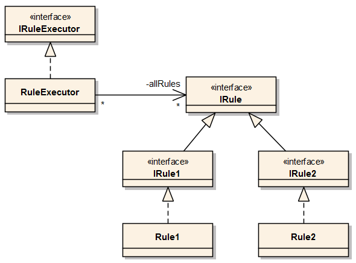

# intro

## 스프링이란 무엇인가?

스프링 컨테이너(애플리케이션 컨텍스트) 라 불리는 스프링 런타임 엔진 제공

아래 세 요소로 애플리케이션을 개발하게 된다.

## 스프링 컨테이너

설정정보를 참고해 애플리케이션을 구상하는 오브젝트를 생성, 관리

독립적 동작도 가능하지만, 보통 웹 모듈에서 동작하는 서비스나 서블릿으로 등록해 사용

## 공통 프로그래밍 모델

### Ioc/DI

오브젝트 생명주기와 의존관계에 대한 프로그래밍 모델

스프링 프레임워크의 근간

스프링의 모든 기술, API, 컨테이너는 IoC/ DI 방식으로 작성되어 있다.

### 서비스 추상화

유연한 어플리케이션 설계를 위해 필요한 개념.

구체적 기술/환경에 종속되지 않는 유연한 추상 계층을 둔다.

### AOP

애플리케이션 코드에 산재해서 나타나는 부가기능을 독립적으로 모듈화하는 프로그래밍 모델

엔터프라이즈 서비스를 적용하고도 깔끔한 코드를 유지할 수 있게 된다

## 기술 API

스프링에는 여러 기술 API들이 있다.

UI 작성, 웹 프레젠테이션 계층, 비즈니스 서비스 계층, 기반 서비스 계층, 도메인 계층, 데이터 액세스 계층… 스프링에서 지원하고 전략클래스를 제공함

> 클래스는 스프링 컨테이너 위에서 오브젝트로 만들어져 동작하게 만들고, 코드는 스프링의 프로그래밍 모델을 따라서 작성하고, 엔터프라이즈 기술을 사용할 때는 스프링이 제공하는 기술 API와 서비스를 활용하도록 해주면 된다.

## 스프링의 성공 요인

### 1. 단순성

스프링이 강력히 주장하는건 POJO 프로그래밍. 가장 단순한 객체지향적인 개발 모델이다.

### 2. 유연성

스프링은 유연성, 확장성이 좋다. 지난 9년(책 기준) 넘도록 여러 서드파티 프레임워크의 지원을 받았다.

## 스프링 학습법

스프링을 잘 학습하려면 다음 방식으로 공부해야 한다

### 1. 스프링 핵심 가치와 원리에 대한 이해

첫 번째 단계는 스프링의 핵심 가치를 이해하고, 스프링 스스로가 그 가치를 어떻게 적용해서 만들어져 있는지를 이해하는 것이다.

### 2. 스프링 기술에 대한 지식과 선택 기준 정립

먼저 스프링이 제공하는 기술의 종류와 접근 방법에는 어떤 것이 있는지 충분히 살펴보고, 선택의 기준을 마련해서 그때그때 상황에 맞는 최선의 기술과 접근 방법을 선택할 수 있어야
한다.

### 3. 스프링의 적용과 확장

스프링은 이전에는 기술적인 문제로 쉽게 적용하지 못했던 아키텍처도 마음껏 활용할 수 있게 도와준다. 또한 스프링에 제공하는 기능을 그대로 사용하는 것 외에도 그것을 확장하거나
추상화해서 사용하는 방법을 알아야 한다.

# 1. DAO 분리

> 개발자에게 가장 중요한 것은 미래의 변화에 어떻게 대비할 것이냐이다.

## SOLID(객체지향 설계 원칙) 속 개방 폐쇄 원칙(OCP)

`개방 폐쇄 원칙`은 깔끔한 설계를 위해 적용 가능한 객체지향 설계 원칙 중의 하나다.

이 원칙을 간단히 정의하자면 “클래스나 모듈은 `확장에는 열려 있어야 하고 변경에는 닫혀 있어야 한다.`” 라고 할 수 있다.

## 관심사의 분리

`관심사의 분리` : 관심이 같은 것 끼리는 하나의 객체 안으로 또는 친한 객체로 모이게 하고, 관심이 다른 것은 서로 영향을 주지 않도록 분리한다.

`높은 응집도` : 응집도가 높다는 것은 변화가 일어날 때 해당 모듈에서 변하는 부분이 크다는 것으로 설명할 수도 있다. 즉 변경이 일어날 때 모듈의 많은 부분이 함께 바뀐다면
응집도가 높다고 말할 수 있다.

`낮은 결합도` : 낮은 결합도는 높은 응집도보다 더 민감한 원칙이다. 책임과 관심사가 다른 오브젝트 또는 모듈과는 낮은 결합도, 즉 느슨하게 연결된 형태를 유지하는 것이
바람직하다. 결합도가 낮아지면 변화에 대응하는 속도가 높아지고, 구성이 깔끔해진다. 또한 확장하기에도 매우 편리하다. 여기서 결합도란 하나의 오브젝트가 변경이 일어날 때에 관계를
맺고 있는 다른 오브젝트에게 변화를 요구하는 정도라고 설명할 수 있다.

## 디자인패턴

`디자인 패턴` : 소프트웨어 설계 시 특정 상황에서 자주 만나는 문제를 해결하기 위해 사용할 수 있는 재사용 가능한 솔루션

### 상속을 사용한 디자인 패턴

- 템플릿 메소드 패턴 : 상속을 통해 슈퍼클래스의 기능을 확장할 때 사용하는 가장 대표적인 방법이다. 변하지 않는 기능은 슈퍼클래스에 만들어두고 자주 변경되며 확장할 기능은
  서브클래스에서 만들도록 한다.

- 팩토리 메소드 패턴 : 템플릿 메소드 패턴과 마찬가지로 상속을 통해 기능을 확장하게 하는 패턴이다.
    - 이 메소드는 주로 인터페이스 타입으로 오브젝트를 리턴하므로 서브클래스에서 정확히 어떤 클래스의 오브젝트를 만들어 리턴할 지는 슈퍼클래스에서는 알지 못한다. 사실 관심도
      없다.

두 패턴의 단점 : 상속!

- 다중상속 불가
- 상하위 클래스 간 결합도 증가

### 전략 패턴

전략 패턴은 자신의 기능 맥락 `context`에서, 필요에 따라 변경이 필요한 알고리즘을 인터페이스를 통해 통째로 외부로 분리시키고, 이를 구현한 구체적인 알고리즘 클래스를
필요에 따라 바꿔서 사용할 수 있게 하는 디자인 패턴이다.

여기서 말하는 알고리즘이란 거창한 수학적 알고리즘을 말하는 게 아니고, **독립적인 책임으로 분리가 가능한 기능을 뜻한다.**

이를 **대체 가능한 전략**이라고 보기 때문에 패턴의 이름이 전략 패턴이다.

# 2. DAO 확장

## 클래스의 분리(조합)

### 방식

DB 커넥션과 관련된 부분을 서브클래스가 아니라, 아예 별도의 클래스에 담는다.

그리고 이렇게 만든 클래스를 UserDao가 이용하게 하면 된다. 정말 간단하지 않은가?

### 문제

- 다른 DB 커넥션 클래스를 사용시 메소드 이름이 다르면 일일히 메소드명을 수정해줘야 한다.
- DB 커넥션을 제공하는 클래스가 어떤 것인지를 UserDao가 구체적으로 알고 있어야 한다.

## 인터페이스의 도입

### 추상화

두 개의 클래스가 서로 긴밀하게 연결되어 있지 않도록 중간에 추상적인 느슨한 연결고리를 만들어주는 것이다. 추상화란 어떤 것들의 공통적인 성격을 뽑아내어 이를 따로 분리해내는
작업이다.

### 인터페이스



자바가 추상화를 위해 제공하는 가장 유용한 도구는 바로 인터페이스다.

인터페이스는 어떤 일을 하겠다는 기능만 정의해놓은 것이다. 따라서 인터페이스에는 어떻게 하겠다는 구현 방법은 나타나 있지 않다. 그것은 인터페이스를 구현한 클래스들이 알아서 결정할
일이다.

### 여전히 문제

```java
public class UserDao {

  private ConnectionMaker connectionMaker;

  public UserDao() {

    connectionMaker = new DConnectionMaker();
  }

  public void add(User user) throws ClassNotFoundException, SQLException {
    Connection c = connectionMaker.makeConnection();
    //...
  }

  public User get(String id) throws ClassNotFoundException, SQLException {
    Connection c = connectionMaker.makeConnection();
    //...
  }
}
```

UserDao의 다른 모든 곳에서는 인터페이스를 이용하게 만들어서 DB 커넥션을 제공하는 클래스에 대한 구체적인 정보는 모두 제거가 가능했지만, 초기에 한 번 어떤 클래스의
오브젝트를 사용할지를 결정하는 생성자의 코드는 제거되지 않고 남아 있다.

제거하고 싶은데 간단한 방법이 보이지 않는다.

클래스 이름을 넣어서 오브젝트를 만들지 않으면 어떻게 사용하란 말인가?

## 관계설정 책임의 분리

```java
public UserDao(ConnectionMaker connectionMaker){
    this.connectionMaker=connectionMaker;
    }
```

오브젝트 사이의 관계가 만들어지려면 일단 만들어진 오브젝트가 있어야 하는데,

이처럼 직접 생성자를 호출해서 직접 오브젝트를 만드는 방법도 있지만

외부에서 만들어준 것을 가져오는 방법도 있다.

외부에서 만든 오브젝트를 전달받으려면 메소드 파라미터나 생성자 파라미터를 이용하면 된다.

# 3. 제어의 역전(IoC)

## 팩토리

```java
package springbook.user.dao; //... public class DaoFactory {

public UserDao userDao(){ConnectionMaker connectionMaker=new DConnectionMaker();UserDao userDao
    =new UserDao(connectionMaker);return userDao;}

    }

public class UserDaoTest {

  public static void main(String[] args) throws ClassNotFoundException,
      SQLException {
    UserDao dao = new DaoFactory().userDao();

  }

}
```

### 개념

객체의 생성 방법을 결정하고 그렇게 만들어진 오브젝트를 돌려주는 일을 하는 오브젝트(클래스)

### 장점

애플리케이션의 컴포넌트 역할을 하는 오브젝트와 애플리케이션의 구조를 결정하는 오브젝트를 분리할 수 있다.

### 활용

```java
public class DaoFactory {

  public UserDao userDao() {
    return new UserDao(new DConnectionMaker());
  }

  public AccountDao accountDao() {
    return new AccountDao(new DConnectionMaker());
  }

  public MessageDao messageDao() {
    return new MessageDao(new DConnectionMaker());
  }

}
```

## 제어의 역전

오브젝트가 자신이 사용할 오브젝트를 스스로 선택하지 않는다. 당연히 생성하지도 않는다. 또 자신도 어떻게 만들어지고 어디서 사용되는지를 알 수 없다.

**모든 제어 권한을 자신이 아닌 다른 대상에게 위임**하기 때문이다.

프로그램의 시작을 담당하는 main()과 같은 엔트리 포인트를 제외하면 모든 오브젝트는 이렇게 위임받은 제어 권한을 갖는 특별한 오브젝트에 의해 결정되고 만들어진다.

> 스프링은 IoC를 모든 기능의 기초가 되는 기반기술로 삼고 있으며, IoC를 극한까지 적용하고 있는 프레임워크다.

# 4. 스프링의 IoC

## 빈(Bean)

### 개괄적 의미

오브젝트 단위의 애플리케이션 컴포넌트

### 스프링 빈

스프링이 제어권을 가지고 직접 만들고 관계를 부여하는 오브젝트, 스프링 컨테이너가 생성과 관계설정, 사용 등을 제어해주는 제어의 역전이 적용된 오브젝트

## 빈 팩토리

`스프링`에서는 빈의 생성과 관계설정 같은 제어를 담당하는 `IoC 오브젝트`를 `빈 팩토리(bean factory)`라고 부른다.

보통 `빈 팩토리`보다는 이를 좀 더 확장한 `애플리케이션 컨텍스트(application context)`를 주로 사용한다. (빈 팩토리 = 애플리케이션 컨텍스트)

## 애플리케이션 컨텍스트

애플리케이션 컨텍스트는 별도의 정보를 참고해서 빈(오브젝트)의 생성, 관계설정 등의 제어 작업을 총괄한다.

애플리케이션의 로직을 담고 있는 컴포넌트와 `설계도` 역할을 하는 팩토리를 구분했었다.

바로 이 설계도라는 게 바로 이런 `애플리케이션 컨텍스트`와 그 설정정보를 말한다고 보면 된다.

### 사용법

> 스프링을 적용하긴 했지만 사실 앞에서 만든 DaoFactory를 직접 사용한 것과 기능적으로 다를 바 없다.
>1. 먼저 스프링이 빈 팩토리를 위한 오브젝트 설정을 담당하는 클래스라고 인식할 수 있도록 @Configuration이라는 애노테이션을 추가
>2. 그리고 오브젝트를 만들어주는 메소드에는 @Bean이라는 애노테이션을 붙여준다.
>- 애플리케이션 컨텍스트는 ApplicationContext 타입의 오브젝트다.
>- getBean() 메소드는 ApplicationContext가 관리하는 오브젝트를 요청하는 메소드다.

getBean()은 기본적으로 Object 타입으로 리턴하게 되어 있어서 매번 리턴되는 오브젝트에 다시 캐스팅을 해줘야 하는 부담이 있다.

자바 5 이상의 제네릭generic 메소드 방식을 사용해 getBean()의 두 번째 파라미터에 리턴 타입을 주면, 지저분한 캐스팅 코드를 사용하지 않아도 된다.

### 장점

DaoFactory가 UserDao를 비롯한 DAO 오브젝트를 생성하고 DB 생성 오브젝트와 관계를 맺어주는 제한적인 역할을 하는 데 반해, 애플리케이션 컨텍스트는 애플리케이션에서
IoC를 적용해서 관리할 `모든 오브젝트에 대한 생성과 관계설정을 담당한다.`

- @Configuration이 붙은 DaoFactory는 이 애플리케이션 컨텍스트가 활용하는 IoC 설정정보다. 내부적으로는 애플리케이션 컨텍스트가 DaoFactory의
  userDao() 메소드를 호출해서 오브젝트를 가져온 것을 클라이언트가 getBean()으로 요청할 때 전달해준다.
- 애플리케이션 컨텍스트는 DaoFactory 클래스를 설정정보로 등록해두고 @Bean이 붙은 메소드의 이름을 가져와 빈 목록을 만들어둔다.

DaoFactory와 같은 오브젝트 팩토리에서 사용했던 IoC 원리를 그대로 적용하는 데 애플리케이션 컨텍스트를 사용하는 이유는 범용적이고 유연한 방법으로 IoC 기능을 확장하기
위해서다.

# 5. 싱글톤 패턴과 싱글톤 레지스트리

## 싱글톤 패턴

> 싱글톤 패턴은 GoF가 소개한 디자인 패턴 중의 하나다. 디자인 패턴 중에서 가장 자주 활용되는 패턴이기도 하지만 가장 많은 비판을 받는 패턴이기도 하다. 심지어 디자인 책을 쓴 GoF 멤버조차도 싱글톤 패턴은 매우 조심해서 사용해야 하거나 피해야 할 패턴이라고 말하기도 한다.

### 정의

싱글톤 패턴은 어떤 클래스를 애플리케이션 내에서 제한된 인스턴스 개수, 이름처럼 주로 하나만 존재하도록 강제하는 패턴이다.

### 구현방법

- 클래스 밖에서는 오브젝트를 생성하지 못하도록 생성자를 `private`으로 만든다.
- 생성된 싱글톤 오브젝트를 저장할 수 있는 자신과 `같은 타입의 스태틱 필드를 정의`한다.
- 스태틱 팩토리 메소드인 `getInstance()`를 만들고 이 메소드가 `최초로 호출되는 시점`에서 한 번만 오브젝트가 만들어지게 한다.
- 생성된 오브젝트는 `스태틱 필드에 저장`된다. 또는 스태틱 필드의 초기값으로 오브젝트를 미리 만들어둘 수도 있다.
- 한번 오브젝트(싱글톤)가 만들어지고 난 후에는 `getInstance() 메소드`를 통해 이미 만들어져 스태틱 필드에 저장해둔 오브젝트를 넘겨준다.

### 한계

- private 생성자를 갖고 있기 때문에 **상속할 수 없다.** 애플리케이션의 로직을 담고 있는 일반 오브젝트의 경우 싱글톤으로 만들었을 때 객체지향적인 설계의 장점을
  적용하기가 어렵다는 점은 심각한 문제다.
- **테스트하기 힘들다.** 테스트는 엔터프라이즈 개발의 핵심인데 애플리케이션 코드를 싱글톤으로 만들면 테스트를 만드는 데 지장이 있다는 건 큰 단점이다.
- 서버환경에서는 **싱글톤이 하나만 만들어지는 것을 보장하지 못한다.**
- **전역상태를 만들 수 있어 안좋다.** 싱글톤은 사용하는 클라이언트가 정해져 있지 않다. 싱글톤의 스태틱 메소드를 이용해 언제든지 싱글톤에 쉽게 접근할 수 있기 때문에
  애플리케이션 어디서든지 사용될 수 있고, 그러다 보면 자연스럽게 전역 상태(`global state`)로 사용되기 쉽다.

## 싱글톤 레지스트리

스프링은 서버환경에서 싱글톤이 만들어져서 서비스 오브젝트 방식으로 사용되는 것은 적극 지지한다. 하지만 자바의 기본적인 싱글톤 패턴의 구현 방식은 여러 가지 단점이 있기 때문에,
스프링은 직접 싱글톤 형태의 오브젝트를 만들고 관리하는 기능을 제공한다. 그것이 바로 싱글톤 레지스트리(singleton registry)다.

### 장점

- 스태틱 메소드와 private 생성자를 사용해야 하는 비정상적인 클래스가 아니라 평범한 자바 클래스를 싱글톤으로 활용하게 해준다.
- 싱글톤 방식으로 사용될 어플리케이션 컨텍스트도 public으로 만들 수 있다.
- 테스트용 목 오브젝트 대체가 간단하다. 무엇보다도, `객체지향적 설계원칙`, `디자인패턴`을 적용할 수 있다.

### 무상태성

> 기본적으로 싱글톤이 멀티스레드 환경에서 서비스 형태의 오브젝트로 사용되는 경우에는 상태정보를 내부에 갖고 있지 않은 무상태(stateless) 방식으로 만들어져야 한다.

Q: 상태가 없는 방식으로 클래스를 만드는 경우에 각 요청에 대한 정보나, DB나 서버의 리소스로부터 생성한 정보는 어떻게 다뤄야 할까?

A: 파라미터와 로컬 변수, 리턴 값 등을 이용하면 된다!

# 6. 의존관계 주입(DI)

> IoC는 매우 느슨하게 정의돼서 폭넓게 사용되는 용어이다. 몇몇 사람의 제안으로 스프링이 제공하는 IoC 방식을 핵심을 짚어주는 의존관계 주입(Dependency Injection)이라는, 좀 더 의도가 명확히 드러나는 이름을 사용하기 시작했다.

> **스프링이 여타 프레임워크와 차별화돼서 제공해주는 기능은 의존관계 주입이라는 새로운 용어를 사용할 때 분명하게 드러난다.** 그래서 초기에는 주로 IoC 컨테이너라고 불리던 스프링이 지금은 의존관계 주입 컨테이너 또는 그 영문약자를 써서 `DI 컨테이너`라고 더 많이 불리고 있다.

## 의존관계 주입

```java
public class UserDao {

  private ConnectionMaker connectionMaker;

  public UserDao(ConnectionMaker connectionMaker) {
    this.connectionMaker = connectionMaker;
  }

}
```

### 개념

의존관계 주입이란 다음과 같은 세 가지 조건을 충족하는 작업을 말한다.

- 클래스 모델이나 코드에는 런타임 시점의 의존관계가 드러나지 않는다. 그러기 위해서는 인터페이스에만 의존하고 있어야 한다.
- 런타임 시점의 의존관계는 컨테이너나 팩토리 같은 제3의 존재가 결정한다.
- 의존관계는 사용할 오브젝트에 대한 레퍼런스를 외부에서 제공(주입)해줌으로써 만들어진다.

전략 패턴에 등장하는 클라이언트나 앞에서 만들었던 DaoFactory, 또 DaoFactory와 같은 작업을 일반화해서 만들어졌다는 스프링의 애플리케이션 컨텍스트, 빈 팩토리,
IoC 컨테이너 등이 **모두 외부에서 오브젝트 사이의 런타임 관계를 맺어주는 책임을 지닌 제3의 존재라고 볼 수 있다.**

### 장점

다른 책임을 가진 사용 의존관계에 있는 대상이 바뀌거나 변경되더라도 자신은 영향을 받지 않으며, 변경을 통한 다양한 확장 방법에는 자유롭다

## 의존관계 검색

```java
public UserDao() {
    AnnotationConfigApplicationContext context =
        new AnnotationConfigApplicationContext(DaoFactory.class);

    this.connectionMaker=context.getBean("connectionMaker",ConnectionMaker.class);

}
```

### 개념

의존관계를 맺는 방법이 외부로부터의 주입이 아니라 스스로 검색을 이용하기 때문에 의존관계 검색(`dependency lookup`)이라고 불리는 것도 있다. 의존관계 검색은 자신이
필요로 하는 의존 오브젝트를 능동적으로 찾는다.

의존관계 검색은 런타임 시 의존관계를 맺을 오브젝트를 결정하는 것과 오브젝트의 생성 작업은 외부 컨테이너에게 IoC로 맡기지만, **이를 가져올 때는 메소드나 생성자를 통한 주입 대신
스스로 컨테이너에게 요청하는 방법을 사용한다.**

## 주입 vs 검색 
`의존관계 주입` 쪽이 훨씬 단순하고 깔끔하다.

사용자에 대한 DB 정보를 어떻게 가져올 것인가에 집중해야 하는 UserDao에서 스프링이나 오브젝트 팩토리를 만들고 API를 이용하는 코드가 섞여 있는 것은 어색하다. 대개는
의존관계 주입 방식을 사용하는 편이 낫다.

`의존관계 검색` 방식에서는 검색하는 오브젝트는 자신이 스프링의 빈일 필요가 없으므로, 빈이 아닌 객체의 경우 의존관계 검색을 사용한다.  
<br>
<br>
<br>
출처 : 토비의 스프링