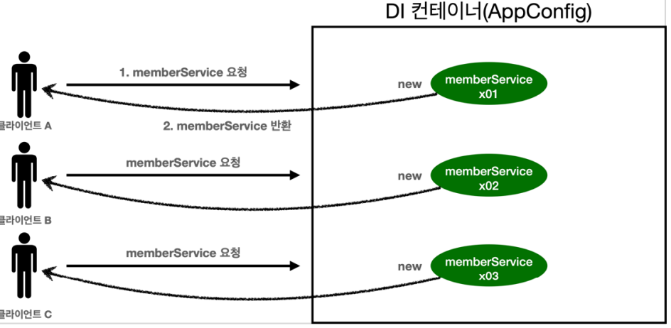
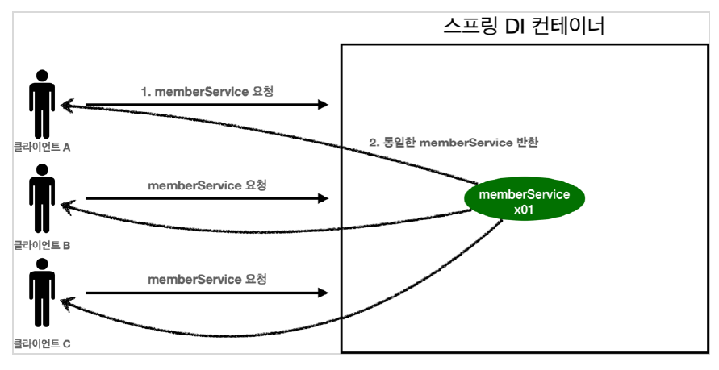

# 1. 스프링과 싱글톤

- 스프링은 태생이 Enterprize Online Service Web App을 지원하기 위해 탄생했다.
- 보통의 기업용 웹 서비스는 여러 고객이 동시에 사용하는 서비르로 많은 요청이 처리된다.
- 만약 수십~ 수백만건의 요청이 발생하는 서비스에서 기존에 요청마다 인스턴스를 만드는 멀티톤 방식대로 동작하게 둔다면, 초당 생성되는 컨테이너 객체수를 메모리가 견디지 못하고(
  OOM 발생) 서비스는 큰 장애를 발생시키고 먹통이되고 말것이다.
- 그러니 우리는 단일 인스턴스를 가지는 싱글톤 패턴을 적용해야한다.
- 스프링은 이러한 상황을 고안해 만들었기 때문에 스프링컨테이너 자체가 하나의 인스턴스만을 보장한다.
- **싱글톤 패턴**으로 구현하는 경우, **효율적인 메모리 사용**이 가능하다는 큰 장점을 가진다.
- 하지만 공유자원을 동시접근 하는 경우, **동시성 문제**가 발생할 수 있기 때문에 이를 유의해서 설계해야만 한다.

<건별 객체생성 구조>  


<싱글톤 패턴 적용시>  


# 2. 싱글톤 패턴

- 클래스의 인스턴스가 딱 1개만 생성되는 것을 보장하는 디자인 패턴이다.
- 그래서 객체 인스턴스를 2개 이상 생성하지 못하도록 막아야 한다.
    - **private 생성자**를 사용해서 <U>외부에서 임의로 new 키워드를 사용하지 못하도록 막아야 한다.</U>

```java
package hello.core.singleton;

public class SingletonService {

  //1. static 영역에 객체를 딱 1개만 생성해둔다.
  private static final SingletonService instance = new SingletonService();
  //2. public으로 열어서 객체 인스터스가 필요하면 이 static 메서드를 통해서만 조회하도록
  허용한다 .

  public static SingletonService getInstance() {
    return instance;
  }

  private SingletonService() { // 생성자를 private으로 적용시켜 외부에서 인스턴스생성을 막는다
  }
}
```

- **static 영역**에 객체 **instance를 미리 하나 생성**해서 올려둔다.
- 이 객체 인스턴스가 필요하면 오직 **getInstance() 메서드를 통해서만 조회**할 수 있다. 이 메서드를 호출하면 **항상 같은 인스턴스를 반환한다.**
- 딱 1개의 객체 인스턴스만 존재해야 하므로, **생성자를 private으로 막아서 혹시라도 외부에서 new 키워드로 객체 인스턴스가 생성되는 것을 막는다.**

```java
@Test @DisplayName("싱글톤 패턴을 적용한 객체 사용")
public void singletonServiceTest(){
    //private으로 생성자를 막아두었다. 컴파일 오류가 발생한다. 
    new SingletonService();
    //1. 조회: 호출할 때 마다 같은 객체를 반환 
    SingletonService singletonService1=SingletonService.getInstance();
    //2.조회:호출할 때 마다 같은 객체를 반환 
    SingletonService singletonService2=SingletonService.getInstance();
    //참조값이 같은 것을 확인 
    System.out.println("singletonService1 = "+singletonService1);
    System.out.println(" singletonService2="+singletonService2);
    // singletonService1 == singletonService2 
    assertThat(singletonService1).isSameAs(singletonService2);singletonService1.logic();
    }
```

싱글톤 패턴을 적용하면 고객의 요청이 올 때 마다 객체를 생성하는 것이 아니라, 이미 만들어진 객체를 공유해서 효율적으로 사용할 수 있다.

하지만 위와같이 자바로 싱글톤 패턴을 구현하면 많은 문제점들을 가지고 있다.

# 3. 싱글톤 컨테이너

### Java 싱글톤 패턴 구현시 문제점

- 싱글톤 패턴을 구현 코드가 많이 들어간다.
- 의존관계상 클라이언트가 **구체 클래스에 의존** → **DIP를 위반**한다.
- 클라이언트가 **구체 클래스에 의존** → **OCP** 원칙 또한 위반할 가능성이 높다.
- **테스트**마다 데이터를 초기화를 해주어야 하므로 **까다롭다.**
- 내부 속성을 변경하거나 초기화 하기 어렵다.
- private 생성자로 **자식 클래스를 만들기 어렵다.**
- 결론적으로 **유연성이 떨어진다.**
- **Anti-패턴**으로 불리기도 한다.

## Spring 싱글톤 컨테이너

**스프링 컨테이너**는 위와 같은 기존의 **싱글톤 패턴의 문제점을 해결**해준다.

**스프링 빈**이 바로 싱글톤으로 관리되는 빈이다.

- 스프링 컨테이너는 싱글턴 패턴을 적용하지 않아도, **객체 인스턴스를 싱글톤**으로 관리한다.
- 싱글톤 객체를 생성하고 관리하는 기능을 **싱글톤 레지스트리**라 한다.
- 스프링 컨테이너에 단일 인스턴스만을 가지는 기능 덕분에 기존의 문제점을 해결하면서 싱글톤으로 유지한다.
- 싱글톤 패턴을 위한 지저분한 코드가 들어가지 않아도 된다.
- DIP, OCP, 테스트, private 생성자로 부터 자유롭게 싱글톤을 사용할 수 있다

> 참고: 스프링의 기본 빈 등록 방식은 싱글톤이지만, 싱글톤 방식만 지원하는 것은 아니다.   
> 요청할 때 마다 새로운 객체를 생성해서 반환하는 기능도 제공한다.

# 4. 싱글톤 방식의 주의점

싱글톤 패턴이든, 스프링 같은 싱글톤 컨테이너를 사용하든, 객체 인스턴스를 하나만 생성해서 공유하는 싱글톤 방식은 여러 클라이언트가 하나의 같은 객체 인스턴스를 공유하기 때문에
상태를 유지(stateful)하게 설계하면 안된다.

- **무상태(stateless)**로 설계해야 한다!
- 특정 클라이언트에 **의존적인 필드가 있으면 안된다.**
- 특정 클라이언트가 **값을 변경할 수 있는 필드가 있으면 안된다.**
- 공유 필드 대신에 자바에서 **지역변수, 파라미터, ThreadLocal** 등을 사용해야 한다.
- 스프링 빈의 필드에 **공유 값을 설정하면 정말 큰 장애가 발생할 수 있다!**

문제가 되는 예시코드

```java
package hello.core.singleton;

public class StatefulService {

  private int price; // 공유필드

  public void order(String name, int price) {
    System.out.println("name = " + name);
    System.out.println("price = " + price);
    this.price = price; //값을 넣어주고
  }

  public int getPrice() {
    return price; // 그 값을 부르게 하면? 
  }
}
```

문제가 되는 부분에 주석이 달려있다.

만약 싱글톤 패턴에서 저런식으로 공유필드를 접근하다보면 얘기치못한 값들을 반환하는 사태가 일어난다.

```java
package hello.core.singleton;

import org.junit.jupiter.api.Test;
import org.springframework.context.ApplicationContext;
import org.springframework.context.annotation.AnnotationConfigApplicationContext;
import org.springframework.context.annotation.Bean;

import static org.assertj.core.api.Assertions.*;

class StatefulServiceTest {

  @Test
  void statefulServiceSingleton() {
    ApplicationContext ac = new AnnotationConfigApplicationContext(TestConfig.class);
    StatefulService statefulService1 = ac.getBean("statefulService", StatefulService.class);
    StatefulService statefulService2 = ac.getBean(" statefulService", StatefulService.class);
    //ThreadA: A사용자 10000원 주문 
    statefulService1.order(" userA", 10000);
    //ThreadB: B사용자 20000원 주문 
    statefulService2.order("userB", 20000);
    //ThreadA: 사용자A 주문 금액 조회
    int price = statefulService1.getPrice();
    //ThreadA: 사용자A는 10000원을 기대했지만, 기대와 다르게 20000원 출력
    System.out.println("price = " + price);
    assertThat(statefulService1.getPrice()).isEqualTo(20000);
  }

  static class TestConfig {

    @Bean
    public StatefulService statefulService() {
      return new StatefulService();
    }
  }
}

//결과값
//name = userA
//price = 10000
//name = userB
//price = 20000
//price = 20000
```

마지막에 userA가 자신의 구매가격을 호출했는데도 10000원이 아닌 20000원이 반환되었다.

그러니 우리는 stateless하게 설계하자

올바르게 수정된 예시코드

```java
public class StatefulService {

  //private int price; // 공유필드는 사용하지말자
  public int order(String name, int price) {
    System.out.println("name = " + name);
    System.out.println("price = " + price);
    //this.price = price; // 값을 넣는 행위 금지, 읽기만 하자 
    return price; // 호출된 메소드 안에서 결과를 넘기자. 
  }

//  public int getPrice() { 
//    return price; // 사용하지말자 
//  }

}
```

이런 식으로 호출된 메소드 안에서 해결하고 값을 넘겨주자! (호출하는 Test부분 코드는 제외)

# 5. @Configuration과 싱글톤

@Configuration의 역할이 무엇일까?

@Bean을 해주면 해당 인스턴스를 Bean에 등록해주는데, Configuration을 명시하는것과 안하는게 무슨차이일까?
<br>
<br>
<br>
<br>
@Configuration의 유무 차이는 각각의 인스턴스 call 횟수를 통해 확인 할 수 있다.

```java
package hello.core;

import hello.core.discount.*;
import hello.core.member.*;
import hello.core.order.*;
import org.springframework.context.annotation.Bean;
import org.springframework.context.annotation.Configuration;

// @Configuration 
public class AppConfig {

  @Bean
  public MemberService memberService() {
    System.out.println("call AppConfig.memberService");
    return new MemberServiceImpl(memberRepository())
        ;
  }

  @Bean
  public MemberRepository memberRepository() {
    System.out.println("call AppConfig.memberRepository");
    return new MemoryMemberRepository(); //메모리 맴버리포지토리로 생성 
  }

  @Bean
  public OrderService orderService() {
    System.out.println("call AppConfig.orderService");
    return new OrderServiceImpl(memberRepository(), discountPolicy());
  }

  @Bean
  public DiscountPolicy
  discountPolicy() {
    System.out.println("call AppConfig.discountPolicy");
    return new FixDiscountPolicy(); // 고정 할인 정책으로 생성
  }
}
```

```java
@Test
@DisplayName("스프링 컨테이너와 싱글톤")
void springContainer(){
    ApplicationContext ac=new AnnotationConfigApplicationContext(AppConfig.class);
    //1. 조회: 호출할 때 마다 같은 객체를 반환
    MemberService memberService1=ac.getBean("memberService",MemberService.class);
    //2. 조회: 호출할 때 마다 같은 객체를 반환 
    MemberService memberService2=ac.getBean("memberService",MemberService.class);
    //참조값이 같은 것을 확인 
    System.out.println("memberService1 ="+memberService1);
    System.out.println(" memberService2="+memberService2);

    assertThat(memberService1).isSameAs(memberService2);
    }
```

위와같이 AppConfig를 수정하고 테스트를 돌려보면,

@Configuration이 있는 경우, 모든 @Bean은 한번씩 호출되지만,

@Configuration이 없는 경우, 호출될때마다 call 로그가 찍혀 여러번의 호출이 일어나고 싱글톤보장이 안되었다.

@Configuration이 붙으면, AnnotationConfigApplicationContext 에 파라미터로 넘긴 값은 스프링 빈으로 등록된다.

그래서 AppConfig 도 스프링 빈이 된다.

```java
@Test 
void configurationDeep(){
    ApplicationContext ac=new AnnotationConfigApplicationContext(AppConfig.class);
    //AppConfig도 스프링 빈으로 등록된다. 
    AppConfig bean=ac.getBean(AppConfig.class);

    System.out.println("bean = "+bean.getClass());
    //출력: bean = class hello.core.AppConfig$$EnhancerBySpringCGLIB$$bd479d70

    }
```

스프링이 CGLIB라는 바이트코드 조작 라이브러리를 사용해서 AppConfig 클래스를 상속받은

임의의 다른 클래스를 만들고, 그 다른 클래스를 스프링 빈으로 등록한 것이다!

CGLIB의 내부 기술을 이용해 무분별한 Method Call을 막고 싱글톤을 보장해준다.

# 정리

- @Bean만 사용해도 스프링 빈으로 등록되지만, 싱글톤을 보장하지 않는다.
- memberRepository()처럼 의존관계 주입이 필요해서 메서드를 직접 호출할 때 싱글톤을 보장하지 않는다.
- 그러므로 스프링 설정 정보는 항상 @Configuration 을 사용하자.