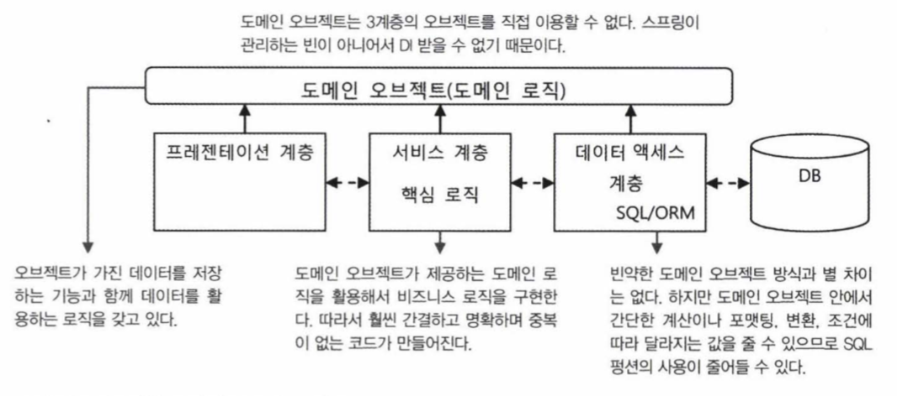
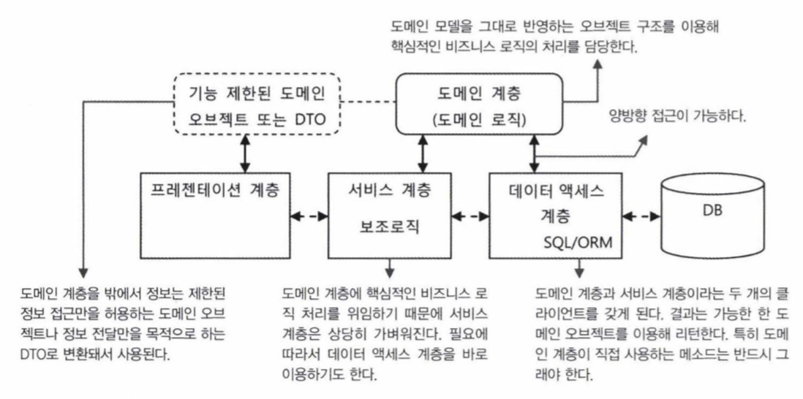

# 9. 스프링 프로젝트 시작하기

## 9.1. 자바 엔터프라이즈 플랫폼과 스프링 애플리케이션

자바 엔터프라이즈 애플리케이션이란?

- 서버에서 동작하며 클라이언트를 상대로 서비스를 제공
- 클라이언트의 요청을 받아서 그에 대한 작업을 수행하고 그 결과를 돌려주는 것이 기본적인 동작 방식
- 클라이언트의 요청 없이도 정해진 시간이나 특정 이벤트 발생에 따라 독자적으로 작업을 수행하기도 함

> 스프링은 주로 자바 엔터프라이즈 환경에서 동작하는 애플리케이션을 개발하는데 사용됨

### 애플리케이션 서버

JavaEE 표준을 따르는 애플리케이션 서버는 크게 두 가지로 구분할 수 있다.

- JavaEE의 대부분의 표준 기술을 지원하고 다양한 형태의 모듈로 배포가 가능한 완전한 웹 애플리케이션 서버(WAS)
- 웹 모듈의 배포만 가능한 경량급 WAS 또는 서블릿/JSP 컨테이너

#### 경량급 WAS/서블릿 컨테이너

- 스프링은 기본적으로 톰캣이나 제티 같은 가벼운 서블릿 컨테이너만 있어도 충분하다.

### 라이브러리 관리와 빌드 툴

#### 라이브러리 관리의 어려움

- 프레임워크 하나에 적게는 5~6개에서 많게는 수십개씩 의존 라이브러리가 필요한 경우도 많다.
- 라이브러리마다 여러 개의 버전이 있다는 것도 문제다.
- 스프링을 이용한 애플리케이션을 만들 때 필요한 라이브러리의 종류와 버전을 적절히 선정하고 개발하면서 추가적으로 필요로 하는 라이브러리를 추가하거나 또는 제거하는 등의 관리 작업은 결코 쉬운 일이 아니다.

#### 빌드 툴과 라이브러리 관리

- Maven과 ANT는 자바의 대표적인 빌드 툴이다.
- IDE를 사용할 수 있는 환경이 아닌 경우에도 일관된 빌드가 가능하도록 만드는 것이 중요하다. Maven 같은 환경에 독립적인 빌드 툴을 함께 사용하는 것이 바람직하다.
- Maven은 단순 빌드 툴을 넘어서 개발 과정에서 필요한 빌드, 테스트, 배치, 문서화, 리포팅 등의 다앙한 작업을 지원하는 종합 프로젝트 관리 툴의 성격을 띠고 있다
- Maven의 특징은 POM이라고 불리는 프로젝트 모델 정보를 이용한다는 점이다.
- Maven POM이 가진 독특한 특징 중의 하나는 애플리케이션이 필요로 하는 의존 라이브러리를 선언해두기만 하면 원격 서버에서 이를 자동으로 다운로드 받아서 사용할 수 있게 해주는 것이다.
- 애플리케이션의 의존정보를 넣으면 Maven으로 빌드할 때 필요한 라이브러리가 개발 PC의 공통 저장소에 있는지 확인하고
  없으면 Maven의 원격 서버에서 자동으로 다운로드 받아서 설치해준다.
- Maven의 의존 라이브러리 관리 기능이 제공하는 더 흥미로운 기능은 전의적 의존 라이브러리 추적 기능이다. POM의 의존정보에 하나의 라이브러리를 지정하면, 지정된 라이브러리가 동작하는 데 필요한 여타 라이브러리까지 함께 다운로드해주는 기능이다.
- springframework-core 모듈이 동작하려면 commons-logging이라는 라이브러리가 반드시 필요하다. Maven은 이런 정보를 springframework-core 모듈의 POM 정보에서 확인해서 springframework-core를 다운로드하면서 commons-logging 라이브러리도 함께 다운로드해준다. 이런 과정은 모든 라이브러리에 재귀적으로 적용된다.
- 잘 정의된 의존정보를 가진 라이브러리들을 갖고 있다면 한두 개의 최상위 의존 라이브러리만 지정해줌으로써 그에 필요한 모든 라이브러리를 손쉽게 추가 할 수 있다.
- 프로젝트 안에 POM을 통해서 의존 라이브러리 정보만 갖게 하고 필요한 라이브러리는 Maven 빌드 과정 중에 자동으로 다운로드 받거나 로컬 공통 리포지토리에서 가져오게 하면 프로젝트 파일의 크기도 줄어들고 코드 관리도 단순해진다.
- 스프링의 모든 모듈은 POM 정보를 갖고 있다. 이 정보를 참고하면 모듈을 사용하는데 필요한 라이브러리가 어떤 것이고 어떤 버전인지를 알 수 있다.
- 필수 라이브러리는 전이적 의존 라이브러리의 추적 기능이 적용되지만 선택 라이브러리는 전의적 의존 라이브러리 추적 기능의 적용을 받지 못한다. 참고는 할 수 있으되 사용하려면 명시적으로 POM에 선언해줘야 한다.
- Maven을 사용하고 POM 정보를 이용한다고 해도 실제 적용할 라이브러리를 선정하는 수고가 사라지는 것은 아니다. 물론 각 모듈의 후보 라이브러리 목록과 호환가능한 버전 정보를 참조 할 수 있다는 것만 해도 도움이 된다.
- Maven은 그룹 아이디와 아티팩트 아이디, 그리고 버전 세 가지로 라이브러리를 정의하는데 그 중에서 아티팩트 아이디와 버전을 조합해서 파일 이름으로 사용한다.

## 9.3. 애플리케이션 아키텍처

아키텍처란?

- 가장 단순한 정의는 어떤 경계 안에 있는 내부 구성요소들이 어떤 책임을 갖고 있고, 어떤 방식으로 서로 관계를 맺고 동작하는지를 규정하는 것

### 9.3.1 계층형 아키텍처

#### 아키텍처와 SoC

- 애플리케이션을 구성하는 오브젝트들을 비슷한 성격과 책임을 가진 것들끼리 묶을수 있다.
    - DAO : 데이터 액세스 로직 담당
    - 비즈니스 서비스 오브젝트 : 비즈니스 로직을 구현
    - 서비스 오브젝트 : 특정 기술과 환경에 종속되지 않으면서 도메인의 업무에는 밀접하게 관련을 갖고 있는 POJO로 만들어진다.
    - 웹을 처리하는 오브젝트 : 서블릿 컨테이너로부터 받은 사용자의 요청 정보를 해석해서 그것을 POJO 기반의 서비스 오브젝트에 전달해주고, 결과를 받아서 다시 웹 사용자 인터페이스에 표시 가능한 형태로 전달해준다.
- 성격이 다른 것은 아키텍처 레벨에서 분리해주는게 좋다. 분리된 각 오브젝트는 독자적으로 개발과 테스트가 가능해서 개발과 변경 작업이 모두 빨라질 수 있다.
- 계층형 아키텍처 : 성격이 다른 것을 크게 그룹으로 만들어 분리해두는 것
- 3계층 애플리케이션 : 보통 웹 기반의 엔터프라이즈 애플리케이션은 일반적으로 3개의 계층을 갖는다.
    - 데이터 액세스 계층 : DAO 계층
    - 서비스 계층 : 비즈니스 로직 계층, 매니저 계층
    - 프레젠테이션 계층 : 웹 계층, UI 계층, MVC 계층

#### 데이터 엑세스 계층

- 데이터 액세스 계층은 추상화 수준에 따라 다시 세분화된 계층으로 구분할 수 있다. 아래는 추상화 레벨에 따라 데이터 액세스 계층을 구분한 것이다. (위에가 가장 추상화 레벨이 높다)
    - DAO 코드 : 직접 JDBC API를 이용하거나 트랜잭션 동기화 API를 직접 이용하기 보다는 JDBC 템플릿을 사용해서 코드를 작성한다. DAO 코드는 JdbcTemplate 추상화를 이용해서 JDBC와 드라이버, 스프링의 트랜잭션 추상화 서비스의 동기화 기능을 간접적으로 이용한다.
    - JdbcTemplate : 스프링이 추가한 추상계층. 이 계층이 있기 때문에 DAO 코드는 직접 DB나 트랜잭션 동기화 계층의 API를 사용할 필요가 없다.
    - JDBC / 트랜잭션 동기화
    - DataSource

#### 서비스 계층

- 잘 만들어진 스프링 애플리케이션의 서비스 계층 클래스는 이상적인 POJO로 작성된다.
- POJO로 만든다면 객체지향적인 설계 기법이 적용된 코드를 통해 비즈니스 로직의 핵심을 잘 담아낼 수 있다. 또한 테스트도 쉽게할 수 있다.
- 서비스 계층은 DAO 계층을 호출하고 이를 활용해서 만들어진다.
- 기반 서비스 : 서버나 시스템 레벨에서 제공하는 기반 서비스를 활용하는 경우 (예를 들어 웹 서비스와 같은 원격 호출을 통해 정보를 가져오거나 메일 서비스를 이용하는 것) 기반 서비스는 3계층 어디에서나 접근이 가능하도록 만들수 있고, 반드시 서비스 계층을 통해 사용되도록 제한할 수도 있다.
    - 트랜잭션, 보안, 리모팅, 메일, 메시징, 스케줄링...
- 기반 서비스 계층을 사용하는 경우에도 데이터 액세스 계층을 사용하는 경우와 마찬가지로 독립된 계층의 서비스를 이용하는 것으로 봐야한다.
- 서비스 계층 코드가 기반 서비스 계층의 구현에 종속되면 안 된다. 서비스 계층의 코드는 추상화된 기반 서비스 인터페이스를 통해서만 접근하도록 만들어서 특정 구현과 기술에 대한 종속성을 제거해야 한다. 또는 AOP를 활용할 수도 있다.

> 이상적인 서비스 계층은 백엔드 시스뱀과 연결되는 데이터 액세스 계층이 바뀌고, 클라이언트와 연결되는 프레젠테이션 계층이 모두 바뀌어도 그대로 유지될 수 있어야 한다. 엔터프라이즈 애플리케이션에서 가장 중요한 자산은 도메인의 핵심 비즈니
> 스 로직이 들어 있는 서비스 계층이어야 한다.

#### 프레젠테이션 계층

- 엔터프라이즈 애플리케이션의 프레젠테이션 계층은 클라이언트의 종류와 상관없이 HTTP 프로토콜을 사용하는 서블릿
  이 바탕이 된다.
- 프레젠테이션 계층은 자바에서 HTTP 프로토콜을 처리하는 가장 기본 엔진인 서블릿 기술을 바탕으로 한다.
- 스프링은 웹 기반의 프레젠테이션 계층을 개발할 수 있는 전용 웹 프레임워크를 제공한다. 동시에 스프링은 다양한 서드파티 웹 기술을 지원하기도 한다. 아예 프레젠테이션 계층을 통째로 스프링이 아닌 다른 웹 기술을 가져다 시용할 수도 있다.

#### 계층형 아키텍처 설계의 원칙

- 오브젝트와 그 관계에 적용했던 대부분의 객체지향 설계의 원칙은 아키텍처 레벨의 계층과 그 관계에도 동일하게 적용할 수 있다. 각 계층은 응집도가 높으면서 다른 계층과는 낮은 결합도를 유지 할 수 있어야 한다.
- 각 계층은 자신의 계층의 책임에만 충실해야 한다. 데이터 액세스 계층은 데이터 액세스에 관한 모든 것을 스스로 처리해야 한다. 데이터 액세스 계층에 비즈니스 로직을 담거나 웹 파라미터를 파싱하는 코드나 결과를 화면에 어떻게 뿌릴지 결정하는 코드가 들어간다면 응집도가 낮아진다.
- 각 계층이 자신의 책임에 충실하게 작성되어 있다면 필요한 그 밖의 작업은 다른 계층에 요청하게 될 것이다. 이때는 계층 레벨에 정의한 인터페이스를 통해서 요청을 하게 되고, 계층 간에 사용되는 인터페이스 메소드에는 특정 계층의 기술이 최대한 드러나지 않게 만들어야 한다.
- 아래와 같은 DAO 메소드는 만들지 않는게 좋다. 이 메소드의 문제는 데이터 엑세스 계층의 기술과 그 역할이 다른 계층에 노출된다는 점이다. 이 메소드를 이용하는 서비스 계층의 코드는 JDBC라는 특정 데이터 액세스 계층 기술에 종속되는 코드가 되고 만다.

``` java
public ResultSet findUserByName(String name) throws SQLException;
```

- 예외도 마찬가지로 SQLException이라는 JDBC 기술 종속적인 예외로 던지면 안된다.
- 계층 간에 강한 결합이 생기면 유연성이 떨어지기 때문에 각 계층의 내부 구현이 변화되면 다른 계층의 코드도 함께 수정해줘야 한다. 또한 코드의 중복이 일어날 가능성이 높고 전체 코드를 이해하기는 힘들어진다.
- 위의 DAO 인터페이스 메소드는 다음과 같이 수정되야한다.
    - ResultSet -> List\<User>
    - SQLException -> DataAccessException

``` java
public List<User> findUserByName(String name) throws DataAccessException;	
```

- 계층의 경계를 넘어갈 때는 반드시 특정 계층에 종속되지 않는 오브젝트 형태로 변환해줘야 한다.
    - HttpServletRequest, HttpServletResponse 같은 타입을 서비스 계층 인터페이스 메소드의 파라미터 타입으로 사용하면 안 된다.
    - 서비스 계층에 웹 관련 오브젝트가 존재하면 POJO 기반의 빠르고 간단한 테스트를 작성하기 어려워진다. 또한 서비스에서 웹 관련 예외가 발생할 수 있다.
- 어떤 경우에라도 계층 사이의 낮은 결합도를 깨뜨리지 않도록 설계해야 한다. 당연히 계층 사이의 호출은 인터페이스를 통해 이뤄져야 한다.

### 9.3.2 애플리케이션 정보 아키텍처

- 데이터 중심의 아키텍처 : 비즈니스 로직이 DB 내부의 저장 프로시저나 SQL에 담겨 있는 경우가 많다. 보통 DB에서 돌려준느 내용을 그대로 맵이나 단순 결과 저장용 오브젝트에 넣어서 전달한다.

#### DB/SQL 중심의 로직 구현 방식

- 하나의 업무 트랜잭션에 모든 계층의 코드가 종속되는 경향이 있다.
- SQL의 결과는 칼럼 이름을 키로 갖는 맵에 저장되거나 조회 페이지에 필요한 정보를 담을 수 있는 단순한 오브젝트로 저장돼서 전달된다.
- 서비스 계층은 별로 할 일이 없다.
- 모든 계층 코드가 하나의 SQL에 종속된다. 또한 SQL이 바뀌면 모든 계층의 코드가 함께 변한다. 종속적일 뿐 아니라 배타적이어서 다른 단위 업무에 재사용되기도 힘들다.
- 자바 코드의 로직은 기껏해야 사용자 요청에 따라서 어떤 SQL을 가진 DAO을 실행할지를 결정하는 정도이다.
- 업무 트랜잭션 단위로 코드를 묶어서 만들지 기능을 세분화해서 분리하고 재사용하지 않는다.
- 서비스 계층이 프렌젠테이션 계층에 전달하는 결과의 포맷은 보통 DAO의 SQL 결과와 같다.
    - DAO의 결과를 그대로 조회 화면에 전달하는 경우가 대부분이다.
    - 존재의 의미가 별로 없다.
- 데이터 액세스 : 주요 비즈니스 로직은 SQL과 DB에 존재한다. 애플리케이션의 핵심이 SQL과 DB 안에서 실행되는 저장 프로시저에 담겨있다. 애플리케이션은 DB에 대한 인터페이스 역할로 제한된다.
- 자바 코드를 단지 DB와 웹 화면을 연결해주는 단순한 인터페이스 도구로 전락시킨다.
- 애플리케이션 내에서 흘러다니는 정보는 항상 단순한 포맷의 데이터다.
- 겉으로 보기에는 각 계층이 독립적으로 보이지만, 그 사이를 이동하는 데이터가 일종의 접착제 역할을 해서 강한 결합을 만들게 된다.
- 변화에 매우 취약하다. 객체지향의 장점이 별로 활용되지 못하는데다 각 계층의 코드가 긴밀하게 연결되어있다.
- 로직을 DB와 SQL에 많이 담으면 담을수록 점점 확장성이 떨어진다. DB는 확장에 한계가 있을 뿐 아니라 확장하는데 매우 큰 비용이 든다.
    - 상대적으로 애플리케이션 서버와 그 안에 담긴 오브젝트는 비용이 적게 든다.
    - 서버를 늘려 쉽게 확장할 수도 있다.
    - 따라서 로직을 DB 보다는 애플리케이션으로 가져오는 편이 유리한 점이 많다. 비용 뿐만 아니라 안정성도 높아지고 코드를 테스트하기도 매우 편하다.
    - DB에는 부하를 가능한 주지 않는 간단한 작업만 하고 복잡한 로직은 오브젝트에 담아서 애플리케이션 내에서 처리하도록 만드는 편이 낫다.

#### 거대한 서비스 계층 방식

- DB에는 부하가 걸리지 않도록 저장 프로시저나 복잡한 SQL 사용을 자제하고, 주요 로직은 서비스 계층의 코드에서 처리하도록 만드는 것이다.
- 비즈니스 로직을 서비스 계층에서 구현하기 때문에 코드의 비중이 커진다. 그만큼 단순해지고 객체지향 개발의 장점을 살릴 기회가 많아진다.
- DAO와 SQL이 상대적으로 단순해지기 때문에 서비스 계층 코드에서 재사용이 가능해진다.
- 비즈니스 로직의 대부분을 서비스 계층에 집중하는 이런 접근 방법은 결국 거대한 서비스 계층을 만들게 된다.
- 서비스 계층의 코드는 여전히 업무 트랜잭션 단위로 집중돼서 만들어지기 때문에 코드 중복이 많이 발생한다.
- 애플리케이션 코드에 비즈니스 로직이 담겨 있기 때문에 자바 언어의 장점을 활용해 로직을 구현할 수 있고 테스트가 수월하다.
- DAO 코드는 여러 비즈니스 로직에서 공유해서 사용할 수 있다.
- 데이터 액세스 계층의 SQL은 서비스 계층의 비즈니스 로직의 필요에 따라 만들어지기 쉽다. 그래서 계층 간의 결합도가 여전히 크다.
- SQL에 비즈니스 로직을 넣지는 않더라도 서비스 계층에서 필요한 정보를 한 번에 SQL을 통해 가져오고, 그 값을 저장하는 방식이 일관성 없이 매번 달라질 수 있기 때문에 서비스 계층의 코드나 DAO에 적지 않은 중복이 발생한다.
- 본격적인 객체지향적 설계를 적용하기 힘들고, 계층별로 독립된 설계와 개발이 어렵다.

> 데이터 중심 아키텍처의 특징은 계층 사이의 결합도가 높은 편이고 응집도는 떨어진다. 화면을 중심으로 하는 업무 트랜잭션 단위로 코드가 모이기 때문에 처음엔 개발하기 편하지만 중복이 많아지기 쉽고 장기적으로 코드를 관리하고 발전시키기 힘들다는 단점이 있다.

### 9.3.3 오브젝트 중심 아키텍처

- 오브젝트 중심 아키텍처가 데이터 중심 아키텍처와 다른 가장 큰 특징은 도메인 모델을 반영하는 오브젝트 구조를 만들어두고 그것을 각 계층 사이에서 정보를 전송하는 데 사용한다는 것이다.
- 데이터 중심의 아키텍처에서는 DAO가 만드는 SQL의 결과에 모든 계층의 코드가 의존하게 된다. 도메인 분석을 통해 작성된 모델정보는 DB에 대한 SQL을 작성할 때 외에는 코드에 반영되는 일이 없다.
- 오브젝트 방식에서는 애플리케이션에서 사용되는 정보가 도메인 모델의 구조를 반영해서 만들어진 오브젝트 안에 담긴다.
- 도메인 모델은 애플리케이션 전 계층에서 동일한 의미를 갖는다. 따라서 도메인 모델이 반영된 도메인 오브젝트도 전 계층에
  서 일관된 구조를 유지한 채로 사용될 수 있다. SQL이나 웹 페이지의 출력 포맷, 입력 폼 등에 종속되지 않는 일관된 형식의 애플리케이션의 정보를 다룰 수 있게 된다.
- RDB에서는 테이블 간의 관계를 직접 명시하는 방법이 없지만, 자바 코드에서는 레퍼런스 변수를 이용해서 다른 오브젝트와 관계를 쉽게 맺을 수 있다. 또한 하나 이상의 오브젝트 관계를 가지려면 컬렉션을 이용하면 된다.
- 각 계층의 역할
    - DAO : DAO는 DB에서 데이터를 가져와서 도메인 모델 오브젝트에 데이터를 담아서 리턴한다.
    - 서비스 : DAO를 이용해서 도메일 모델 오브젝트를 리턴받고, 오브젝트에 담긴 정보를 활용해서 비즈니스 로직을 처리한다.
    - 프레젠테이션 : 전달된 도메인 오브젝트를 활용해서 필요한 정보를 화면에 출력한다.
    - 각 계층이 자신의 역할에만 충실하면 된다.
- 장점
    - 메소드를 재사용하기가 쉽다. 도메인 오브젝트에 비즈니스 로직이 들어가기 때문
    - 오브젝트 구조로 정보를 갖고 있기 때문에 활용하기 편리하고, 쉽다.
    - 도메인 오브젝트는 자바 객체이므로 테스트가 쉽다.
    - 비즈니스가 도메인 오브젝트에 있기 때문에 DAO는 더 작고 효율적이다.
- 단점
    - 성능면에서 떨어질 수 있다. (SQL에 비해)
    - 하나의 오브젝트에 담긴 필드의 개수가 많아지다 보면, 이게 낭비가 될 수 있다. (실제로는 몇개 필드만 사용하는 경우)
- 하이버네이트와 같은 오브젝트/RDB 매핑 기술을 사용하는게 좋다.
- 도메인 오브젝트를 사용하는 오브젝트 중심 아키텍처에서는 가능하다면 ORM과 같은 오브젝트 중심 데이터 액세스 기술을 사용하는 것을 권장한다. 사용하기 쉽고 직관적이며 코드의 양도 대폭 줄기 때문이다.
- 오브젝트 중심의 아키텍처는 도메인 모델을 따르는 오브젝트를 사용해 각 계층 사이에 정보를 전달하고, 이를 이용해 비즈니스 로직이나 프레젠테이션 로직을 작성한다. 계층 간의 결합도는 낮아지고 일관된 정보 모델을 사용하기 때문에 개발 생산성과 코드의 품질, 테스트 편의성도 향상시킬 수 있다.

> 도메인 오브젝트는 모든 계층에서 사용이 된다. (DAO, 서비스, 프레젠테이션)

#### 빈약한 도메인 오브젝트 방식

- 도메인 오브젝트에 정보만 담겨 있고 정보를 활용하는 아무런 기능도 갖고 있지 않다면 이는 온전한 오브젝트라고 보기 힘들다. 그래서 이런 오브젝트를 빈약한 오브젝트라고 부른다.
- 계층 사이의 독립성을 확보하기 위해서는 특정 계층에 종속되지 않으면서 애플리케이션 전반에서 사용될 수 있는 정보를 담은 오브젝트가 필요하기 마련이고 그래서 이런 빈약한 도메인 오브젝트 방식도 실제로 많이 시용된다.
- 비즈니스 로직이 도메인 오브젝트에 존재하지 않고, 서비스에 존재한다. 빈약한 도메인 오브젝트 방식은 데이터 중심 아키텍처의 거대 서비스 계층구조와 비슷하다.
    - 프렌젠테이션 계층
    - 서비스 계층 : 비즈니스 로직이 담겨있다. 도메인 오브젝트를 사용하지만 단순히 정보를 저장하고 조회하는 용도로만 활용한다. 서비스 계층의 메소드에 대부분의 비즈니스 로직이 들어 있기 때문에 로직의 재사용성이 떨어지고 중복의 문제가 발생하기 쉽다.
    - 데이터 액세스 계층 : SQL을 이용해서 DB에서 데이터를 가져와서 도메인 오브젝트 형태로 만들어준다.
    - 도메인 오브젝트 : 모든 계층에 일괄되게 사용된다. 도메인 오브젝트에는 단순 정보 외의 로직은 들어있지 않다.

#### 풍성한 도메인 오브젝트 방식

- 비즈니스 로직은 특정 도메인 오브젝트나 그 관련 오브젝트가 가진 정보와 깊은 관계가 있다. 이런 로직을 서비스 계층의 코
  드가 아니라 도메인 오브젝트에 넣어주고, 서비스 계층의 비즈니스 로직에서 재사용하게 만든다.
- 비즈니스 로직을 서비스 계층의 메소드에 넣어주는 것보다 훨씬 응집도가 높다. 데이터와 기능이 한곳에 집중되기 때문
- 정보를 다루는 메소드를 별개의 서비스에서 구현한다면 해당 기능을 재사용하기 위해선 그 서비스를 DI 받아야한다. 이는 도메인 오브젝트에 기능이 있는것보다 훨씬 더 재사용이 힘들다.
- 빈약한 도메인 오브젝트 방식에 비해 훨씬 더 객체지향적이다.
- 여러 종류의 도메인 오브젝트의 기능을 조합해서 복잡한 비즈니스 로직을 만들었다면 특정 도메인 오브젝트에 넣기는 힘들다. 이런 비즈니스 로직은 서비스 계층의 오브젝트에 두는 것이 적당하다.
- 도메인 오브젝트는 직접 데이터 액세스 계층이나 기반 계층 또는 다른 서비스 계층의 오브젝트에 접근할 수 없기 때문에 서비스 계층이 필요하기도 하다.
- 도메인 오브젝트는 빈이 아니다.
- 도메인 오브젝트 자신에 국한된 로직은 도메인 오브젝트 안에 추가할 수 있지만, 그 결과를 DB에 저장하거나 메일로 발송하거나 DB를 검색해서 원하는 정보를 가져와 활용히는 작업은 도메인 오브젝트에서 불가능하다. 그래서 DAO와 기반계층 오브
  젝트를 DI 받아 사용할 수 있는 서비스 계층의 코드가 펼요하다.
- 서비스 계층은 도메인 오브젝트를 DB나 외부 리소스에서 가져오고 변경된 정보나 새로 등록된 정보를 DB에 반영히는 등의 작업과 함께 도메인 오브젝트가 갖고 있는 기능이 있다면 이를 활용해서 비즈니스 로직을 처리한다.
- 3계층의 오브젝트들은 도메인 오브젝트를 자유롭게 이용할 수 있지만 그 반대는 안된다.



#### 도메인 계층 방식

- 도메인 계층 방식이란 도메인 오브젝트들이 하나의 독립적인 계층을 이뤄서 서비스 계층과 데이터 액세스 계층의 사이에 존재하게 하는 것이다.
- 기존 방식과는 다른 두가지 특징이 있다.
    - 도메인에 종속적인 비즈니스 로직의 처리는 서비스 계층이 아니라 도메인 계층의 오브젝트 안에서 진행된다는 점이다.
    - 도메인 오브젝트가 기존 데이터 액세스 계층이나 기반 계층의 기능을 직접 활용할 수 있다는 것이다. 이를 위해 AspectJ의 AOP 기능을 사용한다.
- 도메인 계층 방식은 이전의 어떤 방식보다 도메인 오브젝트에 많은 비즈니스 로직을 담아낼 수 있다. 그럼에도 서비스 계층의 역할이 완전히 사라지는건 아니다.
    - 여러 도메인 오브젝트의 기능을 조합해서 복잡한 작업을 진행해야 하는 경우가 있다. 특정 도메인 오브젝트에 담길 수 없는 이런 작업은 서비스 계층에서 도메인 계층과 협력을 통해 진행히는 것이 바람직하다.
    - 트랜잭션 경계를 설정하는 역할도 한다.
- 도메인 오브젝트가 도메인 계층을 벗어나서도 사용되게 할지 말지 결정해야 한다.
    - 모든 계층에서 도메인 오브젝트를 사용하도록 한다.
    - 도메인 오브젝트는 도메인 계층을 벗어나지 못하게 하는 것이다. 도메인 계층 밖으로 전달될 때는 별도로 준비된 정보 전달용 오브젝트에 도메인 오브젝트의 내용을 복사해서 넘겨줘야 한다. 이런 오브젝트는 데이터 전달을 위해 사용된다고 해서 DTO라고 불린다. DTO는 상태 변화를 허용하지 않고 읽기 전용으로 만들어진다.
    - DTO는 사용자가 등록한 값이나 외부 시스템으로 전달받은 정보를 도메인 계층으로 전달하는 경우에도 사용된다.
- 아래는 도메인 계층 방식의 구조다.



- 도메인 계층의 오브젝트는 매우 짧은 시간 동안만 존재했다가 사라지는 것을 반복한다. 각 사용자의 요청별로 독립적으로 도메인 계층을 이루는 오브젝트들이 생성됐다가 해당 요청을 처리하고 나면 버려진다.
- 도메인 오브젝트는 상태정보를 담고 있기 때문에 싱글톤이 될 수 없다.
- 도메인 계층은 응집도가 높기 때문에 단위 테스트가 간단하다.

#### DTO와 리포트 쿼리

- 리포트 쿼리의 결과를 DTO라고 불리는 단순하 자바 빈에 담아서 전달하면 된다.
    - 리포트 쿼리의 결과는 DB 테이블에 담긴 필드의 내용보다는 그 합계, 평균과 같은 계산 값이나 아니면 여러 테이블의 필드를 다양한 방식으로 조합해서 만든다.
- 다른 시스템과 자료를 주고 받기 위해 도메인 오브젝트에 담긴 정보를 가공해야할 때가 있다. 이런 경우도 DTO를 이용해 형식에 맞도록 변경하는 작업을 한다.

### 9.3.4 스프링 애플리케이션을 위한 아키텍처 설계

#### 계층형 아키텍처

- 3계층 구조는 가장 많이 사용되는 구조다.
    - 경우에 따라 더 세부적으로 계층을 나눌수 있다. 반대로 서비스 계층과 DAO 계층을 통합하는 것도 된다.
- 프렌젠테이션 계층 : Spring MVC를 이용한다.
- 서비스 계층 : POJO로 구현하면서 트랜잭션 AOP를 적용한다.
- 데이터 액세스 계층 : JDBC를 비롯해 스프링의 데이터 액세스 전략이 적용된 JPA, 하이버네이트 등을 활용하도록 한다.

#### 정보 전송 아키텍처

- 빈약한 오브젝트 방식으로 시작한다.
- 도메인 오브젝트를 계층 간의 정보 전송을 위해 사용한다.
    - 프레젠테이션 : 도메인 오브젝트를 직접 활용한다. MVC 아키텍처에서도 모델은 도메인 오브젝트를 그대로 사용한다. 사용자가 입력한 폼의 정보도 도메인 오브젝트로 변환해서 사용한다.
    - 서비스 : 비즈니스 로직을 도메인 오브젝트를 사용해서 작성한다.
    - DAO : 서비스 계층에서 요청을 받거나 결과를 돌려줄때 도메인 오브젝트 형태를 유지하게 만든다.
- 스프링 철학과 개념에 가장 잘 들어맞는건 데이터 중심의 아키텍처가 아니라 도메인 오브젝트 중심의 아키텍쳐이다.

#### 상태 관리와 빈스코프

- 애플리케이션은 하나의 HTTP 요청의 범위를 넘어서 유지해야 하는 상태정보가 있다.
- 서버 기반 애플리케이션은 Stateless한 특징이 있다. 클라이언트의 요청을 처리하기 위해서 상태를 아주 짧게 유지한다.
- 애플리케이션의 상태와 장시간 진행되는 작업정보는 유지돼야 한다. 이를 위해서 웹 클라이언트에 URL, 파리미터, 폼 히든 필드, 쿠키 등을 이용해 상태정보 또는 서버에 저장된 상태정보에 키 값 등을 전달해야 한다.
- 중요한 상태정보는 파일 시스템, 데이터그리드 DB 등에 저장된다. 또는 제약이 있기는 하지만 HTTP 세션과 같은 서블릿 컨테이너가 제공하는 저장공간을 활용하기도 한다.
- 상태는 클라이언트, 백엔드에 저장해두거나 서블릿의 HTTP 세션 정도에 일시적으로 저장해두는 것이 대부분이지만 경우에 따라서는 장기간 유지되며 중첩될 수 있는 상태를 다루는 고급 상태 관리 기법을 이용할 수도 있다.
- 스프링에서는 싱글톤외에도 다른 스코프를 갖는 빈을 간단히 만들수 있다. 빈의 스코프를 잘 활용하면 스프링이 관리하는 빈이면서 사용자별로 또는 단위 작업별로 독립적으로 생성되고 유지되는 오브젝트를 만들어 상태를 저장하고 이를 DI를 통해 서비스 빈에서 사용하게 만들 수 있다.

#### 서드파티 프레임워크, 라이브러리 적용

- 스프링 애플리케이션은 기본적으로 서블릿을 기반으로 하는 독립 웹 모듈로 만들어진다. 스프링이 제공하는 많은 APl는 이러한 표준 lavaEE의 인터페이스를 사용할 수 있도록 설계되어 있다.
- 많이 사용되는 오픈소스 프레임워크 라이브러리나 상용 제품도 스프링과 함께 시용할 수 있다.
- 스프링이 지원하는 기술이란 무슨 의미일까?
    - 해당 기술을 스프링의 DI 패턴을 따라 사용할 수 있다. 프레임워크나 라이브러리의 핵심 클래스를 빈으로 등록할 수 있게 지원해주는 것이라고 생각해도 좋다.
    - 스프링 서비스 추상화가 적용됐다. 서비스 추상화는 비슷한 기능을 제공하는 기술에 대한 일관된 접근 방법을 정의해준다. 이를 통해 서드파티 프레임워크를 적용할 수 있을 뿐만 아니라 필요에 따라 호환 가능한 기술로 손쉽게 교체해서 사용할 수 있다. 서비스 추상화는 이미 존재하는 다양한 기술의 공통점을 분석해서 추상화를 했다는 점이다. 따라서 추상 서비스 인터페이스를 구현해서 각 기술과 연동하게 해주는 어댑터 클래스가 필요하다. 어댑터 클래스들은 모두 스프링 빈으로 등록되도록 만들어졌다.
    - 스프링이 지지하는 프로그램 모델을 적용했다.
    - 템플릿 / 콜백이 지원된다. 대부분의 템플릿 클래스는 빈으로 등록해서 필요한 빈에서 DI 받아 사용할 수 있다.
- 스프링이 어떤 기술을 지원한다는건 결국 스프링이 지지히는 개발철학과 프로그래밍 모델을 따르면서 해당 기술을 사용 할 수 있다는 의미다.
- 스프링에서 지원하지 않지만 새로운 기술을 연동하려면 스프링의 프로그래밍 모델과 지지하는 개발철학을 따르면서 앞에서 설명한 네 가지 방법을 이용하면 된다.
- 스프링이 직접 지원하지 않는 서드파티 기술도 스프링 스타일의 접근 방식을 따라서 사용할 수 있도록 준비해둬야 한다

> 스프링이 직접 지원 기능을 제공해주지 않으면 무엇인가 시도해볼 생각도 없이 스프링 이전의 방식대로 코드를 만들어서 외부 기술을 사용하는 건 부끄러운 일이다. 스프링을 사용하려면 스프링의 프로그래밍 모델과 그에 담긴 개발 철학을 따르는 일관된 코드를 만드는 데 많은 관심을 기울여야 한다.


출처 : 토비의 스프링