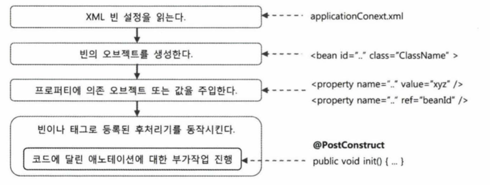
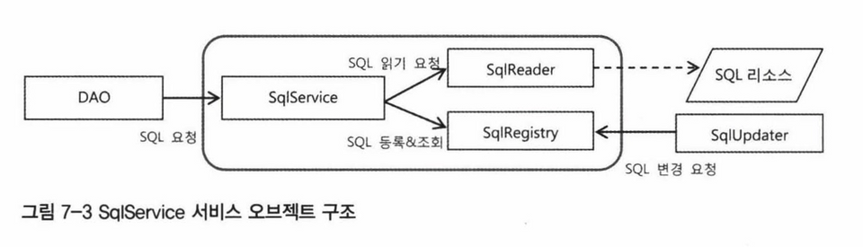
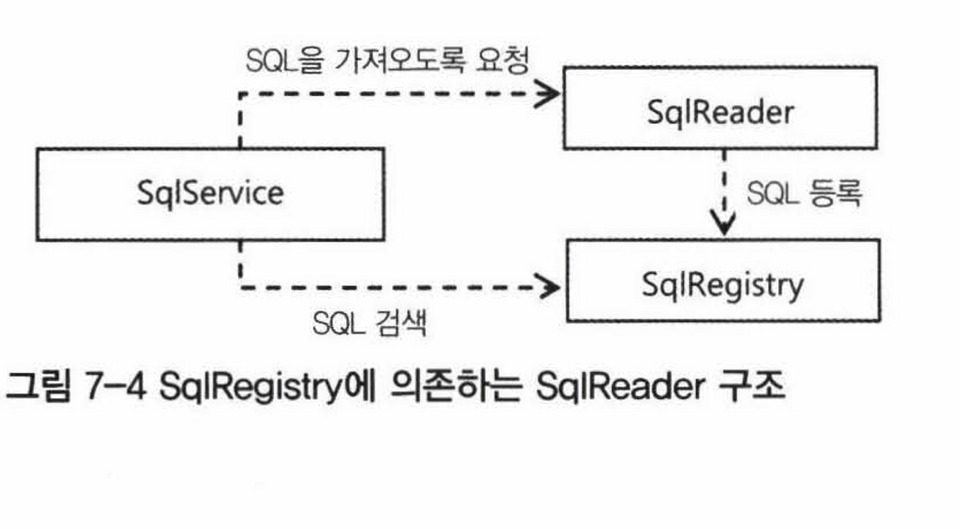
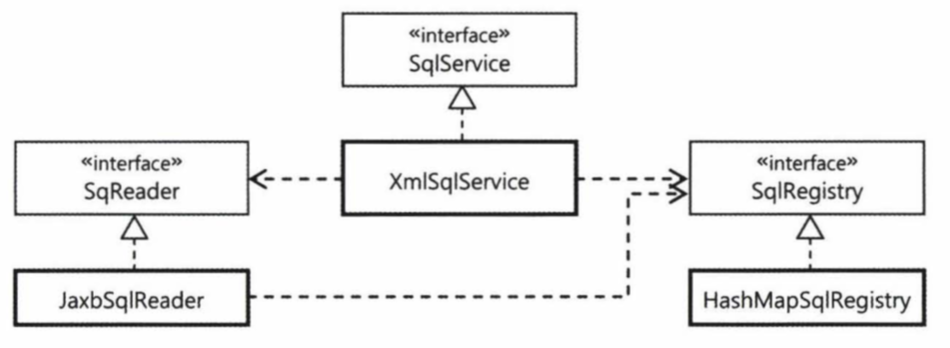
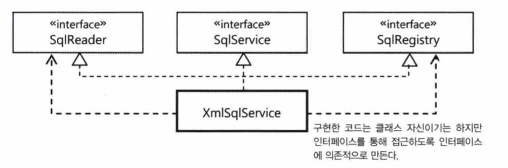
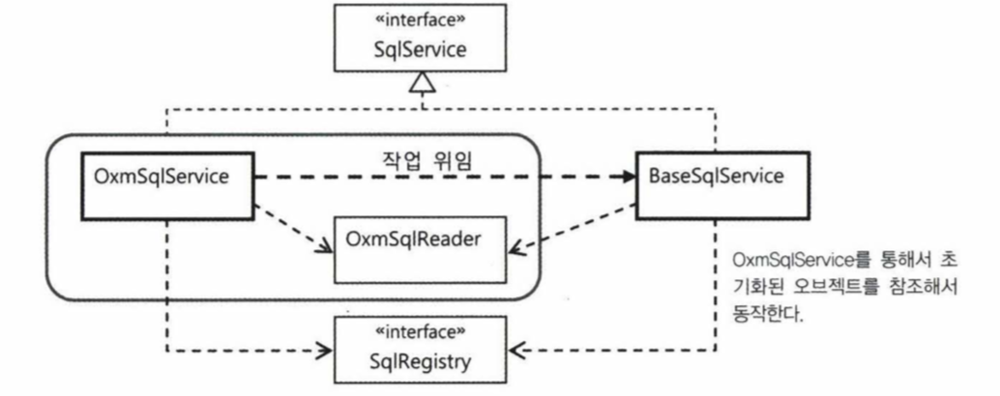
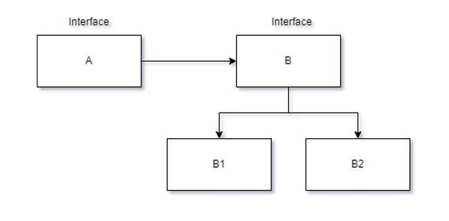
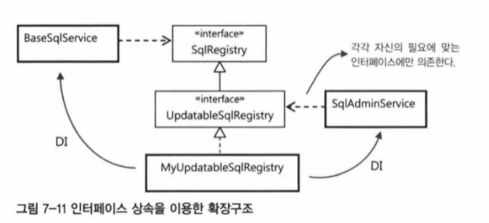

# 7.1 SQL과 DAO의 분리

현재 DAO는 순수한 데이터 액세스 코드만 남아 있다. 여기서 DB 테이블과 필드정보를 담고 있는 SQL 문장을 분리해보자.

굳이 분리하는 이유는 아래와 같다.

- 필드 이름과 SQL 문장은 변경될 수 있다.
- DB 검색 쿼리 최적화를 위해 SQL에 부가적인 내용을 넣어야 할 수도 있다.

물론 처음부터 최적화된 SQL을 잘 준비하면 되겠지만 현실적으로 쉽지 않다. 하지만 SQL 변경이 요구된다고 해서 그 때마다 DAO 코드를 수정하고 다시 컴파일해서 적용하는 것은
번거롭고 위험성도 크다.

## 7.1.1 XML 설정을 이용한 분리

가장 쉽게 생각할 수 있는 방법은 SQL을 스프링의 XML 설정파일로 빼내는 것이다. SQL은 문자열로 이루어져 있으니 설정파일에 프로퍼티 값으로 정의해서 DAO에 주입 가능하다.

### 개별 SQL 프로퍼티 방식

가장 간단한 add() 메서드의 SQL을 외부로 빼는 작업을 해보자.

```java
public class UserDaoJdbc implements UserDao {

  public String sqlAdd;

  public void setSqlAdd(String sqlAdd) {
    this.sqlAdd = sqlAdd;
  }

        ...

  public void add(final User user) throws DuplicateKeyException {
    this.jdbcTemplate.update(this.sqlAdd,
        user.getId(), user.getName(), user.getPassword(), user.getLevel().intValue(),
        user.getLogin(), user.getRecommend(), user.getEmail());
  }
}
```

sqlAdd를 프로퍼티로 추가 후, add() 메서드에 기존 sql 구문이 있던 자리를 this.sqlAdd로 대체한다. 그리고 이 sqlAdd 프로퍼티에 DI를 통해 값을
넣어준다.

```xml

<bean id="userDao" class="dao.UserDaoJdbc">
  <property name="dataSource" ref="dataSource"/>
  <property name="sqlAdd"
    value="insert into users(id, name, password, level, login, recommend, email) values (?, ?, ?, ?, ?, ?, ?)"/>
</bean>
```

### SQL 맵 프로퍼티 방식

SQL이 점점 많아지면 그때마다 DAO에 DI용 프로퍼티를 추가하기가 상당히 귀찮다. 그래서 SQL을 하나의 컬렉션으로 담아두는 방법을 시도해보자.

```java
private Map<String, String> sqlMap;
```

```xml

<bean id="userDao" class="dao.UserDaoJdbc">
  <property name="dataSource" ref="dataSource"/>
  <property name="sqlMap">
    <map>
      <entry key="add"
        value="insert into users(id, name, password, level, login, recommend, email) values (?, ?, ?, ?, ?, ?, ?)"/>
      <entry key="get" value="select * from users where id = ?"/>
      <entry key="getAll" value="select * from users order by id"/>
      <entry key="deleteAll" value="delete from users"/>
      <entry key="getCount" value="select count(*) from users"/>
      <entry key="update"
        value="update users set name=?, password=?, level=?, login=?, recommend = ?, email = ? where id = ?"/>
    </map>
  </property>
</bean>
```

## 7.1.2 SQL 제공 서비스

스프링 설정 파일에 SQL 을 두면 손쉽게 쿼리문을 분리해낼 수 있지만 몇 가지 문제점이 있다.

- SQL과 DI 설정정보가 섞여 있으면 보기에도 지저분하고 관리하기도 쉽지 않다.
- 스프링의 설정파일로부터 생성된 오브젝트와 정보는 애플리케이션을 다시 시작하기 전에는 변경이 매우 어렵다.
- SQL을 꼭 스프링의 빈 설정방법을 사용해 XML에 담아둘 이유가 없다.

이런 문제점을 해결하려면 DAO가 사용할 SQL을 제공해주는 기능을 독립시킬 필요가 있다. 독립적인 SQL 서비스가 필요하다는 뜻이다.

### SQL 서비스 인터페이스

가장 먼저 할 일은 SQL 서비스의 인터페이스를 설계하는 것이다.

```java
public interface SqlService {

  String getSql(String key) throws SqlRetrievalFailureException;
}
```

SQL에 대한 키 값을 전달하면 그에 해당하는 SQL을 돌려주는 간단한 인터페이스이다. 그리고 이 인터페이스를 구현한 SimpleSqlService 클래스 생성 후 xml 파일도
수정해주면 끝이다.

<details>
<summary><b>sqlService를 구현한 SimpleSqlService 클래스 코드</b></summary>
<div markdown="1">

```java
public class SimpleSqlService implements SqlService {

  private Map<String, String> sqlMap;

  public void setSqlMap(Map<String, String> sqlMap) {
    this.sqlMap = sqlMap;
  }

  @Override
  public String getSql(String key) throws SqlRetrievalFailureException {
    String sql = sqlMap.get(key);
    if (sql == null) {
      throw new SqlRetrievalFailureException(key + "에 대한 SQL을 찾을 수 없습니다.");
    } else
      return sql;
  }
}
```

</div>
</details>

<details>
<summary><b>xml 설정 파일 코드</b></summary>
<div markdown="1">

```xml

<bean id="sqlService" class="sqlservice.SimpleSqlService">
  <property name="sqlMap">
    <map>
      <entry key="add"
        value="insert into users(id, name, password, level, login, recommend, email) values (?, ?, ?, ?, ?, ?, ?)"/>
      <entry key="get" value="select * from users where id = ?"/>
      <entry key="getAll" value="select * from users order by id"/>
      <entry key="deleteAll" value="delete from users"/>
      <entry key="getCount" value="select count(*) from users"/>
      <entry key="update"
        value="update users set name=?, password=?, level=?, login=?, recommend = ?, email = ? where id = ?"/>
    </map>
  </property>
</bean>
```

</div>
</details>

# 7.2 인터페이스의 분리와 자기참조 빈

## 7.2.1 XML 파일 매핑

빈 설정파일이 아닌 SQL을 저장해두는 전용 포맷을 가진 독립적인 파일을 이용해보자.

### JAXB

XML과 비교했을 때 JAXB의 장점

- DOM은 XML 정보를 마치 자바의 리플렉션 API를 사용해서 오브젝트를 조작하는 것처럼 간접적으로 접근해야하는 불편함이 있다. 그에 비해 JAXB는 XML의 정보를 그대로
  담고 있는 오브젝트 트리 구조로 만들어주기 때문에 XML 정보를 오브젝트처럼 다룰 수 있어 편리하다.
- JAXB는 XML 문서의 구조를 정의한 스키마를 이용해서 매핑할 오브젝트의 클래스까지 자동으로 만들어주는 컴파일러도 제공해준다.

### 언마샬링

XML 문서를 읽어서 자바의 오브젝트로 변환하는 것을 JAXB에서는 **언마샬링**이라고 부른다.

반대로 바인딩 오브젝트를 XML 문서로 변환하는 것을 **마샬링**이라고 한다.

### XML SQL 서비스

```xml
<?xml version="1.0" encoding="UTF-8" ?>
<sqlmap xmlns:xsi="http://www.w3.org/2001/XMLSchema-instance">
  <sql key="userAdd">insert into users(id, name, password, level, login, recommend, email) values
    (?, ?, ?, ?, ?, ?, ?)
  </sql>
  <sql key="userGet">select * from users where id = ?</sql>
  <sql key="userGetAll">select * from users order by id</sql>
  <sql key="userDeleteAll">delete from users</sql>
  <sql key="userGetCount">select count(*) from users</sql>
  <sql key="userUpdate">update users set name=?, password=?, level=?, login=?, recommend = ?, email
    = ? where id = ?
  </sql>
</sqlmap>
```

이제 sqlmap.xml에 있는 SQL을 가져와 DAO에 제공해주는 SqlService 인터페이스의 구현 클래스를 만들면 된다.

그런데 DAO가 SQL을 요청할 때마다 XML 파일을 매번 읽는 것은 너무 비효율인 방식이다. 그래서 XML 파일로부터 읽은 내용은 어딘가에 저장해두고 DAO에서 요청이 올 때
사용해야 한다.

SQlService를 구현한 클래스는 스프링이 관리하는 빈으로 등록이 될 것이다. 일단 간단히 생성자에서 SQL을 읽어와 내부에 저장해두는 초기 작업을 하자.

JAXB로 XML 문서를 언마샬링하면 SQL 문장 하나는 Sql 클래스의 오브젝트에 하나씩 담길 것이다. 하지만 이 Sql 오브젝트를 리스트에 저장해뒀다가 사용하는 방법은 별로
좋지 않다. 매번 검색을 위해 리스트를 검사해야하기 때문이다. 차라리 상대적으로 검색 속도가 빠른 Map 타입 오브젝트에 저장해두는게 낫다.


<details>
<summary><b>XmlSqlService 구현 코드</b></summary>
<div markdown="1">

```java
public class XmlSqlService implements SqlService {

  private Map<String, String> sqlMap = new HashMap<>();

  public XmlSqlService() {
    try {
      JAXBContext context = JAXBContext.newInstance(Sqlmap.class);
      Unmarshaller unmarshaller = context.createUnmarshaller();
      InputStream is = UserDao.class.getResourceAsStream("/sqlmap.xml");
      Sqlmap sqlmap = (Sqlmap) unmarshaller.unmarshal(is);

      for (SqlType sql : sqlmap.getSql()) {
        sqlMap.put(sql.getKey(), sql.getValue());
      }
    } catch (JAXBException e) {
      throw new RuntimeException(e);
    }
  }

  @Override
  public String getSql(String key) throws SqlRetrievalFailureException {
    String sql = sqlMap.get(key);
    if (sql == null) {
      throw new SqlRetrievalFailureException(key = "를 이용해서 SQL을 찾을 수 없습니다.");
    } else {
      return sql;
    }
  }
}
```

</div>
</details>

## 7.2.3 빈의 초기화 작업

XmlSqlService 코드를 보면 몇 가지 개선 사항이 눈에 띈다.

- 생성자에서 예외가 발생할 수도 있는 복잡한 초기화 작업을 다루는 것은 좋지 않다. 오브젝트를 생성하는 중에 생성자에서 발생하는 예외는 다루기 힘들고, 상속하기 힘들며, 보안에도
  문제가 생긴다.
- 읽어들일 파일의 위치와 이름이 코드에 고정되어 있다. SQL을 담은 XML 파일의 위치와 이름이 코드에 고정되어 있는 것은 좋지 않다. 코드의 로직과 여타 이유로 바뀔 가능성이
  있는 내용은 외부에서 DI로 설정해줘야 한다.

```java
private String sqlmapFile;

public void setSqlmapFile(String sqlmapFile){
    this.sqlmapFile=sqlmapFile;
    }
```

값을 외부에서 주입해주기 위해 sqlmapFile 프로퍼티를 추가한다. 그리고 기존 생성자에서 초기화하던 코드 전부를 loadSql() 메서드를 만들어 거기로 밀어넣는다.
getResourcesAsStream으로 전달되는 매개변수는 당연히 **this.sqlmapFile**로 변경돼야 한다.

문제는 XmlSqlService 오브젝트는 빈이기 때문에 제어권이 스프링에 있다는 점이다. 이것은 XmlSqlService의 loadSql() 같은 초기화 메서드를 스프링에게
맡긴다는 것을 의미한다. 물론 스프링은 빈 오브젝트를 생성하고 DI 작업을 수행해서 프로퍼티를 주입해준 뒤 미리 저장된 초기화 메서드를 호출해주는 기능을 갖고 있다. 바로 **빈
후처리기**다.

빈 후처리기 설정 시 xml 파일에 context 스키마를 이용하면 편하다.(Java 9 미만일 때)

```xml

<beans xmlns:context="http://www.springframework.org/schema/context"
  xsi:schemaLocation=
    "http://www.springframework.org/schema/context
             http://www.springframework.org/schema/spring-context-3.0.xsd">
```

<context:annotation-config /> 태그에 의해 등록되는 빈 후처리기는 몇 가지 특별한 빈 설정에 사용되는 애노테이션을 제공한다. 바로 **
@PostConstruct**다. 이 애노테이션은 빈 오브젝트의 초기화 메서드를 지정하는 데 사용한다.

> **참고.**<br/>
> @PostConstruct는 Java 9부터 Deprecated 가 됐다.
> 그러므로 Java 9 이상부터는 maven이나 gradle 파일에 Javax Annotation API를 빌드해줘야 한다.<br/>
> https://mvnrepository.com/artifact/javax.annotation/javax.annotation-api/1.3.2



## 7.2.4 변화를 위한 준비: 인터페이스 분리

현재 <code>XmlSqlService</code>는 특정 포맷의 XML에서 SQL을 가져오고, 이를 <code>HashMap</code> 타입의 맵 오브젝트에 저장해둔다.
하지만 SQL을 가져오는 것과 보관해두고 사용하는 것은 단일 책임 원칙에 의거하여 충분히 분리할 수 있다.

### 책임에 따른 인터페이스 정의

<code>XmlSqlService</code> 구현을 참고해서 독립적으로 변경 가능한 책임을 뽑아보자.

- SQL 정보를 외부의 리소스로부터 읽어온다.
- SQL을 보관해두고 있다가 필요할 때 제공해준다.

기본적으로 <code>SqlService</code>를 구현해서 DAO에 서비스를 제공해주는 오브젝트가 이 두 가지 책임을 가진 오브젝트와 협력해서 동작하도록 만들어야 한다.



<code>SqlReader</code>가 읽어오는 SQL 정보는 <code>SqlRegistry</code>에 전달해서 등록돼야 한다. 이 때 전달되는 형식을 JAXB에서
만들어준 Sql 클래스를 사용하는 건 좋지 않다. 이러면 특정 기술에 종속되기 때문이다.

그러므로 <code>SqlReader</code>가 가져오는 정보를 SQL과 키를 쌍으로 하는 배열을 만들고, 이를 다시 리스트에 담아서 가져오거나 맵을 이용할 수 있다.

```java
Map<String, String> sqls=sqlReader.readSql();
    sqlRegistry.addSqls(sqls);
```

그런데 이 둘 사이에 정보를 전달하기 위한 목적으로 Map 타입의 형식이 필요하다는 것은 번거롭다. 그리고 전달 과정에서 일정한 포맷으로 변환하도록 강제하면 리스트 타입으로
데이터를 받을 때 이것을 또 변경시켜줘야 한다.

위의 방식보다는 `SqlReader`에게 `SqlRegistry` 전략을 제공해주면서 이를 이용해 SQL 정보를 `SqlRegistry`에 저장하라고 요청하는 편이 낫다.

```java
sqlReader.readSql(sqlRegistry)
```

```java
interface SqlRegistry {

  void registerSql(String key, String sql);
}
```

이렇게 하면 `SqlReader`가 직접 `SqlRegistry`에 SQL 정보를 등록할 수 있다.



`SqlReader`는 내부에 갖고 있는 SQL 정보를 `SqlRegistry` 에게 필요에 따라 등록을 요청할 때만 활용하면 된다.

### SqlRegistry 인터페이스

```java
public interface SqlRegistry {

  void registerSql(String key, String sql);

  String findSql(String key) throws SqlNotFoundException;
}
```

### SqlReader 인터페이스

`SqlReader` 는 `SqlRegistry` 오브젝트를 메서드 파라미터로 DI 받아서 읽어들인 SQL을 등록하는 데 사용하도록 만들어야 한다.

```java
public interface SqlReader {

  void read(SqlRegistry sqlRegistry);
}
```

## 7.2.5 자기참조 빈으로 시작하기

### 다중 인터페이스 구현과 간접 참조

`SqlService`의 구현 클래스는 이제 `SqlReader`와 `SqlRegistry` 두 개의 프로퍼티를 DI 받을 수 있는 구조로 만들어야 한다. 아래 사진처럼 말이다.



기존 `XmlSqlService` 클래스는 이 세 가지 책임을 구분 없이 하나의 클래스에 뭉뚱그려서 만들어놓았다. 이제 이것을 각 책임에 따라 분리해야 한다.

위 그림의 세 개의 인터페이스를 하나의 클래스가 전부 구현한다면 어떻게 될까? 정답은 "크게 상관없다"이다. 어차피 기존 `XmlSqlService`의 코드는 세분화해서
인터페이스를 정의하지 않았을 뿐이지, 이 세 가지 책임을 모두 갖고 있는 클래스였으니 이 세 개의 인터페이스를 구현하도록 만드는 것은 어렵지 않다.



### 인터페이스를 이용한 분리

일단 `XmlSqlService`는 `SqlService`만을 구현한 독립적인 클래스라고 생각한다. 그렇다면 `SqlRegistry`와 `SqlReader` 두 개의 인터페이스
타입 오브젝트에 의존하는 구조로 만들어야 한다.

### 자기 참조 빈 설정

<details>
<summary><b>XmlSqlService SqlReader 구현 코드 </b></summary>
<div markdown="1">

```java
public class XmlSqlService implements SqlService, SqlRegistry, SqlReader {

  private String sqlMapFile;

  public void setSqlMapFile(String sqlMapFile) {
    this.sqlMapFile = sqlMapFile;
  }

  @Override
  public void read(SqlRegistry sqlRegistry) {
    try {
      JAXBContext context = JAXBContext.newInstance(Sqlmap.class);
      Unmarshaller unmarshaller = context.createUnmarshaller();
      InputStream is = UserDao.class.getResourceAsStream(this.sqlMapFile);
      Sqlmap sqlmap = (Sqlmap) unmarshaller.unmarshal(is);

      for (SqlType sql : sqlmap.getSql()) {
        sqlRegistry.registerSql(sql.getKey(), sql.getValue());
      }
    } catch (JAXBException e) {
      throw new RuntimeException(e);
    }
  }
}
```

</div>
</details>


<details>
<summary><b>XmlSqlService SqlRegistry 구현 코드 </b></summary>
<div markdown="1">

```java
public class XmlSqlService implements SqlService, SqlRegistry, SqlReader {

  private Map<String, String> sqlMap = new HashMap<>();

  @Override
  public void registerSql(String key, String sql) {
    sqlMap.put(key, sql);
  }

  @Override
  public String findSql(String key) throws SqlNotFoundException {
    String sql = sqlMap.get(key);
    if (sql == null)
      throw new SqlNotFoundException(key + "에 대한 SQL을 찾을 수 없습니다.");
    return null;
  }
}
```

</div>
</details>

### 자기참조 빈 설정

`XmlSqlService` 클래스 안에 혼재되어 있던 성격이 다른 코드를 세 가지 인터페이스를 구현하는 방법을 통해 서로 깔끔하게 분리해냈다.

- SQL을 읽을 때 : `SqlReader` 인터페이스
- SQL을 찾을 때 : `SqlRegistry` 인터페이스

이제 애플리케이션 컨텍스트에 다음과 같이 설정한다.

```xml

<bean id="sqlService" class="sqlservice.XmlSqlService">
  <property name="sqlRegistry" ref="sqlService"/>
  <property name="sqlReader" ref="sqlService"/>
  <property name="sqlMapFile" value="sqlmap.xml"/>
</bean>
```

빈은 `sqlService` 하나만 선언했으므로 실제 빈 오브젝트도 한 개만 만들어진다. 스프링은 프로퍼티의 ref 항목에 자기 자신을 넣는 것을 허용한다. 이를
통해, `sqlService`를 구현한 메서드와 초기화 메서드는 외부에서 DI된 오브젝트라고 생각하고 결국 자신의 메서드에 접근한다. 인터페이스를 사용하고 DI를 이용하면 이렇게
특별한 구조까지도 유연하게 구성할 수 있다.

자기참조 빈은 흔히 쓰이는 방법은 아니다. 다만 책임과 관심사가 복잡하게 얽혀 있어서 확장이 힘들고 변경에 취약한 구조의 클래스를 유연한 구조로 만들려고 했을 때 처음 시도해볼 수
있는 방법이다.

## 7.2.6 디폴트 의존관계

### 디폴트 의존관계를 갖는 빈 만들기

특정 의존 오브젝트가 대부분의 환경에서 거의 "디폴트"라고 해도 좋을 만큼 기본적으로 사용될 가능성이 있다면, 디폴트 의존관계를 갖는 빈을 만드는 것을 고려해볼 필요가 있다.

디폴트 의존관계란 외부에서 DI 받지 않는 경우 기본적으로 자동 적용되는 의존관계를 말한다.

```java
public class DefaultSqlService extends BaseSqlService {

  public DefaultSqlService() {
    setSqlReader(new JaxbXmlSqlReader());
    setSqlRegistry(new HashMapSqlRegistry());
  }
}
```

```xml

<bean id="sqlService" class="sqlservice.DefaultSqlService"/>
```

`DefaultSqlService` 클래스를 생성해 `SqlReader`와 `SqlRegistry` 을 수동 DI 해줌으로써 빈 설정 파일의 코드 수는 줄어들게 됐다. 하지만
현재 `DefaultSqlService` 내부의 `JaxbXmlSqlReader` 의 `sqlMapFile` 프로퍼티는 비어있는 상태다. 문제는 `JaxbXmlSqlReader`를
디폴트 의존 오브젝트를 직접 넣어줄 때는 프로퍼티를 외부에서 직접 지정할 수 없다는 점이다.

이 문제를 해결할 수 있는 방법이 몇 가지 있다.

1. `sqlMapFile`을 `DefaultSqlService`의 프로퍼티로 정의한다. 하지만 디폴트라는 건 다른 명시적인 설정이 없는 경우에 기본적으로 사용하겠다는 의미다.
   **따라서 이 방법은 좋지 않다.**
2. `JaxbXmlSqlReader`의 `sqlMapFile` 프로퍼티에 **디폴트 파일 이름을 넣어준다.**
   아래 코드처럼 말이다.

```java
private static final String DEFAULT_SQLMAP_FILE="/sqlmap.xml";
private String sqlMapFile=DEFAULT_SQLMAP_FILE;

public void setSqlMapFile(String sqlMapFile){
    this.sqlMapFile=sqlMapFile;
    }
```

`DefaultSqlService`는 `BaseSqlService`를 상속했기 때문에 언제든지 일부 또는 모든 프로퍼티를 변경할 수 있다.

#### 디폴트 의존 오브젝트의 단점

디폴트 의존 오브젝트를 사용하는 방법의 단점은 설정을 통해 다른 구현 오브젝트를 사용하게 해도
`DefaultSqlService`는 생성자에서 일단 디폴트 의존 오브젝트를 다 만들어버린다는 점이다.

```xml

<bean id="sqlService" class="sqlservice.DefaultSqlService">
  <property name="sqlRegistry" ref="ultraSuperFastSqlRegistry"/>
</bean>
```

위의 xml 파일처럼 프로퍼티를 설정한다고 해도 이미 생성자에서 `HashMapSqlRegistry` 오브젝트가 만들어진다. 물론 프로퍼티로 설정한 빈 오브젝트로 바로 대체되긴
하겠지만 사용되지 않는 오브젝트가 만들어진다는 점이 꺼림칙하다.

만약 디폴트로 만드는 오브젝트가 매우 복잡하고 많은 리소스를 소모한다면 디폴트 의존 오브젝트가 아예 만들어지지 않게 하는 방법을 쓸 수 있다. 그
방법은 `@PostConstruct` 초기화 메서드를 이용해 프로퍼티가 설정됐는지 확인하고 없는 경우에만 디폴트 오브젝트를 만드는 방법이다.

# 7.3 서비스 추상화 적용

`JaxbXmlSqlReader`는 좀 더 개선시킬 부분이 있다.

- 자바에는 JAXB 외에도 다양한 XML과 오브젝트를 매핑시키는 기술이 있다. 필요에 따라 다른 기술로 손쉽게 바꿔서 사용할 수 있게 해야 한다.
- XML 파일을 좀 더 다양한 소스에서 가져올 수 있게 만든다. 이것은 임의의 클래스패스나 파일 시스템 상의 절대위치 또는 HTTP 프로토콜을 통해 원격에서 가져오도록 확장할
  수는 없는가 하는 점이다.

## 7.3.1 OXM 서비스 추상화

JAXB 외에도 실전에서 자주 사용되는 XML과 자바 오브젝트 매핑 기술이 있다.

- Castor XML
- JiBX
- XmlBeans
- Xstream

이렇게 XML과 자바오브젝트를 매핑해서 상호 변환해주는 기술을 간단히 **OXM**이라고 한다.

스프링은 트랜잭션, 메일 전송 뿐 아니라 OXM에 대해서도 서비스 추상화 기능을 제공한다.

### OXM 서비스 인터페이스

스프링이 제공하는 OXM 추상화 서비스 인터페이스에는 자바 오브젝트를 XML로 변환하는 `Marshaller`와 XML 을 자바 오브젝트로 변환하는
`Unmarshaller`가 있다.

`Unmarshaller` 인터페이스는 XML 파일에 대한 정보를 담은 Source 타입의 오브젝트를 주면, 설정에서 지정한 OXM 기술을 이용해 자바 오브젝트 트리로 변환하고,
루트 오브젝트를 돌려준다.

```java
@Test
public void unmarshallSqlMap()throws XmlMappingException,IOException{
    StreamSource xmlSource=new StreamSource(getClass().getResourceAsStream("/sqlmap.xml"));
    Sqlmap sqlmap=(Sqlmap)this.unmarshaller.unmarshal(xmlSource);

    List<SqlType> sqlList=sqlmap.getSql();
    assertEquals(sqlList.size(),3);
    }
```

서비스 추상화 덕분에 어떤 OXM 기술이든 언마샬은 한 줄로 끝나는 것을 볼 수 있다.

## 7.3.2 OXM 서비스 추상화 적용

### 멤버 클래스를 참조하는 통합 클래스

`OxmSqlService`는 `BaseSqlService`와 유사하게 `SqlReader` 타입의 의존 오브젝트를 사용하되 이를 스태틱 멤버 클래스로 내장하고 자신만이 사용할 수
있도록 만들어보자. 의존 오브젝트를 자신만이 독점하는 구조로 만드는 방법이다.

밖에서 볼 때는 하나의 오브젝트로 보이지만 내부에서는 의존관계를 가진 두 개의 오브젝트가 깔끔하게 결합돼서 사용된다.

```java
public class OxmSqlService implements SqlService {

  private final OxmSqlReader sqlReader = new OxmSqlReader();

  @Override
  public String getSql(String key) throws SqlRetrievalFailureException {
    // TODO : implementation
    return null;
  }

  private static class OxmSqlReader implements SqlReader {

    @Override
    public void read(SqlRegistry sqlRegistry) {
      // TODO : implementation
    }
  }
}
```

코드를 보면 `OxmSqlReader` 에 final 키워드가 붙어 있으므로 DI 하거나 변경이 불가능하다. 두 개의 클래스를 강하게 결합시킨 이유는 **OXM을 이용하는 서비스
구조로 최적화하기 위해서다.**
하나의 클래스로 만들어두기 때문에 빈의 등록과 설정은 단순해지고 쉽게 사용할 수 있다.

<details>
<summary><b>OxmSqlService: 내부 오브젝트의 프로퍼티를 전달해주는 코드</b></summary>
<div markdown="1">

```java
public class OxmSqlService implements SqlService {

  private final OxmSqlReader sqlReader = new OxmSqlReader();

  public void setUnmarshaller(Unmarshaller unmarshaller) {
    this.sqlReader.setUnmarshaller(unmarshaller);
  }

  public void setSqlmapFile(String sqlmapFile) {
    this.sqlReader.setSqlmapFile(sqlmapFile);
  }

  @Override
  public String getSql(String key) throws SqlRetrievalFailureException {
    // TODO : implementation
    return null;
  }

  private static class OxmSqlReader implements SqlReader {

    private Unmarshaller unmarshaller;
    private String sqlmapFile;

    public void setUnmarshaller(Unmarshaller unmarshaller) {
      this.unmarshaller = unmarshaller;
    }

    public void setSqlmapFile(String sqlmapFile) {
      this.sqlmapFile = sqlmapFile;
    }

    @Override
    public void read(SqlRegistry sqlRegistry) {
      // TODO : implementation
    }
  }
}
```

</div>
</details>

`OxmSqlReader`는 외부에 노출되지 않기 때문에 `OxmSqlService`에 의해서만 만들어지고, 스스로 빈으로 등록될 수 없다. 따라서 자신이 DI를 통해 제공받아야
하는 프로퍼티가 있다면 `OxmSqlService`의 공개된 프로퍼티를 통해 간접적으로 DI 받아야 한다.

그래서 위의 코드를 보면 setter 메서드로 `setUnmarshaller` 와 `setSqlmapFile` 두 개가 있다.

### 위임을 이용한 BaseSqlService의 재사용

`OxmSqlService` 와 `BaseSqlService` 의 loadSql()과 getSql()이라는 SqlService의 핵심 메서드 구현
코드가 `BaseSqlService`와 동일하다. 이런 경우에는 위임 구조를 이용해 코드의 중복을 제거할 수 있다.



`loadSql()`과 `getSql()`의 구현 로직은 `BaseSqlService`에만 두고, `OxmSqlService`는 일종의 설정과 기본 구성을 변경해주기 위한 어댑터
같은 개념으로 `BaseSqlService` 앞에 두는 설계가 가능하다.

아래 코드는 `BaseSqlService`에 대한 위임 방식으로 `OxmSqlService` 작성한 코드이다.

```java
public class OxmSqlService implements SqlService {

  private final BaseSqlService baseSqlService = new BaseSqlService();
    ...

  @PostConstruct
  public void loadSql() {
    this.baseSqlService.setSqlReader(this.oxmSqlReader);
    this.baseSqlService.seqSqlRegistry(this.sqlRegistry);

    this.baseSqlService.loadSql();
  }

  public String getSql(String key) throws SqlRetrievalFailureException {
    return this.baseSqlService.getSql(key);
  }
}
```

## 7.3.3 리소스 추상화

지금까지 만든 `OxmSqlReader` 와 `XmlSqlReader` 는 공통적인 문제점이 있다. SQL 매핑 정보가 담긴 XML 파일 이름을 프로퍼티로 외부에서 지정할 수는
있지만 UserDao 클래스와 같은 클래스패스에 존재하는 파일로 제한된다는 점이다.

그리고 자바에는 다양한 위치에 존재하는 리소스에 대한 단일화된 접근 인터페이스를 제공해주는 클래스가 없다. 그나마 URL을 이용해 웹상의 리소스에 접근할 때 사용할 수 있는
java.net.URL 클래스가 있을 뿐이다.

### 리소스

```java
import java.io.IOException;

public interface Resource extends InputStreamSource {

  boolean exists();

  boolean isReadable();

  boolean isOpen();

  URL getURL() throws IOException;

  URL getURI() throws IOException;

  File getFile() throws IOException;

  Resource createRelative(String relativePath) throws IOException;

  long lastModified() throws IOException;

  String getFilename();

  String getDescription();
}

public interface InputStreamSource {

  InpustStream getInputStream() throws IOException;
}
```

스프링의 거의 모든 API는 외부의 리소스 정보가 필요할 때는 항상 이 Resource 추상화를 이용한다. Resource는 스프링에서 빈이 아니라 값으로 취급되기 때문에 매번
빈으로 등록할 필요가 없다.

그래서 추상화를 적용하는 방법이 문제다. Resource는 빈으로 등록하지 않는다고 했으니 외부에서 값을 지정한다고 해봐야 <property>의 value 애트리뷰트에 넣는 방법
밖에 없다. 하지만 value 애트리뷰트에 넣을 수 있는 것은 단순한 문자열 뿐이다.

### 리소스 로더

그래서 스프링에는 URL 클래스와 비슷하게 접두어를 이용해서 Resource 오브젝트를 선언하는 방법을 제공한다. 문자열 안에 리소스의 종류, 리소스의 위치를 함께 표현하게 해주는
것이다. 그리고 실제 Resource 타입 오브젝트로 변환해주는 `ResourceLoader`를 제공한다.

`ResourceLoader`의 대표적인 예는 **애플리케이션 컨텍스트**다.
`ApplicationContext`는 `ResourceLoader` 인터페이스를 상속하고 있다.

스프링 컨테이너는 리소스 로더를 다양한 목적으로 사용하고 있다.

- 스프링 설정정보가 담긴 XML 파일을 리소스 로더를 이용해 Resource 형태로 읽어온다.
- 외부에서 읽어오는 모든 정보 또한 리소스 로더를 사용한다.
- 빈의 프로퍼티 값을 변환할 때도 리소스 로더가 자주 사용된다.

### Resource를 이용해 XML 파일 가져오기

스트링으로 되어 있던 sqlMapFile 프로퍼티를 모두 Resource 타입으로 바꾼다.

<details>
<summary><b>리소스 적용한 OxmSqlService 코드</b></summary>
<div markdown="1">

```java
public class OxmSqlService implements SqlService {

  public void setSqlmap(Resource sqlmap) {
    this.oxmSqlReader.setSqlmap(sqlmap);
  }
    ...

  private class OxmSqlReader implements SqlReader {

    private Resource sqlmap = new ClassPathResource("sqlmap.xml", UserDao.class);
  }

  public void setSqlmap(Resource sqlmap) {
    this.sqlmap = sqlmap;
  }

  public void read(SqlRegistry sqlRegistry) {
    try {
      Source source = new StreamSource(sqlmap.getInputStream());
            ...
    } catch (IOException e) {
      throw new IllegalStateException(this.sqlmap.getFilename()) + "을 가져올 수 없습니다",e);
    }
  }
}
```

</div>
</details>

Resource는 단지 리소스에 접근할 수 있는 **추상화된 핸들러일 뿐이다.** 실제 리소스가 아니라는 점을 주의하자.

클래스패스 대신 파일 시스템의 특정 위치에 있는 파일이나 HTTP 프로토콜로 접근 가능한 웹 리소스를 가져올 때, 아래와 같이 설정한다.

- file: 접두어 사용

```xml

<bean id="sqlService" class="sqlservice.OxmSqlService">
  <property name="unmarshaller" ref="unmarshaller"/>
  <property name="sqlmap" value="file:/opt/resources/sqlmap.xml"/>
</bean>
```

- http: 접두어 사용

```xml

<bean id="sqlService" class="sqlservice.OxmSqlService">
  <property name="unmarshaller" ref="unmarshaller"/>
  <property name="sqlmap" value="http://www.epril.com/resources/sqlmap.xml"/>
</bean>
```

# 7.4 인터페이스 상속을 통한 안전한 기능 확장

때로는 서버가 운영 중인 상태에서 서버를 재시작하지 않고 긴급하게 애플리케이션이 사용중인 SQL을 변경해야 할 수도 있다. 만약 애플리케이션을 새로 시작하지 않고 특정 SQL의
내용만을 변경하고 싶다면 어떻게 해야할지 생각해보자.

## 7.4.1 DI 기능과 확장

### DI와 인터페이스 프로그래밍

DI를 적용할 때는 가능한 한 인터페이스를 사용하게 해야 한다. 인터페이스를 사용하는 이유는 여러가지가 있다.

- 다형성을 얻기 위해서다. 하나의 인터페이스를 통해 여러 개의 구현을 바꿔가면서 사용할 수 있게 하는 것이 DI가 추구하는 첫 번째 목적이다.
- 인터페이스 분리 원칙을 통해 클라이언트와 의존 오브젝트 사이의 관계를 명확하게 해줄 수 있기 때문이다.



B1 인터페이스를 B가 구현하고 있고, A는 B1 인터페이스를 통해서만 B를 사용한다면, 그래서 DI 받을 때도 B1 인터페이스를 통해 받는다면 A에게 B는 B1이라는 관심사를
구현한 임의의 오브젝트에 불과하다. 그래서 같은 B1 이라는 인터페이스를 구현했다면 B가 아니라 C, D 클래스로 만들어진 오브젝트이더라도 A에게 DI가 가능해진다.

그런데 B 오브젝트는 B1이 아니라 B2라는 다른 인터페이스를 구현하고 있을 수도 있다. B2라는 인터페이스가 그려주는 창으로 B를 바라보는 다른 종류의 **클라이언트**가
존재하기 때문이다.

즉 인터페이스는 하나의 오브젝트가 여러 개를 구현할 수 있으므로, 하나의 오브젝트를 바라보는 창이 여러 가지일 수 있다는 뜻이다.

그러면 굳이 B2라는 인터페이스에 정의된 내용에는 아무런 관심 없는 A 오브젝트가 B2 인터페이스의 메서드까지 모두 노출되어 있는 B라는 클래스에 직접 의존할 이유가 없다. 게다가
B2에 변화가 발생하면 A에도 영향을 줄 수도 있다. 그래서 인터페이스를 클라이언트의 종류에 따라 적절하게 분리해서 오브젝트가 구현하게 하면 매우 유용하다.

오브젝트가 그 자체로 응집도가 높은 작은 단위로 설계됐더라도, 목적과 관심이 각기 다른 클라이언트가 있다면 인터페이스를 통해 이를 적절하게 분리해줄 필요가 있고, 이를 객체지향
설계 원칙에서는 **인터페이스 분리 원칙**이라고 부른다.

## 7.4.2 인터페이스 상속

인터페이스 분리 원칙이 주는 장점은 모든 클라이언트가 자신의 관심에 따른 접근 방식을 불필요한 간섭 없이 유지할 수 있다는 점이다. 그래서 기존 클라이언트에 영향을 주지 않은 채로
오브젝트의 기능을 확장하거나 수정할 수 있다.

SQL 변경을 하는 `UpdatableSqlRegistry`와 변경 요청을 담당하는 SQL 관리용 오브젝트가 있다고 가정한다. SQL을 관리하는 역할을 하는 클래스
이름은 `SqlAdminService`이다.



DI 결과만 보자면 `BaseSqlService`와 `SqlAdminService` 오브젝트는 동일한 `MyUpdatableSqlRegistry` 오브젝트를 DI 받아서 사용한다.

오브젝트의 의존관계를 보자면 DI를 통해 동일한 오브젝트를 의존하고 있지만 설계와 코드에서는 각각 `SqlRegistry`와 `UpdatableSqlRegistry`
라는 인터페이스에 의존하고 있을 뿐이다.

`BaseSqlService`와 `SqlAdminService`는 동일한 오브젝트에 의존하고 있지만 각자의 관심과 필요에 따라 다른 인터페이스를 통해 접근한다. 이것은 인터페이스를
사용하는 DI이기 때문에 가능한 일이다.

# 7.5 DI를 이용해 다양한 구현 방법 적용하기

위에서 설계한 UpdateableSqlRegistry를 구현해보자.

- 운영 중인 시스템에서 사용하는 정보를 실시간으로 변경하는 작업 → 동시성 문제를 고려해야함.

## 7.5.2  ConcurrentHashMap을 이용한 수정 가능 SQL 레지스트리

일반적인 HashMap은 멀티쓰레드 환경에서 의도치 않은 결과가 발생할 수 있다. Collections.synchronizedMap()과 같이 외부에서 동기화해주는 메서드가
개발되어 있지만 모든 작업을 동기화하게 되면 많은 요청이 몰릴 때 성능 하락은 피할 수 없다. 대신 동기화된 해시데이터 조작에 최적화된 ConcurrentHashMap이 대안이 될
수 있다.

- 전체 데이터에 락을 걸지 않는다.
- 읽기 작업엔 락을 사용하지 않는다.

동시성에 대한 테스트는 작성하기가 매우 어렵다. 대신 ConcurrentHashMap을 이용한 SqlRegistry 구현을 우선 만들고 테스트할 수 있다.

```java
public class ConcurrentHashMapSqlRegistry implements UpdatableSqlRegistry {

  private Map<String, String> sqlMap = new ConcurrentHashMap<String, String>();

  @Override
  public void registerSql(String key, String sql) {
    sqlMap.put(key, sql);
  }

  @Override
  public String findSql(String key) throws SqlNotFoundException {
        ...
  }

  @Override
  public void updateSql(String key, String sql) throws SqlUpdateFailureException {
    if (sqlMap.get(key) == null) {
      throw new SqlUpdateFailureException(key + "에 해당하는 SQL을 찾을 수 없습니다.");
    }
    sqlMap.put(key, sql);
  }

  @Override
  public void updateSql(Map<String, String> sqlmap) throws SqlUpdateFailureException {
    for (Map.Entry<String, String> entry : sqlmap.entrySet()) {
      updateSql(entry.getKey(), entry.getValue());
    }
  }
}
```

## 7.5.2 내장형 데이터베이스를 이용한 SQL 레지스트리 만들기

그러나 ConcurrentHashMap은 변경이 자주 일어나는 환경에선 동기화의 성능하락에서 자유로울 수 없다. 그래서 SQL을 담는 DB같은 것을 설계해볼 순 있지만, 관계형
데이터베이스 스키마를 구현하는 것은 배보다 배꼽이 더 커질 수가 있다. 그래서 내장형 DB를 고려해볼 수 있다.

내장형 DB(Embedded DB)는 인메모리 DB라고 생각하면 좋다. Persistence는 보장되지 않지만 메모리에 저장되어 빠른 IO가 가능하다. 또한 등록, 수정, 검색,
격리수준, 트랜잭션, 최적화된 락킹 등 DB가 제공할 수 있는 것들은 모두 제공할 수 있다. SQL문으로 질의가 가능한 것은 덤이다.

### 스프링의 내장형 DB 지원

자바에서는 Derby, HSQL, H2등의 내장형 데이터베이스가 널리 쓰인다.

- JDBC 드라이버를 사용하기 때문에 JDBC 프로그래밍 모델을 그대로 사용할 수 있다.
- 표준 DB와 호환된다.
- 어플리케이션 내에서 DB를 초기화하는 스크립트의 실행 등의 초기화 작업이 별도로 필요하다.
- 스프링에서 서비스 추상화처럼 별도의 레이어나 인터페이스를 제공하지는 않지만, 초기화 작업이 끝난 이후에는 JDBC나 DataSource등을 이용하여 접근이 가능하다.

스프링에선 초기화를 지원하는 내장형 DB 빌더를 제공한다. 이 DB 빌더에는 내장형 DB를 위한 URL과 드라이버를 초기화해주는 기능이 있다. 그리고 데이터 초기화를 위해 테이블을
생성하거나 초기 데이터를 삽입하는 SQL 초기화를 실행해주기도 한다. 이 모든 작업이 끝나면 DataSource 타입 오브젝트(정확하겐 DataSource를 extend한
EmbeddedDatabase)를 반환한다. 이 때부터 일반적인 DB와 똑같은 사용법으로 내장 DB에 접근이 가능하다.

특이한 기능으로는 어플리케이션 내에서 DB 종료를 요청하는 shutdown() 메서드도 제공을 하는 EmbeddedDatabase 인터페이스를 제공한다.

```sql
-- 테이블을 생성하는 schema.sql
CREATE TABLE SQLMAP
(
    KEY_ VARCHAR(100) PRIMARY KEY,
    SQL_ VARCHAR(100) NOT NULL
-- KEY와 SQL은 SQL의 키워드이기 때문에 _를 하나 붙여준다.
);

-- DB를 초기화하는 data.sql
INSERT INTO SQLMAP(KEY_, SQL_)
values ('KEY1', 'SQL1');
INSERT INTO SQLMAP(KEY_, SQL_)
values ('KEY2', 'SQL2');
```

내장형 DB가 시작될 때, 테이블을 생성하고 초기화 해주는 위 두 개의 파일이 실행되어야 한다.

내장형 DB 빌더는 EmbeddedDatabaseBuilder()이다.

```java
new EmbeddedDatabaseBuilder() // 빌더오브젝트 생성
    .setType(/*내장형 DB 종류. HSQL, DERBY, H2 중 택*/)
    .addScript(/*테이블 생성과 데이터 초기화를 맡는 SQL 스크립트 위치 지정*/)
    //...
    .build(); 
```

```java
public class EmbeddedDbTest {

  EmbeddedDatabase db;
  SimpleJdbcTemplate template;

  @Before
  public void setUp() {
    db = new EmbeddedDatabaseBuilder()
        .setType(HSQL)
        .addScript("classpath:schema.sql")
        .addScript("classpath:data.sql")
        .build();

    template = new SimpleJdbcTemplate(db);
  }

  @After
  public void tearDown() {
    db.shutdown();
  }

  @Test
  public void initData() {
    assertThat(template.queryForInt("select count(*) from sqlmap"), is(2));

    List<Map<String, Object>> list = template.queryForList("select * from sqlmap order by key_");
    assertThat(list.get(0).get("key_"), is("KEY1"));
    assertThat(list.get(0).get("sql_"), is("SQL1"));
    assertThat(list.get(1).get("key_"), is("KEY2"));
    assertThat(list.get(1).get("sql_"), is("SQL2"));
    // LIST의 원소는 각 ROW에 대응되고 MAP의 원소는 각 ROW의 COLUMN에 대응된다.
  }

  @Test
  public void insert() {
    template.update("insert into sqlmap(key_, sql_) values(?,?)", "KEY3", "SQL3");

    assertThat(template.queryForInt("select count(*) from sqlmap"), is(3));
  }
}
```

### 내장형 DB를 이용한 SqlRegistry 만들기

내장형 DB는 초기화가 필요하기에, 단순히 빈으로 등록해 사용할 수 없다. 그래서 팩토리 빈으로 만들어 초기화한 뒤 빈을 반환할 수 있도록 작성해야한다.

스프링에는 이 번거로운 작업을 대신하는 jdbc 태그가 존재한다.

```
<jdbc:embedded-database id=”embeddedDatabase” type=”HSQL”>
  <jdbc:script location=”classpath:schema.sql”/> <!-- 초기화 SQL 스크립트 등록 -->
</jdbc:embedded-database>
```

빈을 등록했으면 DI받아 SqlRegistry를 구현하도록 한다.

```java
public class EmbeddedDbSqlRegistry implements UpdatableSqlRegistry {

  SimpleJdbcTemplate jdbc;

  public void setDataSource(DataSource dataSource) {
    jdbc = new SimpleJdbcTemplate(dataSource);
    //DataSource를 주입받도록 한 이유는, 인터페이스 분리 원칙을 지키기 위함이다.
    //EMbeddedDatabase는 DataSource를 상속받아 shutdown() 메서드를 추가했다.
    //그러나 이 클래스에선 조회만을 담당할 것이기 때문에, DataSource만으로 충분하다.
  }

  public void registerSql(String key, String sql) {
    jdbc.update("insert into sqlmap(key_,sql_) values(?,?)", key, sql);
  }

  public String findSql(String key) throws SqlNotFoundException {
    try {
      return jdbc.queryForObject("select sql_ from sqlmap where key_=?", String.class, key);
    } catch (EmptyResultDataAccessException e) {
      throw new SqlNotFoundException(key + "에 해당하는 SQL을 찾을 수 없습니다.".e);
    }
  }

  public void updateSql(String key, String sql) throws SqlUpdateFailureException {
    int affected = jdbc.update("update sqlmap set sql_=? where key_=?", sql, key);
    if (affected == 0) {
      throw new SqlUpdateFailureException(key + "에 해당하는 SQL을 찾을 수 없습니다.");
    }
  }

  public void updateSql(Map<String, String> sqlmap) throws SqlUpdateFailureException {
    for (Map.Entry<String, String> entry : sqlmap.entrySet()) {
      updateSql(entry.getKey(), entry.getValue());
    }
  }
}
```

### 테스트 상속하기

UpdatableSqlRegistry를 구현한 다른 클래스의 테스트 코드를 작성했고, 새로 만든 EmbeddedSqlRegisry의 테스트 코드도 많은 부분이 비슷할 거라면,
JUnit의 상속 기능을 이용할 수 있다.

## 7.5.3트랜잭션 적용

여러개의 SQL을 맵으로 전달받아 한번에 수정할 경우, 중간에 예외가 발생하면??? → 이런 작업은 반드시 트랜잭션 안에서 일어나야 한다.

스프링에서 트랜잭션 적용 시 트랜잭션 경계가 DAO 밖에 있고 범위가 넓으면 AOP를 사용. but SqlRegistry라는 제한된 오브젝트 내에서 간단한 트랜잭션이므로 트랜잭션
추상화 API를 직접 사용해보자.

트랜잭션이 적용되지 않으면 실패하고 적용하면 성공하는 테스트를 만들자.

```java
public class EmbeddedDbSqlRegistryTest extends AbstractUpdatableSqlRegitstryTest {
  //    …
  @Test
  public void transactionlUpdate(){
    checkFind(“SQL1”,”SQL2”,”SQL3”);
    // 초기상태 확인

    Map<String, String> sqlmap = new HashMap<String,String>();
    sqlmap.put(“KEY1”,”Modified1”);
    sqlmap.put(“KEY9999!@#$”,”Modified9999”); // 존재하지 않는 키를 수정하도록 하면 예외가 발생할 것이다

    // 트랜잭션 테스트를 위해 일부러 실패하도록 설정했다. 롤백을 체크하기 위한 테스트코드.
    try{
      sqlRegistry.updateSql(sqlmap);
      fail();
    }
    catch(SqlUpdateFailureException e){}
    checkFind(“SQL1”,”SQL2”,”SQL3”);  // 초기상태와 동일한지 검증한다.
  }
}
```

트랜잭션 적용 코드에 템플릿/콜백 패턴을 적용한 TransactionTemplate을 쓰자. 
- 트랜잭션 템플릿이 만드는 트랜잭션 경계 안에서 동작할 코드를 콜백 형태로 만들고 execute()에 전달

```java
public class EmbeddedDbSqlRegistry implements UpdateSqlRegistry{
  SimpleJdbcTemplate jdbc;
  TransactionTemplate transactionTemplate;  // 템플릿/콜백 패턴을 적용

  public void setDataSource(DataSource dataSource){
    jdbc = new SimpleJdbcTemplate(dataSource);
    transactionTemplate = new TransactionTemplate( new DataSourceTransactionManager(dataSource));
  }

  // 일반적으로는 트랜잭션 매니져는 여러 AOP를 통해 만들어지는 트랜잭션 프록시가 같은 트랜잭션 매니져를 공유하여야 한다.
  // 그러나 여기선 트랜잭션 매니저를 공유할 필요가 없다.
  public void updateSql(final Map<String, String> sqlmap) throws SqlUpdateFailureException{
    transactionTemplate.execute(new TransactionCallbackWithoutResult() {
      protected void doInTransactionWithoutResult(TransactionStatus status){
        for(Map.Entry<String, String> entry: sqlmap.entrySet() ) {
          updateSql(entry.getKey(), entry.getValue());
        }
      }
    });
  }
}
```

# 7.6 스프링 3.1의 DI 
스프링은 꾸준히 발전해왔지만, 1.0부터 3.1까지 완벽한 구버젼 호환성을 가지고 있다. 그리고 객체지향 언어의 장점을 극대화하도록 프로그래밍을 유도하는 정체성을 유지하고, 자기 스스로도 잘 지켰기 때문이다. 그렇기에 기존 설계에 영향을 주지 않고 기능을 확장해나갈 수 있는 것이다.

DI의 원리는 변하지 않았지만 DI를 적용하는 방법은 많이 변해왔다. 대표적인 두 가지는 아래와 같다.

### 1. 애너테이션의 메타정보 활용  
자바 코드는 바이트코드로 컴파일되어 JVM에 의해 로딩되어 실행되지만, 때론 코드가 다른 코드에 의해 데이터 취급을 받기도 한다. 자바 코드의 일부를 리플렉션 API를 이용해 코드를 분석하고 그에 따라 동작하도록 하는 스타일이 자바 5 이후로 확산되었다. 
이러한 프로그래밍의 정점은 애너테이션이라고 할 수 있다. 애너테이션은 코드 실행에 직접적으로 영향을 끼치지 못하고, 인터페이스처럼 타입을 부여하는 것도 아니며, 오버라이드나 상속이 불가능하다. 대신 프레임워크가 코드의 특성을 분석할 수 있는 메타정보로써 활용된다.

에너테이션이 부여된 클래스나 메서드의 패키지, 클래스 이름, 메서드 시그니쳐, 접근제한자, 상속한 클래스나 구현 인터페이스 등을 알 수 있다. 반면에 XML은 모든 내용을 명시적으로 작성해야 하기에 번거롭다.

리팩토링의 경우, 변수 이름 하나가 바뀌어도 XML은 모두 찾아 바꿔주어야 하지만, 애너테이션은 IDE가 이를 지원해주는 장점이 있다.

하지만 애너테이션은 변경이 발생하면 새로 컴파일을 해야하지만, XML은 그렇지 않다.
###2. 정책과 관례를 이용한 프로그래밍
애너테이션 같은 메타정보를 활용하는 이유는 코드로 동작 내용을 구체적으로 구현하는 대신, 미리 약속한 규칙이나 관례를 따라 구현했다면, 애너테이션으로 쉽게 부가적인 것들을 부여할 수 있다. 
반복되는 부분을 줄여주고 빠르게 구현할 수 있다는 장점이 있다. 반면에 이 모든 규칙들을 익히는 러닝 커브와 방대한 분량이 문제가 된다.


출처 : 토비의 스프링